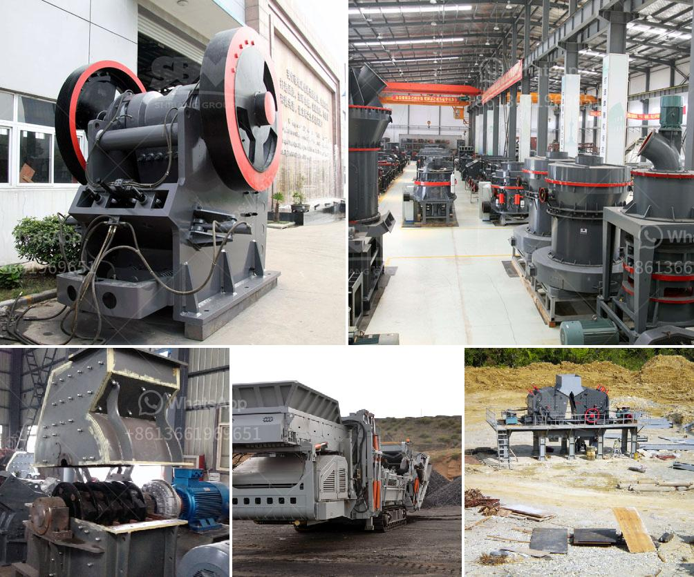

<h3>How to maintain stone crusher equipment?</h3>
Stone crusher equipment is widely used in various industries, mainly for various crushing operations. It plays a vital role in the construction industry, industrial and building materials industry, metallurgy industry, chemical industry, and other industries. Therefore, the maintenance of stone crusher equipment is very important.

A proper maintenance schedule should be established for the efficient functioning of the stone crusher equipment. This will ensure that the equipment lasts longer, operates efficiently, and potentially saves on costly repairs and downtime.

Regular cleaning: Dust and dirt can accumulate on the equipment over time, leading to potential problems if not cleaned regularly. It is essential to clean the equipment thoroughly and remove any dirt, debris, or dust that may have accumulated. This can be achieved using a high-pressure water hose, brush, or air blower.

Proper lubrication: All moving parts of the stone crusher equipment require lubrication to reduce friction and prevent wear and tear. It is crucial to regularly lubricate all the bearings, gears, and other moving parts to ensure smooth operation. Using the manufacturer's recommended lubricants and following the manufacturer's instructions is essential to maintain the equipment's performance.

Check for wear and tear: Regularly inspect all the components of the stone crusher equipment for signs of wear and tear. This includes checking the crusher liners, jaw plates, toggle plate, and any other wearing parts. If any parts are worn out or damaged, they should be replaced promptly to prevent further damage to the equipment.

Tighten loose bolts and connections: Over time, the vibration and movement of the stone crusher equipment can cause bolts and connections to loosen. It is essential to check and tighten any loose bolts or connections regularly. This will help maintain the structural integrity of the equipment and prevent any accidents or breakdowns.

Monitor the temperature: Stone crusher equipment can generate heat during operation, and excessive heat can cause damage to the machinery. It is crucial to monitor the temperature regularly to ensure it stays within the manufacturer's recommended limits. If the temperature exceeds the recommended range, it may be necessary to investigate the cause and make the necessary adjustments.

Train operators: Proper training of the equipment operators is vital for maintaining the stone crusher equipment. Operators should be trained on the safe and efficient operation of the equipment, as well as the maintenance procedures. This will help minimize operator errors and potential equipment damage.

In conclusion, maintaining stone crusher equipment is crucial for the efficient and safe operation of the equipment. Regular cleaning, proper lubrication, checking for wear and tear, tightening loose bolts, monitoring the temperature, and training operators are essential maintenance practices. Following these tips will not only prolong the life of the equipment but also ensure its optimal performance, reducing downtime and costly repairs.
<h3>Contact us</h3><ul><li><strong>Whatsapp:&nbsp;<a href="https://wa.me/8613661969651">+8613661969651</a></strong></li><li><a href="https://swt.shibang-china.com/?git&amp;zhl&amp;How to maintain stone crusher equipment"><strong>Online Service(chat now)</strong></a></li></ul><h3>Related</h3><ul><li><a href='How does investing in a cone crusher benefit.md'>How does investing in a cone crusher benefit?</a></li><li><a href='how to an ore bauxite jaw crusher ？.md'>how to an ore bauxite jaw crusher ？</a></li><li><a href='Procedures on how to mine nickel ore .md'>Procedures on how to mine nickel ore ?</a></li><li><a href='How to choose the suitable location of crusher in open pit mining.md'>How to choose the suitable location of crusher in open pit mining?</a></li><li><a href='How to build your own shaker wash plant.md'>How to build your own shaker wash plant?</a></li></ul>