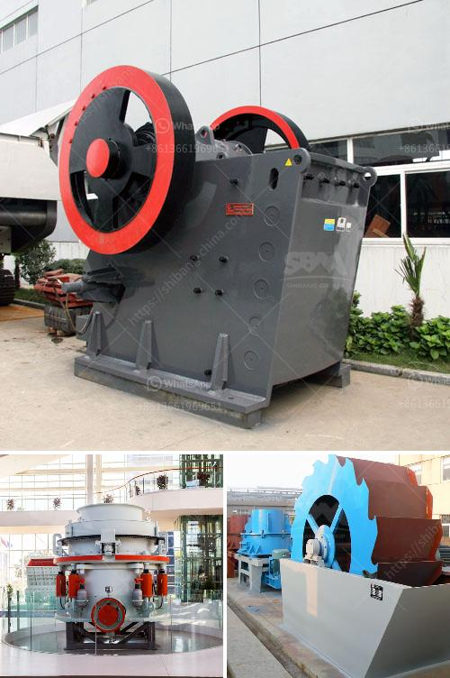

<h3>How to maintain stone crushing plant?</h3>
Stone crushing plant is widely applied in quarry, mine and recycling operations to crush and screen various materials such as limestone, granite, quartz, basalt, gravel, and construction waste. It is widely used in fields of construction, cement, environmental protection, and mining. To ensure the quality of the finished product, it is important to maintain the stone crushing plant properly.

Regular maintenance, including routine inspection and repairs, is essential to ensure the reliability, performance, and longevity of the equipment. Here are some tips to help maintain the stone crushing plant:

Recurring breakdowns, stoppages, and failures could indicate underlying problems that need to be addressed. Regular inspection of equipment allows operators to identify potential issues before they become bigger problems. Check all components of the plant, such as the crushers, screens, and conveyors, for signs of wear, damage, or loose connections.

Proper lubrication is crucial for the smooth operation of crushers and other machinery in the plant. Follow the manufacturer's recommendations for lubricating equipment and make sure to use the correct type and amount of lubricant. Insufficient or improper lubrication can lead to excessive wear, component failure, and reduced performance.

Dust and debris can accumulate on and inside the equipment, affecting its performance. Regularly clean all areas of the plant, including the crushers, screens, conveyors, and hoppers. Remove any buildup or blockages that could impede the operation or cause damage.

Proper feeding of the crushers is essential to avoid overloading and maximize efficiency. Ensure that the material size is within the specified range and that it is evenly distributed across the entire width of the crusher's feed opening. Overloading the crushers can result in damage to the equipment and reduce its lifespan.

Worn out or damaged parts, such as crusher liners, screen meshes, and conveyor belts, should be replaced promptly. Neglecting to replace these components could lead to further damage or even complete equipment failure.

Provide proper training for operators and maintenance personnel. Well-trained staff will understand the operation and maintenance procedures, helping to minimize the risk of accidents and costly downtime. Regularly update training to keep the team informed about the latest industry standards and best practices.

Keep a close eye on the operating conditions of the equipment, such as temperature, vibration, and oil pressure levels. Sudden changes in these parameters could indicate a problem that needs attention. Regularly check and record these conditions to establish a baseline pattern and identify any deviations.

By following these maintenance tips, stone crushing plants can be kept in good operating condition to ensure the production efficiency and product quality. So next time, when you're wondering how to maintain a stone crushing plant, remember these tips for a successful operation.
<h3>Contact us</h3><ul><li><strong>Whatsapp:&nbsp;<a href="https://wa.me/8613661969651">+8613661969651</a></strong></li><li><a href="https://swt.shibang-china.com/?git&amp;zhl&amp;How to maintain stone crushing plant"><strong>Online Service(chat now)</strong></a></li></ul><h3>Related</h3><ul><li><a href='How to find granite quarries in Salem Tamil Nadu.md'>How to find granite quarries in Salem, Tamil Nadu?</a></li><li><a href='How to build a 600TPH mobile cone crusher.md'>How to build a 600TPH mobile cone crusher?</a></li><li><a href='How do they grind phosphate in a ball mill.md'>How do they grind phosphate in a ball mill?</a></li><li><a href='How can sulfur and copper be removed from iron ore.md'>How can sulfur and copper be removed from iron ore?</a></li><li><a href='How to maintain the stone crusher .md'>How to maintain the stone crusher ?</a></li></ul>