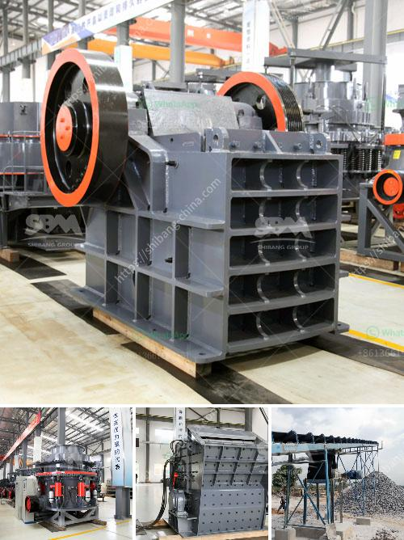

<h3>How to maintain stone grinding machine？</h3>
Stone grinding machines are powerful and efficient tools in the construction and engineering industry. They are used to grind and smooth various stones and concrete surfaces, making them essential for any project that requires precision and a polished finish. However, like any machine, stone grinding machines require regular maintenance to ensure their longevity and optimal performance. In this article, we will discuss some essential tips for maintaining your stone grinding machine.

1. Clean the machine regularly: One of the most crucial maintenance tasks is to keep the stone grinding machine clean. After each use, make sure to remove any debris, dust, or residue from the machine. This can be done by vacuuming or using a brush to sweep away the loose particles. Cleaning the machine regularly will prevent excess build-up and keep the machine running smoothly.

2. Lubricate moving parts: Stone grinding machines consist of many moving parts that require regular lubrication to reduce friction and ensure proper functioning. Therefore, it is important to identify these parts and apply lubricant regularly. This will prevent wear and tear, reduce noise levels, and extend the lifespan of the machine.

3. Inspect the belts and gears: Check the belts and gears of your stone grinding machine regularly for any signs of wear or damage. Loose or damaged belts can cause the machine to vibrate or produce inconsistent results. If you notice any issues, replace the belts or gears immediately to avoid further damage to the machine.

4. Sharpen and balance the grinding stones: The grinding stones are the heart of a stone grinding machine. Over time, these stones can become dull or imbalanced, resulting in inefficient grinding. To maintain the machine's performance, regularly sharpen the grinding stones using a dressing tool. Additionally, check the balance of the stones and adjust if necessary to ensure even grinding.

5. Check electrical connections and switches: Stone grinding machines are powered by electricity, so it is important to inspect the electrical connections and switches periodically. Loose or damaged connections can lead to electrical issues or even pose a safety risk. Regularly check the wiring, connectors, and switches for any signs of damage or wear and repair or replace as needed.

6. Follow manufacturer's guidelines: Every stone grinding machine is unique, and each manufacturer provides specific guidelines for maintenance and care. It is essential to read and follow these instructions to maintain the machine effectively. The manufacturer's recommendations will offer valuable insights into proper maintenance practices and ensure that you are using the machine in a safe and efficient manner.

In conclusion, maintaining a stone grinding machine requires regular cleaning, lubrication, and inspections. By following these essential tips, you can ensure that your machine performs optimally and has a long lifespan. Remember to read and follow the manufacturer's guidelines for maintenance to avoid potential issues or safety hazards. With proper care, your stone grinding machine will continue to be a reliable and valuable tool in your construction projects.
<h3>Contact us</h3><ul><li><strong>Whatsapp:&nbsp;<a href="https://wa.me/8613661969651">+8613661969651</a></strong></li><li><a href="https://swt.shibang-china.com/?git&amp;zhl&amp;How to maintain stone grinding machine？"><strong>Online Service(chat now)</strong></a></li></ul><h3>Related</h3><ul><li><a href='How to set up a jaw crusher production line ？.md'>How to set up a jaw crusher production line ？</a></li><li><a href='how ores are classified .md'>how ores are classified ?</a></li><li><a href='How to Use a Hammer Mill Kenya ？.md'>How to Use a Hammer Mill Kenya ？</a></li><li><a href='How to operate a vibrating screen.md'>How to operate a vibrating screen?</a></li><li><a href='How to process metallic minerals .md'>How to process metallic minerals ?</a></li></ul>