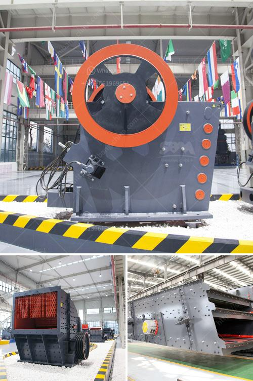

<h3>How to maintain the jaw crusher?</h3>
A jaw crusher, sometimes referred to as a toggle crusher, is one of the most commonly used crushing machines in mining, quarry, and construction industries. Jaw crushers are designed to crush the toughest materials through the use of compressive force (pressure). The jaw crusher design includes a set of two vertical jaws—a fixed (stationary) jaw and a swing (reciprocating) jaw. The swing jaw moves back and forth by a cam or pitman mechanism, acting like a nutcracker or a class II lever.

To ensure the optimal performance and extended lifespan of a jaw crusher, regular maintenance is essential. Here are some tips to help you maintain your jaw crusher effectively:

1. Regularly inspect the machine: Regularly check the machine components such as the jaw liners, toggle plate, and other vulnerable parts for wear and tear. Replace any damaged or worn parts immediately to avoid further damage or costly downtime.

2. Lubricate properly: Proper lubrication is crucial for the smooth functioning of the jaw crusher. Make sure to use the correct lubricating oil or grease and apply it as directed by the manufacturer. Regularly check the oil levels and top up if necessary.

3. Keep the jaw crusher clean: A jaw crusher accumulates dirt and debris over time, which can affect its performance. Clean the machine regularly to remove any buildup of dust, dirt, or residual materials.

4. Check the jaw crusher settings: Jaw crushers are designed to produce a specific output size, so it's important to adjust the settings regularly to ensure optimal performance. Check the closed side setting (CSS) to ensure the desired product size is being achieved.

5. Avoid overloading the machine: Overloading the jaw crusher can cause significant damage and result in costly repairs. Avoid feeding oversized materials into the crusher and always operate within the recommended capacity limits.

6. Protect against non-crushable objects: To prevent damage to the jaw crusher, make sure to install a metal detector or magnetized separator before the crusher. This will help remove any non-crushable materials, such as metal, wood, or plastic, that could jam the machine.

7. Train employees on proper operation: It's crucial to train all employees operating the jaw crusher on the correct procedures and safety precautions. This will minimize the risk of accidents and maximize the machine's longevity.

8. Schedule regular maintenance: Develop a routine maintenance schedule for the jaw crusher and stick to it. Consider creating a checklist of tasks that need to be performed daily, weekly, monthly, and annually, and assign responsible individuals to carry out the tasks.

Proper maintenance is key to ensuring the longevity and optimal performance of a jaw crusher. By following these maintenance tips, you can reduce downtime, increase productivity, and extend the lifespan of your jaw crusher, ultimately saving both time and money. Remember, preventive maintenance is always better than reactive maintenance when it comes to equipment reliability and cost-effectiveness.
<h3>Contact us</h3><ul><li><strong>Whatsapp:&nbsp;<a href="https://wa.me/8613661969651">+8613661969651</a></strong></li><li><a href="https://swt.shibang-china.com/?git&amp;zhl&amp;How to maintain the jaw crusher"><strong>Online Service(chat now)</strong></a></li></ul><h3>Related</h3><ul><li><a href='How to design a marble or stone processing production line.md'>How to design a marble or stone processing production line?</a></li><li><a href='How to choose a stone crusher station .md'>How to choose a stone crusher station ?</a></li><li><a href='how to make a ball mill .md'>how to make a ball mill ?</a></li><li><a href='How does a coal crusher work.md'>How does a coal crusher work?</a></li><li><a href='How to choose the suitable location of crusher in open pit mining.md'>How to choose the suitable location of crusher in open pit mining?</a></li></ul>