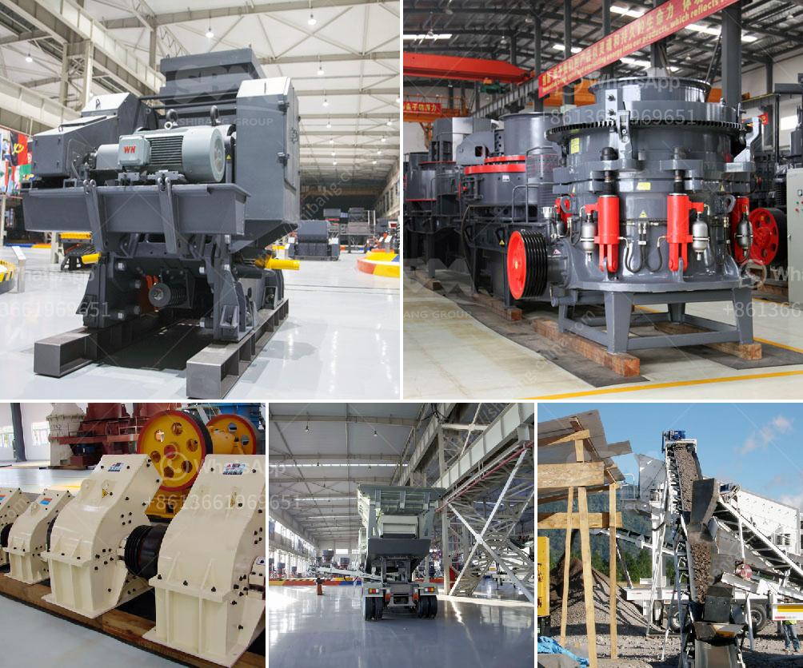

<h3>How to maintain the long-term advantages of the impact crusher</h3>
The impact crusher is a popular crushing machine used in the construction, mining, and recycling industries. It offers high efficiency, versatility, and durability, making it an ideal choice for many applications. However, to ensure that the impact crusher continues to deliver its long-term advantages, proper maintenance and care are necessary. In this article, we will discuss some essential tips for maintaining the long-term advantages of the impact crusher.

1. Regularly inspect and clean the machine: Regular inspections should be conducted to identify any potential issues or damages. Check for loose or worn-out parts, such as belts, drives, and bearings. Clean the machine regularly to remove any dust, dirt, or debris that may accumulate on the surfaces and affect its performance.

2. Lubricate the moving parts: Proper lubrication helps to reduce friction and wear on the impact crusher's components. Use the manufacturer-recommended lubricants and follow the suggested intervals for lubrication. Pay particular attention to the bearings, as they are critical for smooth operation. Over-lubrication should be avoided as it can cause overheating.

3. Replace worn-out parts promptly: Components that experience wear and tear, such as blow bars, liners, and anvils, should be replaced promptly to maintain the crusher's efficiency and productivity. Regularly inspect these parts for any signs of damage or excessive wear. Timely replacements will prevent further damage to the machine and ensure consistent performance.

4. Adjust the impact aprons and curtains: The impact aprons and curtains play a crucial role in controlling the size and shape of the crushed material. Periodically check their position and adjust them if necessary. Misaligned or worn-out curtains can result in poor-quality and irregularly shaped output. By keeping them in the correct position, you can maintain the desired product quality.

5. Monitor the feed size and avoid overloading: The impact crusher is designed to process a specific range of feed materials. Exceeding the recommended feed size can lead to reduced performance and increased wear and tear on the machine. Therefore, it is crucial to monitor the feed size and prevent overloading. Use a proper feed chute to ensure a consistent and controlled feed.

6. Train operators and provide proper training materials: Properly trained operators are essential for the efficient and safe operation of the impact crusher. Provide comprehensive training to the operators on the correct operation procedures and safety practices. Regularly update the training materials to include any new information or recommendations from the manufacturer.

7. Keep a maintenance log: Maintaining a detailed record of the maintenance activities performed on the impact crusher can help in tracking its performance and identifying any recurring issues. The maintenance log should include information about inspections, repairs, component replacements, and any other relevant details. This log will provide valuable insights into the machine's overall condition and help in planning future maintenance activities.

By following these maintenance tips, you can ensure that your impact crusher continues to deliver its long-term advantages, providing high efficiency and productivity. Regular inspections, proper lubrication, timely parts replacements, and adherence to the manufacturer's recommendations will help extend the lifespan of your impact crusher and optimize its performance. Remember, proper maintenance is key to maximizing the return on investment in any crushing equipment.
<h3>Contact us</h3><ul><li><strong>Whatsapp:&nbsp;<a href="https://wa.me/8613661969651">+8613661969651</a></strong></li><li><a href="https://swt.shibang-china.com/?git&amp;zhl&amp;How to maintain the longterm advantages of the impact crusher"><strong>Online Service(chat now)</strong></a></li></ul><h3>Related</h3><ul><li><a href='how to choose a portable crusher plant ？.md'>how to choose a portable crusher plant ？</a></li><li><a href='How iron ore mining is conducted.md'>How iron ore mining is conducted</a></li><li><a href='How to operate a coal crusher machine.md'>How to operate a coal crusher machine?</a></li><li><a href='How to Grind Manganese Ores Using a Ball Mill.md'>How to Grind Manganese Ores Using a Ball Mill?</a></li><li><a href='How much does calcite mineral processing equipment cost.md'>How much does calcite mineral processing equipment cost?</a></li></ul>