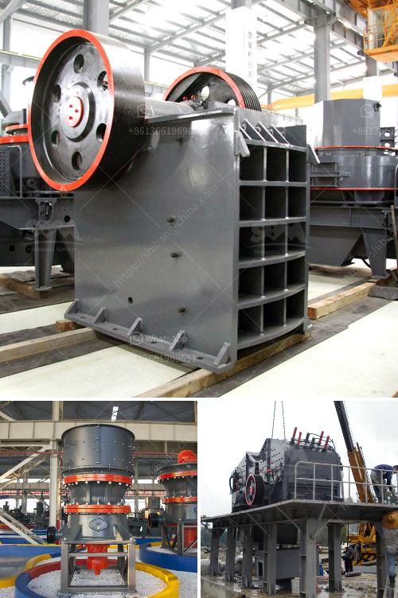

<h3>How to maintain vertical raw mill in cement plant?</h3>
A cement plant’s vertical raw mill is used to grind raw materials into powdery form in the manufacturing process of cement. The material is crushed and dried in the mill to reduce moisture content and enable easy storage and transportation. The raw mill equipment is crucial for ensuring production efficiency and consistent quality of finished cement.

1. Check for wear and tear: Worn-out parts can reduce the grinding capacity of the mill and negatively impact production. Regularly inspect each component such as grinding rollers, grinding table, and liners for any signs of wear. If worn parts are identified, they should be replaced promptly to maintain optimal mill performance.

2. Lubrication and cooling: Proper lubrication is necessary to minimize friction and wear between moving parts in the mill. Lubricate gears, bearings, and other mechanical components using the recommended lubricants and ensure they are operating within the specified temperature range. Additionally, check coolant levels and ensure they are sufficient for effective cooling of the mill’s internal components.

3. Regular cleaning: Dust and debris can accumulate inside the mill, affecting its performance and causing potential blockages. Regularly clean the mill by removing any built-up dust and other foreign particles. Use compressed air or vacuum cleaners to clean hard-to-reach areas and ensure optimal airflow through the mill.

4. Tightening of fasteners: Vibrations during mill operation can cause loosening of fasteners, which can lead to excessive wear or mechanical failure. Regularly inspect and tighten all bolts, nuts, and screws on the mill to ensure they are securely fastened. Use appropriate torque settings provided by the manufacturer to prevent over-tightening.

5. Calibration and adjustment: Over time, the mill’s operating conditions may change, affecting its performance. Regularly calibrate and adjust the mill settings to maintain the desired product fineness and throughput. Consult the mill’s operating manual or seek guidance from technical experts to accurately adjust parameters such as mill air flow, grinding pressure, and separator speed.

6. Training and operator awareness: Well-trained operators are essential for maintaining the vertical raw mill effectively. Provide comprehensive training to all operators on the proper operation, maintenance, and troubleshooting procedures for the mill. Encourage operators to report any abnormalities or issues promptly to prevent escalation of problems.

By following these maintenance practices, cement plant operators can ensure that their vertical raw mill operates reliably and efficiently. Regular maintenance minimizes downtime and helps to avoid costly repairs and production losses. It is crucial to stay proactive and address issues promptly to maintain the mill's performance and ultimately contribute to the smooth running of the entire cement production process.
<h3>Contact us</h3><ul><li><strong>Whatsapp:&nbsp;<a href="https://wa.me/8613661969651">+8613661969651</a></strong></li><li><a href="https://swt.shibang-china.com/?git&amp;zhl&amp;How to maintain vertical raw mill in cement plant"><strong>Online Service(chat now)</strong></a></li></ul><h3>Related</h3><ul><li><a href='How to maintain a coal crusher.md'>How to maintain a coal crusher?</a></li><li><a href='How to install a conveyor belt for the coal mill.md'>How to install a conveyor belt for the coal mill?</a></li><li><a href='How to get a sandmaking mini machine.md'>How to get a sand-making mini machine?</a></li><li><a href='How to design an impact crusher.md'>How to design an impact crusher?</a></li><li><a href='How to turn off crushing and screening plant.md'>How to turn off crushing and screening plant?</a></li></ul>