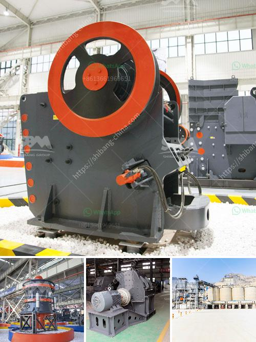

<h3>How to maintenance coal mill?</h3>
Coal mills are used in coal-fired power plants to grind and dry coal before it is blown into the power plant furnace. The coal is fed into the mill through a central inlet pipe, where it falls into the grinding table and is crushed by the rollers. The maintenance of coal mills can be challenging due to the harsh operating conditions and the high level of dust generated during the grinding process. Here are some tips to keep your coal mill running smoothly and minimize downtime.

Regular Inspection: Regular inspection of the coal mill is crucial to ensure its reliability and performance. Check the mill for any wear and tear, such as vibration, leaks, or overheating. Any unusual noise or vibration should be investigated further to identify potential issues.

Cleanliness: Cleanliness is crucial to the proper functioning of a coal mill. Dust and debris can accumulate and clog the mill, reducing its efficiency and increasing wear and tear. Regularly clean the mill, including the grinding table, rollers, and other components, to remove any dust or dirt. Use appropriate cleaning equipment and ensure proper disposal of dust collected during the cleaning process.

Lubrication: Proper lubrication is essential to reduce friction and wear in the coal mill. Regularly lubricate all moving parts, such as the grinding table, rollers, and bearings, with the recommended lubricants. Ensure that the lubrication system is functioning properly and there is no leakage or contamination.

Replace Wear Parts: As the coal mill operates, parts such as the grinding table, liners, and rollers wear out over time. Regularly inspect these parts and replace them when necessary. Use high-quality and durable replacement parts to ensure the longevity and efficiency of the mill.

Monitor Mill Performance: Monitor the performance of the coal mill regularly to identify any changes or abnormalities that may indicate a problem. Keep track of parameters such as coal flow, temperature, air flow, and pressure. Additionally, measure the fineness of the coal coming out of the mill. Deviations from the normal operating parameters can indicate performance issues and should be investigated promptly.

Train Operators: Properly trained operators are essential for the efficient and safe operation of coal mills. Provide regular training to the operators on mill operations, maintenance procedures, safety protocols, and troubleshooting techniques. Empower operators to identify and address potential issues promptly to prevent major breakdowns and downtime.

By following these maintenance tips, coal mills can be kept in optimal condition, ensuring smooth and efficient operation. Regular inspection, cleanliness, lubrication, replacement of wear parts, monitoring of mill performance, and operator training are key aspects of the maintenance process. Proper maintenance not only extends the life of the mill but also helps in reducing operating costs and improving overall plant performance.
<h3>Contact us</h3><ul><li><strong>Whatsapp:&nbsp;<a href="https://wa.me/8613661969651">+8613661969651</a></strong></li><li><a href="https://swt.shibang-china.com/?git&amp;zhl&amp;How to maintenance coal mill"><strong>Online Service(chat now)</strong></a></li></ul><h3>Related</h3><ul><li><a href='How to move and install a mobile rock crusher.md'>How to move and install a mobile rock crusher?</a></li><li><a href='how a stone crusher operates ？.md'>how a stone crusher operates ？</a></li><li><a href='How to adjust a jaw crusher .md'>How to adjust a jaw crusher ?</a></li><li><a href='how limestone is mined in kenya.md'>how limestone is mined in kenya</a></li><li><a href='how to start a stone crushing business in USA .md'>how to start a stone crushing business in USA ?</a></li></ul>