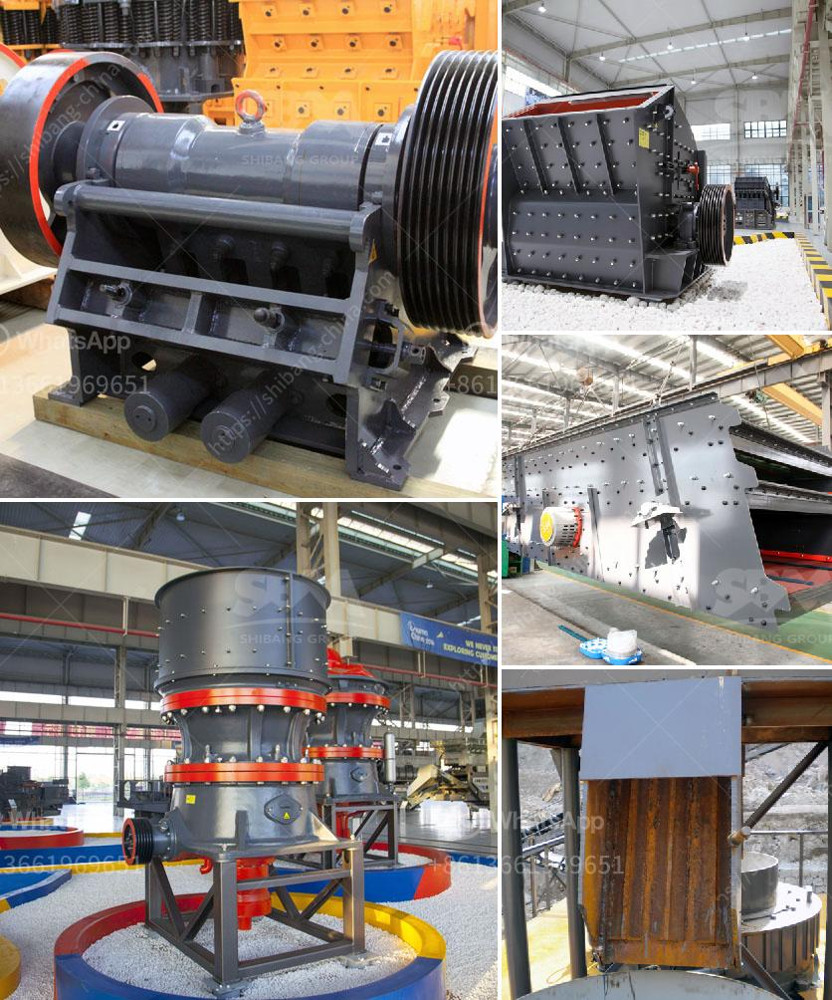

<h3>How to make a coal primary jaw crusher machine?</h3>
Coal is a crucial resource for humanity, as it plays a vital role in powering industries, generating electricity, and heating homes. With the increasing demand for coal, mining operations have become more prevalent. When extracting coal from the ground, primary jaw crusher machines are commonly utilized.

A coal primary jaw crusher machine is typically used in a mine or ore processing plant. The size of a jaw crusher is designated by the rectangular or square opening at the top of the jaws (feed opening). For instance, a 24 x 36 jaw crusher has a opening of 24" by 36", a 56 x 56 jaw crusher has a opening of 56" square.

   - Insert steel rods into the corners and critical areas of the jaw crusher to strengthen the overall structure.

   - Make any necessary adjustments to the components, such as the jaw plate alignment or motor performance.

It is essential to note that building a jaw crusher machine requires technical knowledge and skills in metalworking and welding. If you lack experience in these areas, it is advisable to seek assistance from professionals or consult relevant resources.

A well-constructed coal primary jaw crusher machine can greatly enhance mining operations by effectively breaking down large chunks of coal into smaller, manageable pieces. It maximizes efficiency and optimizes the coal extraction process.

In conclusion, constructing a coal primary jaw crusher machine is a complex task that requires careful planning, precise execution, and attention to detail. By following the steps outlined in this article, you will be able to create a reliable and efficient jaw crusher machine for coal extraction. Remember to prioritize safety throughout the construction process and seek professional guidance when necessary.
<h3>Contact us</h3><ul><li><strong>Whatsapp:&nbsp;<a href="https://wa.me/8613661969651">+8613661969651</a></strong></li><li><a href="https://swt.shibang-china.com/?git&amp;zhl&amp;How to make a coal primary jaw crusher machine"><strong>Online Service(chat now)</strong></a></li></ul><h3>Related</h3><ul><li><a href='How to select a vibrating screen in Britain.md'>How to select a vibrating screen in Britain?</a></li><li><a href='How to Start a Quarry Crushing Plant in Nigeria Need those crushing machines.md'>How to Start a Quarry Crushing Plant in Nigeria? Need those crushing machines?</a></li><li><a href='how to calculate stone crusher production .md'>how to calculate stone crusher production ?</a></li><li><a href='How to commission a mobile cone crusher.md'>How to commission a mobile cone crusher?</a></li><li><a href='How to balance cement mill fans.md'>How to balance cement mill fans?</a></li></ul>