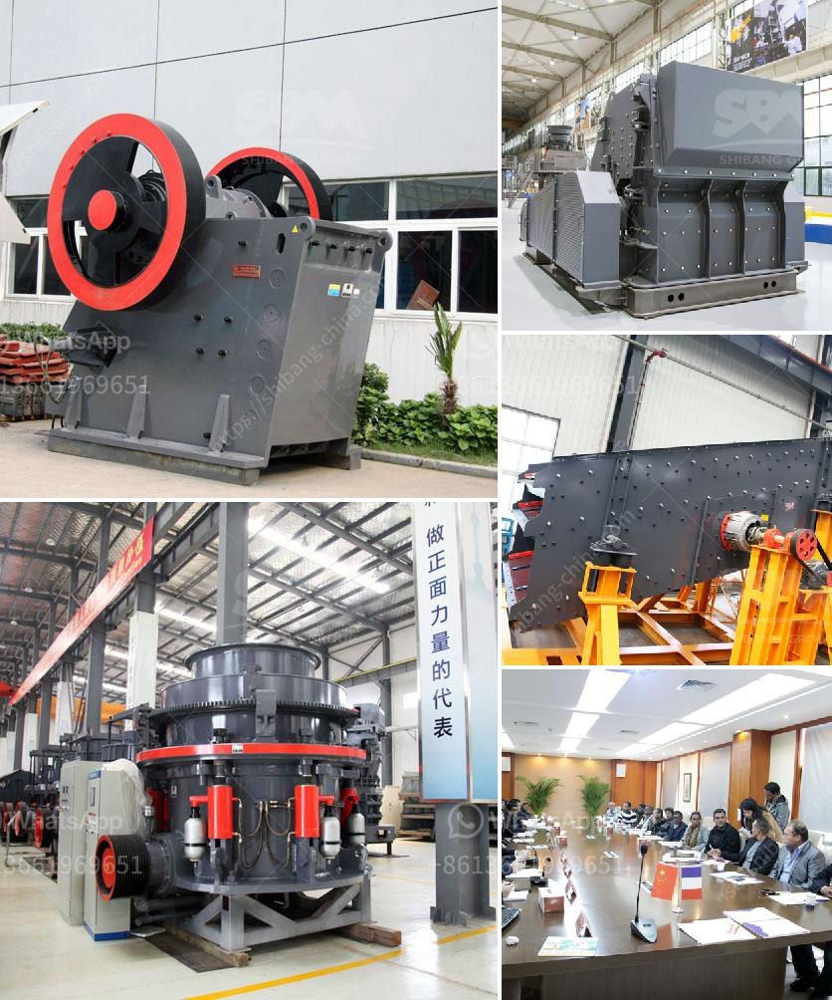

<h3>How to make boulders into gravel</h3>
Boulders are large rocks that can present obstacles in construction projects or landscaping. However, when broken down into smaller, more manageable pieces, gravel can be a versatile material for various applications, such as pathways, driveways, or as a base for concrete. In this article, we will explore the step-by-step process of transforming boulders into gravel, providing you with a comprehensive guide.

Before starting any project involving boulders, prioritize safety. Wear appropriate protective gear, such as safety goggles, gloves, and steel-toed boots. It is also crucial to have the necessary tools, including a sledgehammer, pry bar, and backhoe or excavator.

Inspect the boulder and determine its quality. Check for cracks or fractures, as these can indicate weaknesses that may affect the gravel quality. Avoid boulders that are extensively cracked or damaged, as they may not break down into suitable gravel.

Ensure that the area where you plan to break down the boulder is clear of any obstacles, including people and equipment. It is essential to work in a safe and uncluttered environment to avoid accidents.

Begin by using a sledgehammer to break off smaller, manageable pieces from the boulder. Focus on hitting the boulder's edges and corners, as these are typically weaker points. Use controlled and forceful swings to break the smaller sections off. It may take several hits to progressively break down the boulder.

Once you have obtained smaller pieces of the boulder, use a pry bar to apply force to any existing cracks or fractures in the rock. This will help break the boulder down further. Be patient, as it may take some time and effort to achieve the desired outcome.

For larger boulders, using a backhoe or excavator can significantly expedite the process. These heavy machinery options can provide the necessary force and leverage to break the boulders into gravel more efficiently. However, it is essential to have proper training and experience when operating such equipment to avoid accidents or damage to the machinery.

Once the boulders are broken down into smaller pieces, sort and classify the resulting gravel based on size and quality. If you require a specific size for your project, use a sieve or screen to separate the gravel according to your requirements.

Dispose of any remaining large pieces or debris from the boulders properly. You can repurpose these materials for other construction or landscaping projects, or dispose of them appropriately if they have no further use.

The transformed boulders are now ready for use as gravel in your desired applications. They can be used for pathways, driveways, or as a base for concrete. Ensure proper installation techniques to ensure stability and longevity.

In conclusion, converting boulders into gravel can be a labor-intensive but achievable task. With the right tools, safety measures, and perseverance, these large rocks can be broken down into smaller, versatile gravel pieces suitable for various projects. Remember to prioritize safety throughout the process and utilize appropriate equipment when necessary.
<h3>Contact us</h3><ul><li><strong>Whatsapp:&nbsp;<a href="https://wa.me/8613661969651">+8613661969651</a></strong></li><li><a href="https://swt.shibang-china.com/?git&amp;zhl&amp;How to make boulders into gravel"><strong>Online Service(chat now)</strong></a></li></ul><h3>Related</h3><ul><li><a href='How to reduce vibration in a jaw crusher.md'>How to reduce vibration in a jaw crusher?</a></li><li><a href='How does a work of impact crusher.md'>How does a work of impact crusher?</a></li><li><a href='How to enter into a business of stone crusher plant in Malaysia .md'>How to enter into a business of stone crusher plant in Malaysia ?</a></li><li><a href='How to install a crusher for quarry operation.md'>How to install a crusher for quarry operation?</a></li><li><a href='How to select the screen size for a crusher plant.md'>How to select the screen size for a crusher plant?</a></li></ul>