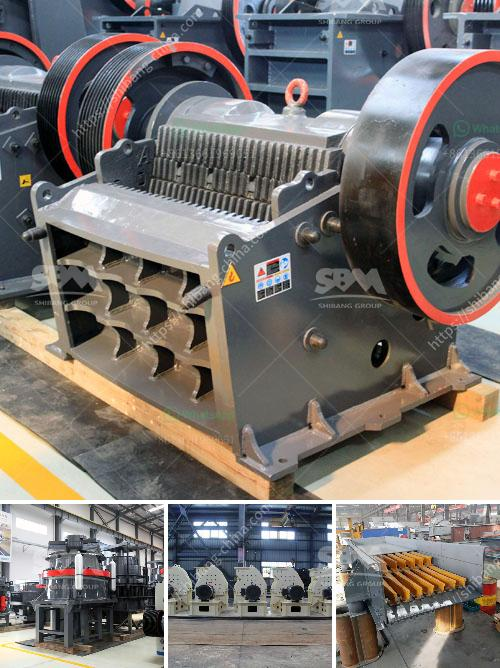

<h3>How to make quartz powder grinding mill in Kenya ？</h3>
Quartz is a crystalline mineral that is resistant to high temperatures and acid, making it an ideal material for various industrial applications. One of the most common uses of quartz is in the production of quartz powder, which is essential for the manufacturing of glass, ceramics, and other similar products. In Kenya, there is a growing demand for quartz powder, and a grinding mill is essential in producing high-quality powder from quartz.

The grinding mill is an equipment designed to reduce the size of stones or rocks into smaller pieces. It is commonly used in the mining and construction industries for grinding materials such as quartz, limestone, and granite. With its high efficiency and durability, a grinding mill can be a valuable tool in processing quartz powder.

1. Obtain the necessary equipment: To start the process, you will need a sturdy grinding mill. Look for a model that is specifically designed for grinding quartz or other similar minerals. A high-quality grinding mill will be efficient and provide consistent results.

2. Prepare the quartz: Before grinding, the quartz needs to be prepared. This involves washing the quartz to remove any impurities and ensuring it is in the right particle size. It is important to have a consistent feed size for the grinding mill to achieve the desired fineness of the quartz powder.

3. Load the mill: Once the quartz is properly prepared, load it into the grinding mill. The grinding mill will have a container or a hopper where the quartz can be placed for grinding. Make sure to load the mill with the right amount of quartz to avoid overloading the equipment.

4. Start the grinding process: Turn on the grinding mill and adjust the settings according to your desired fineness and throughput. It is advisable to start with a low speed to allow the quartz to be properly ground before gradually increasing the speed.

5. Monitor the process: As the grinding mill operates, monitor the process closely to ensure the quartz is being properly ground. Check the fineness of the powder produced and make adjustments if necessary. Also, keep an eye on the equipment to ensure it is functioning properly and to prevent any potential issues.

6. Collect the quartz powder: Once the grinding process is complete, collect the quartz powder in a separate container. Make sure to keep the powder clean and free from any impurities. Label the container properly for ease of identification and storage.

In conclusion, making a quartz powder grinding mill in Kenya involves obtaining the necessary equipment, preparing the quartz, loading the mill, starting the grinding process, monitoring the process, and collecting the quartz powder. By following these steps, you can produce high-quality quartz powder that is in demand in various industries. It is important to note that proper maintenance of the grinding mill is essential to ensure its longevity and efficient operation.

Note: It is important to consult an expert or a professional before starting any industrial process to ensure safety and efficiency.
<h3>Contact us</h3><ul><li><strong>Whatsapp:&nbsp;<a href="https://wa.me/8613661969651">+8613661969651</a></strong></li><li><a href="https://swt.shibang-china.com/?git&amp;zhl&amp;How to make quartz powder grinding mill in Kenya ？"><strong>Online Service(chat now)</strong></a></li></ul><h3>Related</h3><ul><li><a href='How to choose crusher for limestone.md'>How to choose crusher for limestone?</a></li><li><a href='How to clean copper ore with equipment .md'>How to clean copper ore with equipment ?</a></li><li><a href='How to Make Plaster of Phosphogypsum.md'>How to Make Plaster of Phosphogypsum</a></li><li><a href='How to set up a clinker grinding unit.md'>How to set up a clinker grinding unit?</a></li><li><a href='How does investing in a cone crusher benefit.md'>How does investing in a cone crusher benefit?</a></li></ul>