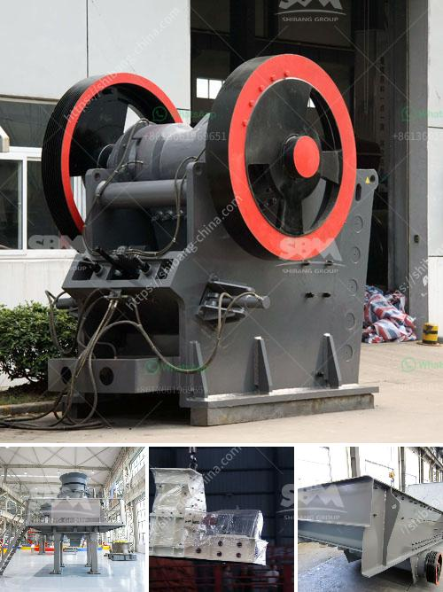

<h3>How to make sand from quartzite customer case ?</h3>
Quartzite is a naturally occurring metamorphic rock composed primarily of quartz. With its beautiful appearance and durability, it is a popular choice for various applications, including countertops and flooring. However, at times, individuals may have a specific need for sand made from quartzite. In this article, we will explore how to make sand from quartzite, highlighting a customer case and providing a step-by-step guide.

One of our clients, a construction company specializing in the development of high-end resorts and hotels, recently approached us with a unique request. They needed a consistent supply of sand made from quartzite to match the surrounding landscape of their new project. After carefully evaluating their requirements, we decided to assist them in this endeavor.

The first step in making sand from quartzite is obtaining the raw material. Quartzite deposits can be found in various regions globally; however, the availability may vary. It is essential to identify a trustworthy supplier who can provide quartzite rock suitable for sand production. In our customer's case, we sourced the raw quartzite from a nearby quarry, ensuring its quality and compatibility with their project.

Once the quartzite rock is obtained, the next step is crushing and grinding it into small granules. This process requires heavy machinery capable of handling the robust nature of quartzite. Initially, the quartzite rock is fed into a jaw crusher for primary crushing. The crusher reduces the large-sized rocks into smaller pieces, making it easier to handle further in the production process.

After the primary crushing stage, the quartzite is further reduced in size using secondary crushers, such as cone or impact crushers. The goal is to achieve the desired particle size for making sand, typically 0.6-2.36mm. The crushed quartzite is then sorted using screens to separate the granules into different sizes, ensuring consistency in the final product.

To produce high-quality sand from quartzite, the material must undergo a process called sand washing. This involves removing impurities and excess fines to enhance its usability. The quartzite granules are fed into a sand washer, where water and a controlled amount of detergent are added. The mixture is vigorously agitated to remove any surface impurities and dirt. After the washing process, the sand is dewatered using a vibrating screen or a centrifugal dewatering machine.

Finally, the washed sand is dried either naturally or with the help of mechanical drying systems. The purpose of drying is to eliminate any leftover moisture and achieve the desired moisture content suitable for the intended application. This step ensures that the sand is ready for use and can be seamlessly incorporated into the customer's construction project.

In conclusion, making sand from quartzite requires a well-planned process that involves sourcing the raw material, crushing and grinding the quartzite rocks, sorting them into desired granule sizes, washing away impurities, and finally drying the sand. By following these steps, we were able to successfully meet our client's specific requirement for sand made from quartzite. This case study showcases the importance of understanding customer needs and finding innovative solutions to fulfill them efficiently.
<h3>Contact us</h3><ul><li><strong>Whatsapp:&nbsp;<a href="https://wa.me/8613661969651">+8613661969651</a></strong></li><li><a href="https://swt.shibang-china.com/?git&amp;zhl&amp;How to make sand from quartzite customer case "><strong>Online Service(chat now)</strong></a></li></ul><h3>Related</h3><ul><li><a href='How to use the sand making machine.md'>How to use the sand making machine?</a></li><li><a href='How to install crusher.md'>How to install crusher?</a></li><li><a href='How does a rock crusher work.md'>How does a rock crusher work?</a></li><li><a href='how to choose a jaw crusher malaysia.md'>how to choose a jaw crusher malaysia?</a></li><li><a href='How to enter into a business of stone crusher plant in Malaysia .md'>How to enter into a business of stone crusher plant in Malaysia ?</a></li></ul>