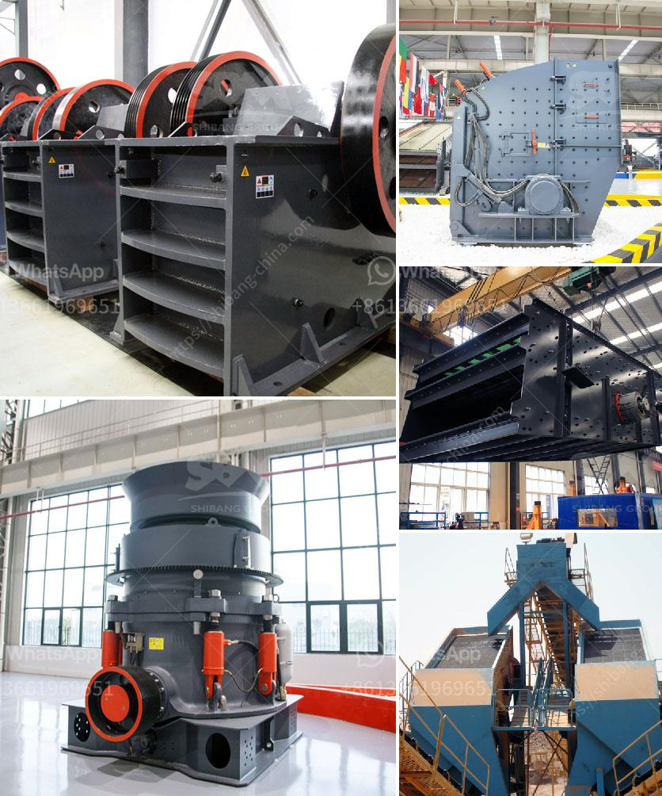

<h3>How to make sand from rocks?</h3>
Sand is an essential component in building materials and landscaping projects. It can also be used for recreational purposes, such as creating sandboxes or beaches. While it is readily available in nature, you may also find yourself in situations where making sand from rocks becomes necessary. Whether you are a DIY enthusiast or simply curious about the process, this article will provide you with a simple guide on how to make sand from rocks.

The first step in making sand from rocks is to select the right type of rock. Ideally, you want rocks that are relatively soft and breakable. Sandstone, limestone, and granite are excellent choices for this purpose. Avoid using extremely hard rocks as they are difficult to crush and may damage your equipment.

Once you have obtained the appropriate rocks, you will need some machinery to break them down. The most commonly used equipment for this task is a crusher or a pulverizer. These devices are specifically designed to crush rocks into smaller pieces, transforming them into sand-like particles.

Before you begin the crushing process, it is crucial to take safety precautions. Wear protective gear such as safety goggles, gloves, and a dust mask to protect your eyes, hands, and respiratory system from the rock particles. Furthermore, operate the equipment in a well-ventilated area to prevent the accumulation of dust.

Once you have taken the necessary safety measures, place the rocks into the crusher or pulverizer. Depending on the size of the rocks and your equipment, you may need to break them down into smaller pieces manually beforehand. Start the machine and feed the rocks into it slowly and steadily. Make sure to maintain a consistent flow of rocks to avoid damaging the equipment.

The rocks will be crushed into smaller fragments as they pass through the crusher or pulverizer. These fragments will resemble sand, but they may not be of the desired size or texture yet. To achieve the desired sand-like consistency, it is recommended to run the crushed rock fragments through a sand-making machine or a vibrating screen with various mesh sizes. This will help separate the fragments into particles of the desired size range.

During this process, it is important to frequently check the quality of the sand being produced. Adjust the equipment if necessary to achieve the desired consistency. Be aware that the final product may still have some larger rock fragments mixed in, but with additional sifting or screening, you can obtain a finer and more uniform sand.

After obtaining the sand-like particles, it is crucial to clean and wash the material thoroughly. Rinse the sand with clean water to remove any remaining dust or impurities. Let it dry before using it or storing it for later use.

In conclusion, making sand from rocks can be achieved with the right equipment and appropriate safety measures. Selecting the right type of rock, using a crusher or pulverizer, and sifting the crushed fragments are crucial steps in the process. Regularly inspect the sand to ensure it meets your desired consistency, and wash it thoroughly before use. By following these steps, you can create sand from rocks for various applications, whether it be construction, landscaping, or recreational purposes.
<h3>Contact us</h3><ul><li><strong>Whatsapp:&nbsp;<a href="https://wa.me/8613661969651">+8613661969651</a></strong></li><li><a href="https://swt.shibang-china.com/?git&amp;zhl&amp;How to make sand from rocks"><strong>Online Service(chat now)</strong></a></li></ul><h3>Related</h3><ul><li><a href='How to judge how much power the jaw crusher needs？.md'>How to judge how much power the jaw crusher needs？</a></li><li><a href='How to collect crusher dust.md'>How to collect crusher dust?</a></li><li><a href='How to start stone mining hard rock crusher.md'>How to start stone mining hard rock crusher?</a></li><li><a href='How to choose a limestone hammer mill ？.md'>How to choose a limestone hammer mill ？</a></li><li><a href='how to start a stone crushing business in USA .md'>how to start a stone crushing business in USA ?</a></li></ul>