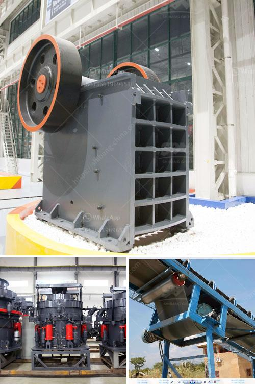

<h3>How to make sand from stone dust?</h3>
Stone dust, also known as rock dust or quarry dust, is a byproduct of crushing stones during quarrying activities. It is a residual material that is produced during the process of reducing larger stones into smaller sizes for various construction purposes. Stone dust is typically coarse, angular, and irregular in shape. While it may not serve as a suitable construction material on its own, it can be transformed into sand by following a few simple steps. In this article, we will guide you on how to make sand from stone dust.

Firstly, it is important to note that the process of converting stone dust into sand involves crushing the stone dust to finer sizes. This can be achieved by utilizing a crusher machine. There are various types of crushers available in the market, such as jaw crushers, gyratory crushers, cone crushers, impact crushers, etc. The selection of the appropriate crusher depends on factors such as the hardness, abrasiveness, and desired final product size of the stone dust.

Once you have selected the crusher, the next step is to adjust its settings to obtain the desired output size. By decreasing the gap between the crusher jaws, you can achieve finer sizes of stone dust. It is advisable to start by using larger settings and gradually reducing them until the desired size is achieved. The crushed stone dust should have a consistent particle size and a uniform distribution to resemble natural sand.

After crushing the stone dust, the next step is to remove any impurities or unwanted materials. You can accomplish this by utilizing a process called screening. Screening involves passing the crushed stone dust through a mesh or screen to separate it into different particle sizes. This process helps eliminate larger particles and ensures that the final product is of uniform size and quality.

Once the stone dust has been screened, you will have a product that closely resembles sand in terms of particle size and shape. However, to further enhance its quality and mimic natural sand, it is advisable to wash the crushed stone dust. Washing stone dust involves removing any fines or silt content. This process can be achieved by using water and a sieve or screen. By agitating the stone dust in water, the fines will settle at the bottom and can be subsequently removed.

By following these steps, you can successfully convert stone dust into sand. The resulting sand can be used for various purposes, such as construction, gardening, or landscaping. However, keep in mind that the quality of the sand will depend on the quality of the stone dust and the efficiency of the crushing and washing processes.

In conclusion, stone dust can be converted into sand by crushing it to finer sizes, screening it to remove impurities, and washing it to eliminate fines. The resulting sand can be utilized for various construction purposes. However, it is essential to ensure that the stone dust is of good quality and that the crushing and screening processes are carried out efficiently to obtain a high-quality sand product.
<h3>Contact us</h3><ul><li><strong>Whatsapp:&nbsp;<a href="https://wa.me/8613661969651">+8613661969651</a></strong></li><li><a href="https://swt.shibang-china.com/?git&amp;zhl&amp;How to make sand from stone dust"><strong>Online Service(chat now)</strong></a></li></ul><h3>Related</h3><ul><li><a href='how to do ball mill liner？.md'>how to do ball mill liner？</a></li><li><a href='How much does a mobile crusher plant cost.md'>How much does a mobile crusher plant cost?</a></li><li><a href='How to select cone crusher parts.md'>How to select cone crusher parts?</a></li><li><a href='how to intall a jaw crusher ？.md'>how to intall a jaw crusher ？</a></li><li><a href='How to improve the crushing capacity of ball mill.md'>How to improve the crushing capacity of ball mill?</a></li></ul>