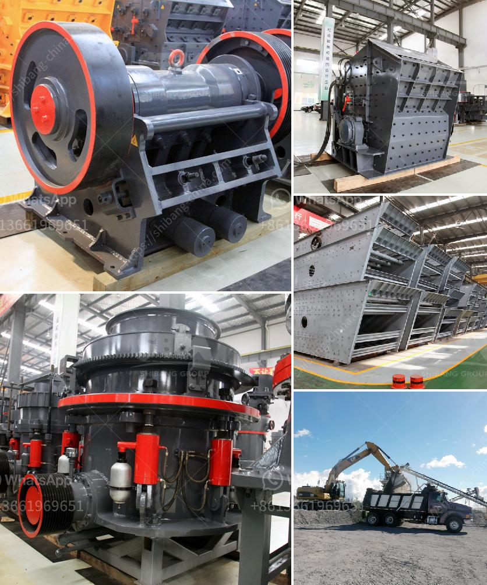

<h3>How to make the design of gold mining plant ?</h3>
Gold mining is a lucrative business that comes with its own set of challenges. One of the most crucial aspects of gold mining is the design of the mining plant. A well-designed gold mining plant will significantly increase the efficiency of obtaining gold, while also reducing the environmental impact of the mining process. In this article, we will discuss how to make the design of a gold mining plant.

The first step in designing a gold mining plant is to understand the geological features of the area where the plant will be located. By studying the geology of the site, mining engineers can determine the potential quantity and quality of gold deposits. This knowledge is vital in deciding the type of equipment and machinery needed for the mining operation.

Once the geological assessment is complete, the next step involves designing the plant layout. The plant layout should take into consideration various factors like the topography of the site, availability of water, and proximity to transportation routes. It is essential to ensure that the plant is easily accessible to transport the extracted gold to the market.

The plant design must also consider the type of mining method to be used. There are various mining methods, such as open-pit mining, underground mining, and placer mining. Each mining method requires a specific design approach. For instance, if open-pit mining is chosen, the design must accommodate large machinery, including trucks and excavators, to extract the gold.

When designing the gold mining plant, it is crucial to pay attention to the recovery process. The goal is to maximize the extraction of gold while minimizing waste. The plant design should include units like crushers, screens, and concentrators to break down the ore and extract the gold particles. The tailings management system is equally important to ensure proper disposal of waste materials and to prevent environmental contamination.

Another critical aspect of the plant design is the use of sustainable practices. Gold mining has a reputation for causing environmental degradation, but modern mining plants can be designed to minimize the impact on the environment. This can include the use of green technologies like renewable energy sources, recycling of water, and proper waste management systems.

Once the plant design is complete, it is essential to conduct thorough testing and quality control measures. This helps identify any potential issues and ensures that the plant is functioning optimally. Regular maintenance and monitoring of the plant are necessary to ensure its continued efficiency and productivity.

In conclusion, the design of a gold mining plant is a complex task that requires careful consideration of various factors. From the geological assessment of the site to the selection of mining methods, machinery, and equipment, every decision impacts the success of the mining operation. By employing sustainable practices and implementing rigorous testing and quality control measures, a well-designed gold mining plant can efficiently extract gold while minimizing its environmental impact.
<h3>Contact us</h3><ul><li><strong>Whatsapp:&nbsp;<a href="https://wa.me/8613661969651">+8613661969651</a></strong></li><li><a href="https://swt.shibang-china.com/?git&amp;zhl&amp;How to make the design of gold mining plant "><strong>Online Service(chat now)</strong></a></li></ul><h3>Related</h3><ul><li><a href='How to check the stone crusher and daily maintenance？.md'>How to check the stone crusher and daily maintenance？</a></li><li><a href='How can we prevent rocks from coming out of the impact crushers work.md'>How can we prevent rocks from coming out of the impact crusher's work?</a></li><li><a href='How to measure the theoretical output of a jaw crusher .md'>How to measure the theoretical output of a jaw crusher ?</a></li><li><a href='How to improve stone crusher production.md'>How to improve stone crusher production?</a></li><li><a href='How is iron ore crushed ready for processing.md'>How is iron ore crushed ready for processing?</a></li></ul>