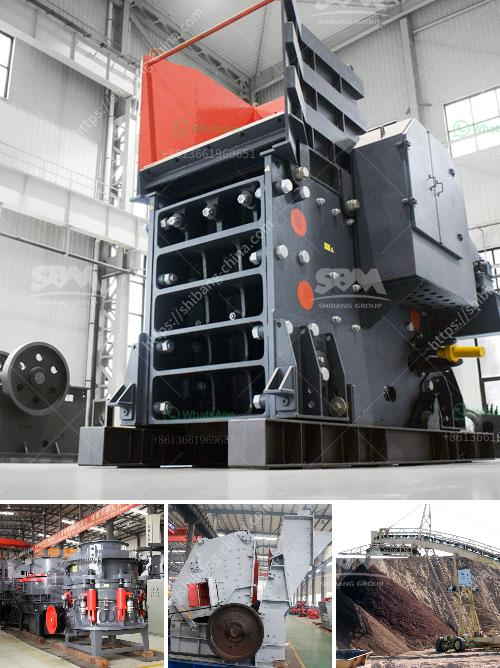

<h3>How to manage a limestone quarry?</h3>
A limestone quarry is an integral part of many industries, including construction, manufacturing, and agriculture. These quarries provide essential raw materials needed for various applications. However, managing a limestone quarry can be challenging, as it requires careful planning, robust processes, and effective management techniques. Here are some key steps to efficiently manage a limestone quarry.

Before starting a limestone quarry, thorough planning and exploration are crucial. Conducting detailed geological surveys and assessments of the location will help identify the quality and quantity of limestone deposits. This information is vital for estimating the profitability and sustainability of the quarry. It will also aid in obtaining the necessary permits and approvals from relevant authorities.

As with any mining operation, managing a limestone quarry requires careful consideration of its environmental impact. Conducting an Environmental Impact Assessment (EIA) will help identify and mitigate potential environmental risks associated with the quarry. This assessment should cover areas like air quality, water management, waste management, and restoration plans for flora and fauna.

Ensuring the safety of workers and visitors is paramount in managing a limestone quarry. Implementing strict safety protocols, including appropriate training, equipment inspection, and safety audits, is essential. Additionally, developing emergency response plans for potential incidents like health emergencies, accidents, or natural disasters is crucial in minimizing risks and safeguarding the well-being of all stakeholders.

Efficiency in quarry operations is crucial to managing costs and maximizing productivity. Establishing well-defined work processes, such as extraction, crushing, and screening, will help streamline operations. Additionally, regular maintenance and inspection of quarry equipment, including loaders, haul trucks, and crushers, is essential to minimize downtime and optimize operational efficiency.

Quarry management should include plans for rehabilitation and restoration post-extraction. This involves restoring the natural habitat and landscape around the quarry area. Implementing these plans as extraction progresses helps mitigate the environmental impact and enhances the overall sustainability of the quarry. Rehabilitation measures can include reforestation, soil stabilization, and watercourse restoration to reclaim the land for future use.

Managing a limestone quarry requires maintaining positive relationships with various stakeholders, including local communities, regulatory authorities, and environmental organizations. Open and transparent communication with these stakeholders can help address concerns, build trust, and ensure compliance with regulations. Engaging with the community through community initiatives and promoting sustainable practices can foster long-term support for the quarry.

In conclusion, managing a limestone quarry involves careful planning, environmental assessments, safety protocols, efficient operations, rehabilitation measures, and stakeholder engagement. Following these essential steps will not only result in a successful quarry but also contribute to the overall sustainability of the site. With proper management, a limestone quarry can provide essential resources to multiple industries while minimizing its impact on the environment and surrounding communities.
<h3>Contact us</h3><ul><li><strong>Whatsapp:&nbsp;<a href="https://wa.me/8613661969651">+8613661969651</a></strong></li><li><a href="https://swt.shibang-china.com/?git&amp;zhl&amp;How to manage a limestone quarry"><strong>Online Service(chat now)</strong></a></li></ul><h3>Related</h3><ul><li><a href='How does Raymond Mill work.md'>How does Raymond Mill work?</a></li><li><a href='How to maintain the vibrating feeder.md'>How to maintain the vibrating feeder?</a></li><li><a href='How to construct a ramp for a granite crushing plant.md'>How to construct a ramp for a granite crushing plant?</a></li><li><a href='How to increase the efficiency coal pulveriser on power plant.md'>How to increase the efficiency coal pulveriser on power plant?</a></li><li><a href='How much is the copper ore separation machine.md'>How much is the copper ore separation machine?</a></li></ul>