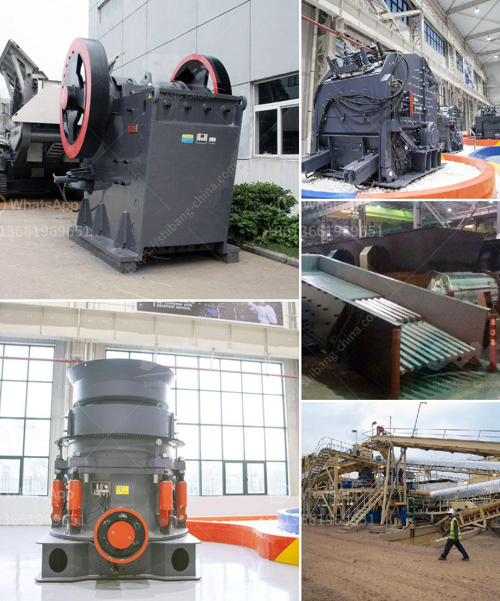

<h3>How to manage a quarry plant? 10 suggestions</h3>
Quarry plants are essential for the mining industry to supply raw materials for construction, agriculture, and other industries. Managing a quarry plant requires careful planning and meticulous supervision to ensure efficient operations and maximum productivity. Here are ten suggestions to effectively manage a quarry plant:

1. Develop a comprehensive operational plan: Begin by creating a detailed plan that outlines the overall vision, mission, and objectives of the quarry plant. This plan should also cover factors like production capacity, material quality, and safety measures.

2. Implement strict safety standards: Safety should be the foremost concern in quarry plant management. Ensure all employees receive proper safety training and enforce safety protocols rigorously. Conduct regular safety audits and make necessary improvements to prevent accidents and injuries.

3. Efficient inventory management: Implement an effective inventory management system to avoid shortages or overstocking of key materials. Regularly monitor stock levels and ensure timely replenishment to maintain uninterrupted production.

4. Optimize production processes: Continuously review and refine production processes to enhance productivity and reduce downtime. Regularly inspect machinery and equipment for maintenance and repairs, optimizing their performance and prolonging their lifespan.

5. Environmental sustainability: Quarry operations must be conducted with environmental sustainability in mind. Employ sustainable practices such as water recycling, soil conservation, and plant restoration to minimize the impact on the surrounding ecosystem.

6. Embrace technological advancements: Stay updated with the latest technology and machinery suited for quarry operations. Invest in advanced equipment that enhances productivity, improves efficiency, and reduces fuel consumption and carbon emissions.

7. Regular monitoring and maintenance: Regularly monitor the performance of the quarry plant and address any operational issues promptly. Conduct routine inspections, service equipment regularly, and replace worn-out parts to prevent breakdowns and downtime.

8. Staff training and development: Invest in the training and development of your employees. Equip them with the necessary skills and knowledge to operate machinery, understand safety procedures, and handle emergencies efficiently. This will create a skilled and motivated workforce.

9. Foster effective communication: Establish a culture of open communication among all teams involved in the quarry plant management. Encourage feedback, suggestions, and ideas from your employees, fostering a collaborative and productive work environment.

10. Community engagement: Engage with the local community to maintain positive relationships and address any concerns they may have. Regularly communicate with community members, address environmental concerns, and support initiatives that benefit the local community.

In conclusion, managing a quarry plant requires a holistic approach considering various factors like safety, sustainability, efficiency, and community engagement. By following these ten suggestions, quarry plant managers can ensure smooth operations, maximize productivity, and create a safe and sustainable work environment.
<h3>Contact us</h3><ul><li><strong>Whatsapp:&nbsp;<a href="https://wa.me/8613661969651">+8613661969651</a></strong></li><li><a href="https://swt.shibang-china.com/?git&amp;zhl&amp;How to manage a quarry plant 10 suggestions"><strong>Online Service(chat now)</strong></a></li></ul><h3>Related</h3><ul><li><a href='How many kilowatts motor is equipped with jaw crusher ？.md'>How many kilowatts motor is equipped with jaw crusher ？</a></li><li><a href='How to Build Your Own Rock Crusher in the Philippines ？.md'>How to Build Your Own Rock Crusher in the Philippines ？</a></li><li><a href='How to install a stone crusher hopper.md'>How to install a stone crusher hopper?</a></li><li><a href='how to replace dryer bearing ？.md'>how to replace dryer bearing ？</a></li><li><a href='How to make a foundation for sand crusher.md'>How to make a foundation for sand crusher?</a></li></ul>