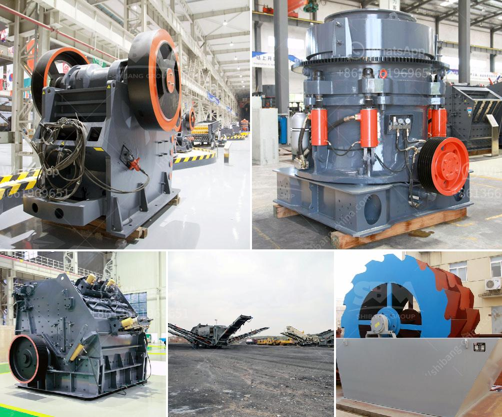

<h3>How to manage and run a crushing plant?</h3>
A crushing plant is a necessary part of every construction project. These plants are responsible for breaking down larger rocks into smaller, more manageable sizes for construction purposes. In order to successfully run a crushing plant, there are various factors that need to be considered. Here are some important tips on how to manage and run a crushing plant:

1. Understand the Purpose: Before starting any crushing plant operations, it is crucial to clearly understand the purpose for which the plant is being set up. Are you breaking down rocks for road construction, creating gravel for concrete production, or mining for valuable minerals? This knowledge will help in determining the type of equipment and machinery required for the plant's efficient operation.

2. Plan Properly: Planning is a critical aspect of managing a crushing plant. Create a detailed layout plan and establish a clear production goal. Identify the specific quantity and quality of the crushed products needed. Determine the required production capacity and set realistic targets for meeting these goals. This will help in optimizing the use of resources and maximizing productivity.

3. Choose the Right Equipment: Investing in the right equipment is essential for running a crushing plant effectively. Consider factors such as the type of rocks being processed, desired end products, and the scale of the operation. Ensure you have crushers, screens, feeders, conveyors, and other types of equipment that suit your specific needs. Regularly maintain and upgrade your equipment to keep it in optimal condition.

4. Train and Empower Your Team: A well-trained and motivated workforce is crucial for the smooth functioning of a crushing plant. Provide comprehensive training programs to your employees to enhance their skills and knowledge about plant operations, safety protocols, and troubleshooting techniques. Encourage teamwork and empower your team members to take ownership of their responsibilities. This will create a positive work culture and improve overall plant efficiency.

5. Prioritize Safety: Safety should always be a top priority in any crushing plant operation. Ensure that all employees and visitors adhere to safety guidelines and wear the necessary personal protective equipment. Regularly inspect and maintain equipment to prevent accidents or malfunctions. Conduct safety audits and stay updated with industry safety standards. Provide training on emergency protocols and establish a culture of safety consciousness among your team.

6. Monitor Efficiency and Quality: Keep a close eye on the plant's efficiency and the quality of the crushed products. Install intelligent monitoring systems and utilize data analytics to collect real-time information regarding production rates, energy utilization, and equipment performance. Proactively address any inefficiencies or quality issues to maintain the desired level of productivity.

Running a crushing plant requires careful planning, proper training, and a diligent approach to safety. By following these tips, you can effectively manage and run a crushing plant, ensuring the production of high-quality materials while maintaining the safety and well-being of your team.
<h3>Contact us</h3><ul><li><strong>Whatsapp:&nbsp;<a href="https://wa.me/8613661969651">+8613661969651</a></strong></li><li><a href="https://swt.shibang-china.com/?git&amp;zhl&amp;How to manage and run a crushing plant"><strong>Online Service(chat now)</strong></a></li></ul><h3>Related</h3><ul><li><a href='How to improve the output of stone crusher .md'>How to improve the output of stone crusher ?</a></li><li><a href='how to size a limestone screen？.md'>how to size a limestone screen？</a></li><li><a href='How to build a small cement plant ？.md'>How to build a small cement plant ？</a></li><li><a href='How to operate aggregate crushing plant.md'>How to operate aggregate crushing plant?</a></li><li><a href='How to increase productivity in ball mill.md'>How to increase productivity in ball mill?</a></li></ul>