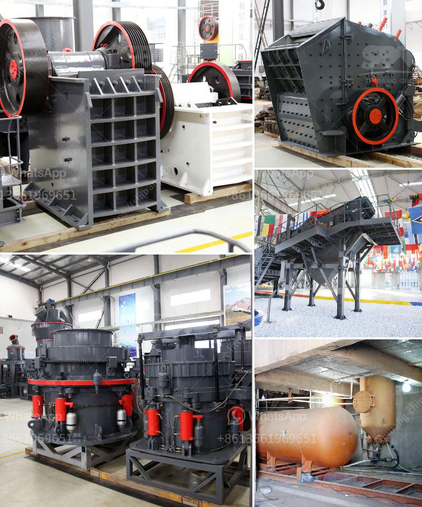

<h3>How to manufacture cement plant ball mill in Kenya?</h3>
The demand for cement in Kenya is constantly growing due to the rapid development in the construction industry. As a result, there is a need for cement plants to provide high-quality cement for various projects. One of the key equipment in the cement production line is the ball mill.

Cement plant ball mills are used to grind various materials into fine powder, ensuring a consistent and high-quality product. The equipment is designed for long-term operation and requires regular maintenance and repair to ensure its efficiency.

1. Obtain the necessary materials: The raw materials needed for manufacturing cement are limestone, clay, iron ore, and gypsum. These materials are extracted from quarries and mines and then transported to the cement plant.

2. Crushing and grinding: The raw materials are crushed and ground into a fine powder. Limestone and clay are crushed separately and mixed with water to form slurry. The slurry is then fed into a ball mill, where it is ground to a fine consistency.

3. Mixing and homogenizing: After grinding, the raw materials are mixed and homogenized to ensure a consistent composition. This is done in a blending silo, which is equipped with mechanical compressors to achieve thorough blending.

4. Heating and clinker formation: The blended raw materials are then heated in a rotary kiln to a temperature of around 1,500 degrees Celsius. This process, known as calcination, causes chemical reactions that result in the formation of clinker.

5. Grinding the clinker: The clinker is cooled and then ground into a fine powder in a cement mill. The ball mill is the most commonly used grinding equipment in the cement industry.

6. Packing and shipping: The final product, cement, is packed in bags or bulk and then transported to various construction sites for use.

To ensure the efficient operation of a cement plant ball mill in Kenya, regular maintenance and repair are essential. This includes checking the oil levels, inspecting the gearbox, and lubricating the bearings. It is also important to clean the equipment regularly to prevent dust buildup, which can affect the performance and lifespan of the mill.

In conclusion, manufacturing a cement plant ball mill in Kenya requires several steps, from obtaining the raw materials to the final production and shipment. Regular maintenance and repair are crucial to ensure the mill's efficiency and longevity. With proper operation and maintenance, a cement plant ball mill can provide high-quality cement for construction projects in Kenya.
<h3>Contact us</h3><ul><li><strong>Whatsapp:&nbsp;<a href="https://wa.me/8613661969651">+8613661969651</a></strong></li><li><a href="https://swt.shibang-china.com/?git&amp;zhl&amp;How to manufacture cement plant ball mill in Kenya"><strong>Online Service(chat now)</strong></a></li></ul><h3>Related</h3><ul><li><a href='How to install a cone crusher.md'>How to install a cone crusher?</a></li><li><a href='How to crush metallurgical coke.md'>How to crush metallurgical coke?</a></li><li><a href='How to remove calcium oxide from manganese ore.md'>How to remove calcium oxide from manganese ore?</a></li><li><a href='How to select crushing equipment.md'>How to select crushing equipment?</a></li><li><a href='how a cone crusher works .md'>how a cone crusher works ?</a></li></ul>