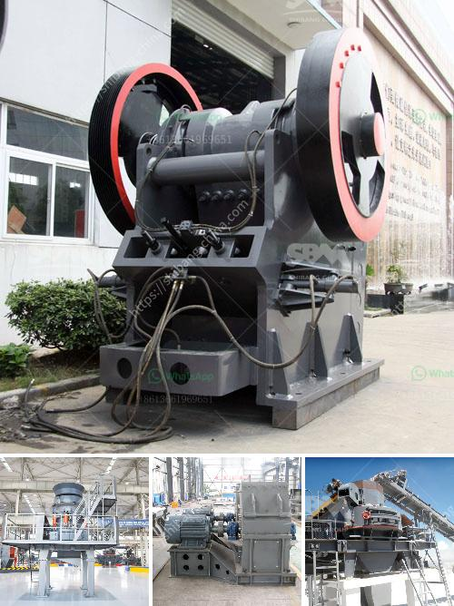

<h3>How to manufacture marble powder with a mesh size of 1000?</h3>
Marble powder is a versatile material that can be used in various industries, including construction, cosmetics, and art. It is derived from marble, a metamorphic rock that is known for its durability and aesthetic appeal. Manufacturing marble powder with a mesh size of 1000 requires careful processing and grinding techniques to ensure the desired particle size and quality. In this article, we will explore the steps involved in manufacturing marble powder of the specified mesh size.

1. Source high-quality marble: The first step in manufacturing marble powder is to select the appropriate marble stones. The quality of the marble directly affects the quality of the powder. Look for marble stones that are free from impurities and have a consistent color and texture. It is preferable to choose marble stones with a higher calcium carbonate content as they produce a finer powder.

2. Marble cutting and formation: Once you have selected the marble stones, they need to be cut into manageable sizes for further processing. Use diamond blades or other specialized cutting tools to ensure clean and precise cuts. The cut marble pieces are then shaped into small, uniform blocks or slabs, depending on the machinery available.

3. Grinding and crushing: To manufacture marble powder with a mesh size of 1000, the marble blocks or slabs need to undergo a grinding process. Initially, larger pieces of marble are crushed using a jaw crusher or similar crushing equipment. This helps reduce the size of the marble into more manageable chunks.

4. Milling and grinding: The crushed marble pieces are then fed into a mill or grinder with high-speed rotating blades. The blades grind and pulverize the marble into a fine powder. Care should be taken to maintain the temperature and moisture levels during this process to ensure the quality of the final product.

5. Sieving and meshing: After the grinding process, the marble powder needs to be sieved to achieve the desired mesh size. A mesh size of 1000 indicates that the powder particles should pass through a sieve with 1000 openings per square inch. This helps ensure uniformity in the particle size distribution of the marble powder. Different types of sieves or mesh screens are used for this purpose and can be adjusted according to the desired mesh size.

6. Packaging and storage: Once the marble powder has been sieved to achieve the desired mesh size, it is packaged in suitable containers. Proper packaging helps protect the powder from moisture and external contaminants. Store the packaged marble powder in a dry and cool environment to maintain its quality and extend its shelf life.

In conclusion, manufacturing marble powder with a mesh size of 1000 involves careful sourcing of high-quality marble, cutting and crushing it into smaller pieces, followed by grinding, sieving, and packaging the final product. Each step of the process requires precision and attention to detail to ensure the desired mesh size and quality. By following these processes diligently, manufacturers can produce consistent and high-quality marble powder for various applications.
<h3>Contact us</h3><ul><li><strong>Whatsapp:&nbsp;<a href="https://wa.me/8613661969651">+8613661969651</a></strong></li><li><a href="https://swt.shibang-china.com/?git&amp;zhl&amp;How to manufacture marble powder with a mesh size of 1000"><strong>Online Service(chat now)</strong></a></li></ul><h3>Related</h3><ul><li><a href='How is manganese extracted.md'>How is manganese extracted?</a></li><li><a href='How to set up concrete batching plant malaysia .md'>How to set up concrete batching plant malaysia ?</a></li><li><a href='how to build stone crushing machine .md'>how to build stone crushing machine ?</a></li><li><a href='How to calculate the running cost of a crusher.md'>How to calculate the running cost of a crusher?</a></li><li><a href='How to control vibrating screen .md'>How to control vibrating screen ?</a></li></ul>