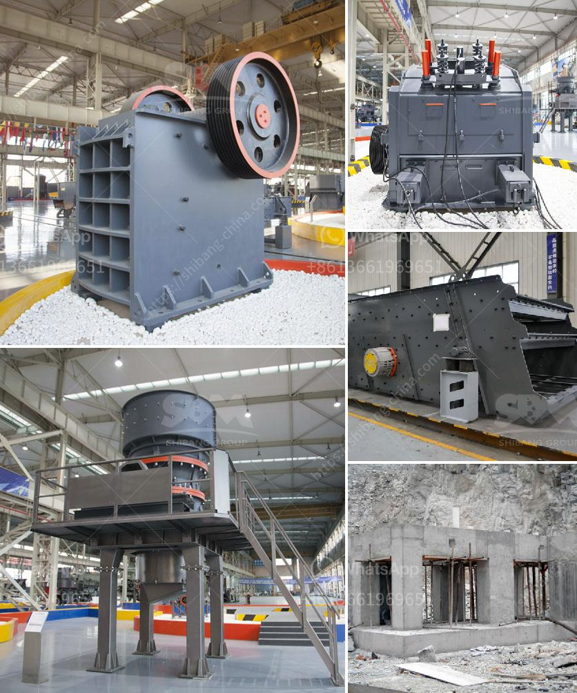

<h3>How to measure the jaw crusher bearing temperature?</h3>
A jaw crusher is a commonly used crushing equipment in the mining industry. It plays an important role in the ore processing line and the continuous operation of the jaw crusher directly affects the production efficiency. Therefore, it is necessary to correctly determine and control the bearing temperature of the jaw crusher.

The bearing temperature plays an important role in the operation of the equipment. Excessive bearing temperature will lead to frequent equipment failures, affecting the production efficiency of the jaw crusher. Therefore, it is necessary to measure the bearing temperature of the jaw crusher accurately and take necessary measures to control it.

The most direct and common method to measure the bearing temperature is by using a thermometer. Place the thermometer in contact with the bearing surface and wait for a few seconds until the temperature stabilizes. Be careful not to touch the rotating parts to avoid accidents.

An infrared thermometer is a non-contact temperature measuring device. It uses the infrared radiation emitted by the object to measure its temperature. It is an accurate and efficient method to measure the bearing temperature of the jaw crusher. Simply point the infrared thermometer towards the bearing surface, and you can get an accurate reading.

A thermal imaging camera is an advanced temperature measuring tool that uses infrared technology to capture and record thermal images. It can quickly and accurately display the temperature distribution of the equipment, including the jaw crusher bearings. By analyzing the temperature distribution, you can identify abnormal heat sources and take appropriate actions.

It is essential to regularly measure the bearing temperature during the operation of the jaw crusher. To ensure accurate and reliable temperature measurements, it is recommended to follow these guidelines:

Jaw crushers have multiple bearings that can generate different temperatures. Therefore, it is important to measure the temperature at multiple points to ensure accuracy. Measure the temperature at both the inlet and outlet bearings, as well as other critical points.

Measure the bearing temperature when the jaw crusher is in normal operation to obtain a true representation of the temperature. Avoid measuring immediately after startup or shutdown when the temperature may fluctuate due to thermal inertia.

Each type of bearing has a specified operating temperature range. Compare the measured temperature with the recommended operating temperature range provided by the bearing manufacturer. If the temperature exceeds the range, it indicates a potential problem that requires attention.

If the measured bearing temperature exceeds the recommended operating range, take appropriate measures to control it. Common solutions include checking lubrication, inspecting for bearing damage or wear, adjusting the jaw crusher operation parameters, and consulting with maintenance professionals if needed.

In conclusion, measuring the jaw crusher bearing temperature accurately is crucial to ensure the smooth operation and production efficiency of the equipment. By following the methods mentioned above and taking necessary actions, operators can effectively monitor and control the bearing temperature, preventing potential failures and optimizing the jaw crusher's performance.
<h3>Contact us</h3><ul><li><strong>Whatsapp:&nbsp;<a href="https://wa.me/8613661969651">+8613661969651</a></strong></li><li><a href="https://swt.shibang-china.com/?git&amp;zhl&amp;How to measure the jaw crusher bearing temperature"><strong>Online Service(chat now)</strong></a></li></ul><h3>Related</h3><ul><li><a href='How to maintain a stone crusher machine.md'>How to maintain a stone crusher machine?</a></li><li><a href='How to adjust rotary kiln support rollers.md'>How to adjust rotary kiln support rollers?</a></li><li><a href='How to select a reversible hammer crusher as a coal crusher.md'>How to select a reversible hammer crusher as a coal crusher?</a></li><li><a href='how to give a seminar on jaw crusher .md'>how to give a seminar on jaw crusher ?</a></li><li><a href='How to construct a ramp for a granite crushing plant.md'>How to construct a ramp for a granite crushing plant?</a></li></ul>