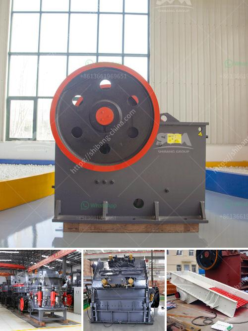

<h3>How to measure the theoretical output of a jaw crusher ?</h3>
A jaw crusher is a commonly used crushing device that can be found in various mining and construction industries. It operates by using compressive force to crush materials between a stationary jaw plate and a moving jaw plate. When the moving jaw plate moves away from the stationary jaw plate, the crushed material is discharged from the jaw crusher. This process continues until the material is small enough to pass through the gap between the two jaws.

Measuring the theoretical output of a jaw crusher involves determining the maximum particle size that can be achieved with the given material and operating parameters. It is important to note that while there are many factors that can affect the theoretical output of a jaw crusher, such as the hardness of the material, the feed size, the closed side setting (CSS), and the eccentric throw, this article will focus on the basic principles of measurement.

The first step in measuring the theoretical output of a jaw crusher is to determine the CSS, which is the minimum distance between the two jaws at the top of the crushing chamber. This distance is important because it determines the maximum size of the material that can be fed into the crusher. To measure the CSS, a lead ball or steel rod is placed between the two jaws, and the crusher is closed until the ball or rod is compressed to a certain size. The distance between the two jaws at this point is the CSS.

Once the CSS is determined, the next step is to measure the maximum feed size, which is the largest size of the material that can be effectively fed into the crusher. This can be done by measuring the width and height of the material using a ruler or a tape measure.

With the CSS and maximum feed size determined, the next step is to calculate the theoretical output of the jaw crusher. This can be done using the following formula:

It is important to note that the theoretical output is just an estimate and may not represent the actual output of the jaw crusher. Other factors, such as the type of material being crushed, the shape of the crushing chamber, and the efficiency of the jaw crusher, can also affect the actual output.

In conclusion, measuring the theoretical output of a jaw crusher involves measuring the CSS and maximum feed size and using these values to calculate the theoretical output. While this is a useful tool in predicting the performance of a jaw crusher, it is important to remember that other factors can also affect the actual output. Therefore, it is always recommended to conduct real-world tests to determine the actual output of a jaw crusher in a specific application.
<h3>Contact us</h3><ul><li><strong>Whatsapp:&nbsp;<a href="https://wa.me/8613661969651">+8613661969651</a></strong></li><li><a href="https://swt.shibang-china.com/?git&amp;zhl&amp;How to measure the theoretical output of a jaw crusher "><strong>Online Service(chat now)</strong></a></li></ul><h3>Related</h3><ul><li><a href='How to crush small gravel into sand.md'>How to crush small gravel into sand?</a></li><li><a href='How to Build a Granite Jaw Crusher in South Africa ？.md'>How to Build a Granite Jaw Crusher in South Africa ？</a></li><li><a href='How to crush lumps of coal.md'>How to crush lumps of coal?</a></li><li><a href='How to build a ball mill.md'>How to build a ball mill?</a></li><li><a href='How does a coal crusher work.md'>How does a coal crusher work?</a></li></ul>