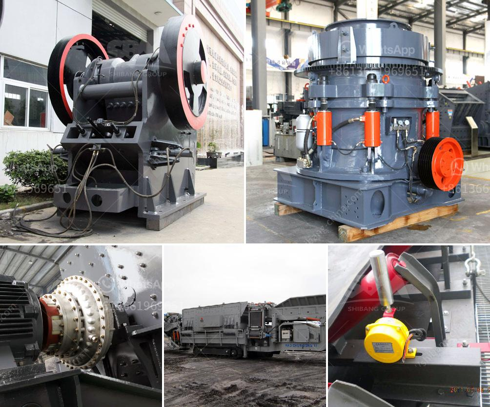

<h3>How to motorize a small conveyor belt ?</h3>
Conveyor belts are widely used in various industries for transporting goods and materials efficiently. While there are many ready-made conveyor systems available in the market, they can be quite expensive. If you have a small-scale project or workshop and require a conveyor belt without breaking the bank, you can consider motorizing a small conveyor belt yourself. This article will guide you through the process of motorizing a small conveyor belt.

1. Determine the specifications: Begin by determining the specifications of the conveyor belt that suits your needs. Consider the length, width, and material handling capacity required for your application. This will help you in selecting a suitable motor and other required components.

2. Select the motor: The heart of your motorized conveyor belt is the motor. Choose a motor that is compatible with the power supply available in your workshop. Consider the speed and torque requirements of your belt to select an appropriately sized motor. Electric motors are commonly used, but you can also explore other motor types based on your needs.

3. Obtain the necessary components: Once you have selected a motor, gather the necessary components to assemble your conveyor. You will need a motor mounting bracket, pulley, belt, belt frame or conveyor bed, and supporting rollers or stands.

4. Assemble the frame and rollers: Start by assembling the frame for your conveyor belt. Weld or attach the frame's pieces together to form the desired size and shape. Once the frame is complete, attach the supporting rollers or stands to ensure the belt's stability and smooth movement.

5. Mount the motor and pulley: Attach the motor mounting bracket to the conveyor frame, ensuring it is securely fastened. Then, mount the motor to the bracket and install a pulley on the motor's shaft. Ensure the pulley is properly aligned with the driven pulley on the conveyor belt.

6. Install the belt: Place the belt on the conveyor bed or frame, aligning it with the pulleys. Adjust the tension of the belt by moving the motor or adjusting the position of the supporting rollers or stands. Make sure the belt is not too loose or too tight, as it may affect the efficiency and lifespan of the conveyor.

7. Power up and test: Connect the motor to the power supply and make sure all the components are properly wired and grounded. Pay close attention to safety precautions to avoid any accidents. Once everything is set up, power up the motor and observe the conveyor belt's movement. Adjust the tension and alignment if necessary.

8. Maintain and troubleshoot: Regularly inspect and maintain your motorized conveyor belt to ensure its smooth operation. Lubricate the moving parts, check for any signs of wear and tear, and address any issues promptly. Troubleshoot any abnormalities or malfunctions to keep your conveyor running efficiently.

By following these steps and taking the necessary precautions, you can successfully motorize a small conveyor belt for your project or workshop. Remember to prioritize safety, and do not hesitate to seek professional assistance if needed. With the right setup, a motorized conveyor belt can greatly enhance your productivity and simplify your material handling tasks.
<h3>Contact us</h3><ul><li><strong>Whatsapp:&nbsp;<a href="https://wa.me/8613661969651">+8613661969651</a></strong></li><li><a href="https://swt.shibang-china.com/?git&amp;zhl&amp;How to motorize a small conveyor belt "><strong>Online Service(chat now)</strong></a></li></ul><h3>Related</h3><ul><li><a href='how do you process of gold in south africa.md'>how do you process of gold in south africa</a></li><li><a href='How to install a jaw crusher.md'>How to install a jaw crusher?</a></li><li><a href='How to Make Plaster of Phosphogypsum.md'>How to Make Plaster of Phosphogypsum</a></li><li><a href='How to manufacture artificial sand.md'>How to manufacture artificial sand?</a></li><li><a href='How to choose the useful sand making machine.md'>How to choose the useful sand making machine?</a></li></ul>