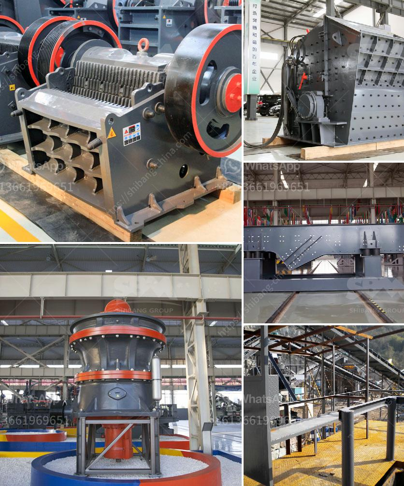

<h3>How to move a mobile screen crusher?</h3>
Mobile screen crushers are increasingly becoming popular in the construction industry due to their versatility and efficiency. These machines are designed to process a variety of materials, such as stones, rocks, and concrete, into reusable aggregates. They are also highly mobile, allowing contractors to easily move them from one location to another.

Moving a mobile screen crusher may seem like a daunting task, but with careful planning and the right equipment, it can be done efficiently and safely. Here are some essential steps to consider when moving a mobile screen crusher:

1. Conduct a thorough inspection: Before moving the crusher, thoroughly inspect the machine to ensure it is in good working condition. Check for any mechanical or electrical issues that may need to be addressed before transportation.

2. Secure the crusher for transportation: Ensure that the crusher is securely fastened to the trailer or vehicle that will be used for transportation. This can be done by using heavy-duty straps, chains, or other securement devices. It is essential to follow the manufacturer's guidelines on how to properly secure the crusher to avoid any accidents or damages during transportation.

3. Disconnect all utilities: Before moving the crusher, disconnect all utilities such as electricity, water, and hydraulic lines. This will prevent any damage to these systems and ensure a smoother relocation process.

4. Prepare the transportation route: Plan the transportation route in advance, making sure to consider any potential obstacles such as low bridges, narrow roads, or weight restrictions. It is important to obtain the necessary permits and adhere to local regulations regarding the transportation of heavy equipment.

5. Use the right transportation equipment: Moving a mobile screen crusher requires the use of appropriate transportation equipment. Depending on the size and weight of the crusher, a flatbed trailer or low-loader trailer may be required. Ensure that the transportation equipment is in good condition and capable of safely carrying the crusher to its new location.

6. Hire professional movers: If you are unfamiliar with the process of moving heavy equipment, it is recommended to hire professional movers who specialize in handling and transporting such machinery. These experts will have the necessary experience, skills, and equipment to ensure a smooth and safe relocation process.

7. Follow safety guidelines: Always prioritize safety when moving a mobile screen crusher. Make sure that all personnel involved in the process are trained on proper lifting techniques and wearing the appropriate personal protective equipment. It is also crucial to adhere to all safety regulations and guidelines set forth by the local authorities.

In conclusion, moving a mobile screen crusher requires careful planning, thorough inspection, and the use of appropriate equipment. By following these essential steps and prioritizing safety, contractors can ensure a successful and efficient relocation process for their mobile screen crushers, ultimately contributing to increased productivity and profitability in the construction industry.
<h3>Contact us</h3><ul><li><strong>Whatsapp:&nbsp;<a href="https://wa.me/8613661969651">+8613661969651</a></strong></li><li><a href="https://swt.shibang-china.com/?git&amp;zhl&amp;How to move a mobile screen crusher"><strong>Online Service(chat now)</strong></a></li></ul><h3>Related</h3><ul><li><a href='How to make quartz powder grinding mill in Kenya ？.md'>How to make quartz powder grinding mill in Kenya ？</a></li><li><a href='How can we improve cement mill production.md'>How can we improve cement mill production?</a></li><li><a href='How to extend the working life of a jaw crushing plate.md'>How to extend the working life of a jaw crushing plate?</a></li><li><a href='how to set up stone crusher unit ？.md'>how to set up stone crusher unit ？</a></li><li><a href='How to make railway ballast stones.md'>How to make railway ballast stones?</a></li></ul>