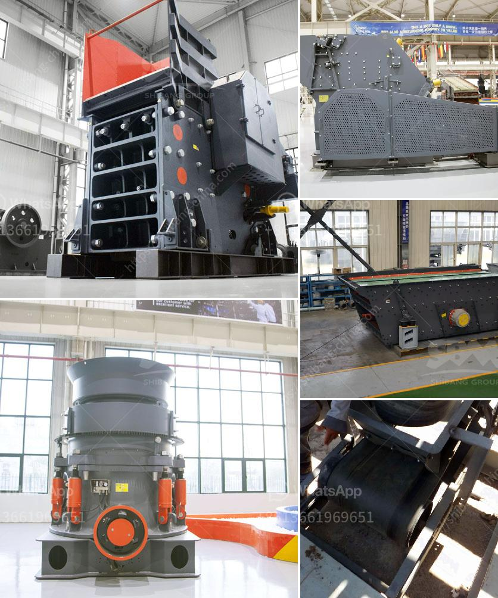

<h3>How to open a crusher plant in Fujairah?</h3>
Fujairah, located on the eastern coast of the United Arab Emirates, is a thriving region with vast industrial potential. Opening a crusher plant in Fujairah can be a beneficial venture for entrepreneurs looking to capitalize on the growing demand for construction materials in the area. In this article, we will explore the necessary steps and considerations for setting up a crusher plant in Fujairah.

1. Conduct thorough market research: Before diving into the process of opening a crusher plant, it is essential to conduct comprehensive market research. Understanding the current and future demand for construction materials in Fujairah will help you assess the feasibility and profitability of your business venture.

2. Identify suitable locations: Fujairah offers several prime locations for setting up a crusher plant. Consider factors such as proximity to raw material sources, access to transportation networks, and availability of utilities when selecting the ideal location for your plant.

3. Obtain necessary permits and licenses: Like any other business, opening a crusher plant in Fujairah requires obtaining the necessary permits and licenses from the relevant government authorities. This typically includes obtaining a trade license, environmental permits, and health and safety certifications.

4. Secure sufficient funding: Starting a crusher plant involves significant capital investment. It is crucial to secure sufficient funding to cover the costs of land acquisition, machinery procurement, labor expenses, and initial working capital. Explore the possibility of accessing loans or partnerships to ensure adequate financial support for your project.

5. Develop a comprehensive business plan: A well-structured business plan is vital for the success of your crusher plant. It should outline your production capacity, marketing strategy, target customers, and financial projections. A meticulously prepared business plan will not only serve as a roadmap for your operations but can also be valuable for securing financing and attracting potential investors.

6. Procure necessary equipment and machinery: A crusher plant requires various types of machinery and equipment for efficient operation. Identify reliable suppliers and manufacturers who can provide high-quality crushers, conveyors, screens, and other necessary components. Pay attention to factors such as durability, efficiency, and maintenance requirements when selecting your equipment.

7. Recruit skilled labor: To ensure smooth plant operations, it is crucial to hire skilled and experienced personnel. From plant operators to maintenance staff, assembling a competent team is critical. Invest in proper training and safety protocols to enhance productivity and mitigate risks.

8. Develop a marketing strategy: Effective marketing is the key to establishing a strong presence in the construction material market in Fujairah. Develop a marketing plan that includes online and offline promotion, participation in industry events, and building relationships with key stakeholders like contractors and developers.

9. Ensure compliance with environmental regulations: Crusher plants must operate in an environmentally responsible manner. Implement measures to minimize dust, noise, and pollution from your plant. Regularly monitor and evaluate your environmental impact, adopt sustainable practices, and fulfill reporting requirements set by local regulatory authorities.

10. Establish strong partnerships: Building strong relationships with suppliers, contractors, and other industry players is crucial for the long-term success of your crusher plant. Collaborate with construction companies, developers, and government agencies to secure consistent demand and explore mutually beneficial opportunities.

Opening a crusher plant in Fujairah offers exciting prospects in a rapidly growing market. By following these steps and conducting thorough research, you can set the foundation for a successful venture that contributes to the region's construction industry and overall economic development.
<h3>Contact us</h3><ul><li><strong>Whatsapp:&nbsp;<a href="https://wa.me/8613661969651">+8613661969651</a></strong></li><li><a href="https://swt.shibang-china.com/?git&amp;zhl&amp;How to open a crusher plant in Fujairah"><strong>Online Service(chat now)</strong></a></li></ul><h3>Related</h3><ul><li><a href='How to operate a ore ball mill normally.md'>How to operate a ore ball mill normally?</a></li><li><a href='How to choose a stone crusher station .md'>How to choose a stone crusher station ?</a></li><li><a href='How to maintain vertical raw mill in cement plant.md'>How to maintain vertical raw mill in cement plant?</a></li><li><a href='how to choose a portable crusher plant ？.md'>how to choose a portable crusher plant ？</a></li><li><a href='How can I start a business with quarry stone in Malaysia.md'>How can I start a business with quarry stone in Malaysia?</a></li></ul>