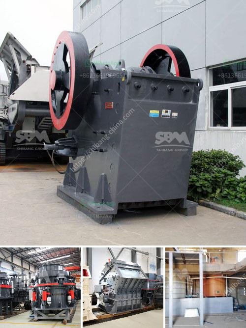

<h3>How to operate a coal crusher machine?</h3>
Coal crusher, also known as double stage crusher, is a highly efficient crushing equipment. It is a new type of equipment developed for the coal industry, and it mainly crushes high moisture coal. Besides, it is mainly used to crush coal cinder, slag, shale, coal gangue, and other materials. And it can be applied to building material, highway, railway, mining and other industries.

This article will introduce the main working principle of the coal crusher machine, as well as the types of coal crushers that can be used in the process of coal crushing.

The main working principle of the coal crusher machine is divided into three steps: crushing, grinding, and drying. In the crushing process, the coal crusher machine plays an important role in the coal industry. The coal crusher machine manufactured by Liming Heavy Industry is suitable for coal gangue, pebble, limestone, and other crushing materials. Mainly used for thermal power plants, coal handling system feed chute, and coal screening system discharge chute.

The coal crusher machine can be used in power generation, coal mining, metallurgy, chemical industry, building materials, and other industries. It is suitable for crushing coal cinder, slag, shale, coal gangue, and other materials. Due to the high moisture content of materials, the coal crusher machine is widely used in the coal industry. At present, the coal crusher machine has achieved great success in the coal industry.

The coal crusher machine is mainly used in coal mining in the pre-processing step of coal. Coal crusher machine is a machine crushing coal which is unprocessed after being extracted from mine. Coal crusher machine is a type crusher of ore crushing equipment used for crushing coal. Coal crusher machine is acknowledged well in coal processing industry for a long time. It is used widely in coal mining and coal processing because of its advantages.

In the coal crushing plant, coal crushing can resize the coal stone so that it can be easily handled and processed. For the Mosh hardness of coal is usually under 5, the miners can use jaw crusher, impact crusher, hammer crusher, etc. to handle it. After the coal has been crushed, we need vibrating screen to grade the coal by size and then transport the coal via belt conveyor. In this process, dewatering screen is optional to remove water from the product.

Coal crusher machine is effective in crushing coal, however, the process of drying coal is usually inefficient if being done separately. Therefore, manufacturers need to improve the drying efficiency of coal crusher machine to improve their economic benefits. Liming Heavy Industry has developed a new type of coal crusher machine, which can achieve the goal of drying and crushing materials simultaneously. The equipment is equipped with hot gas system, which can eliminate the need for external drying equipment and reduce the investment cost.

In conclusion, operating a coal crusher machine is not difficult. If you have any question or need further information or coal crusher machine price, please feel free to contact us at any time.
<h3>Contact us</h3><ul><li><strong>Whatsapp:&nbsp;<a href="https://wa.me/8613661969651">+8613661969651</a></strong></li><li><a href="https://swt.shibang-china.com/?git&amp;zhl&amp;How to operate a coal crusher machine"><strong>Online Service(chat now)</strong></a></li></ul><h3>Related</h3><ul><li><a href='How to set up a crushing production line station ？.md'>How to set up a crushing production line station ？</a></li><li><a href='How to select a Highquality sand making machine.md'>How to select a High-quality sand making machine?</a></li><li><a href='How to Install a crusher equipment ？.md'>How to Install a crusher equipment ？</a></li><li><a href='How to install a sand making machine.md'>How to install a sand making machine?</a></li><li><a href='How to install a gyratory crusher 7 steps are critical.md'>How to install a gyratory crusher? 7 steps are critical</a></li></ul>