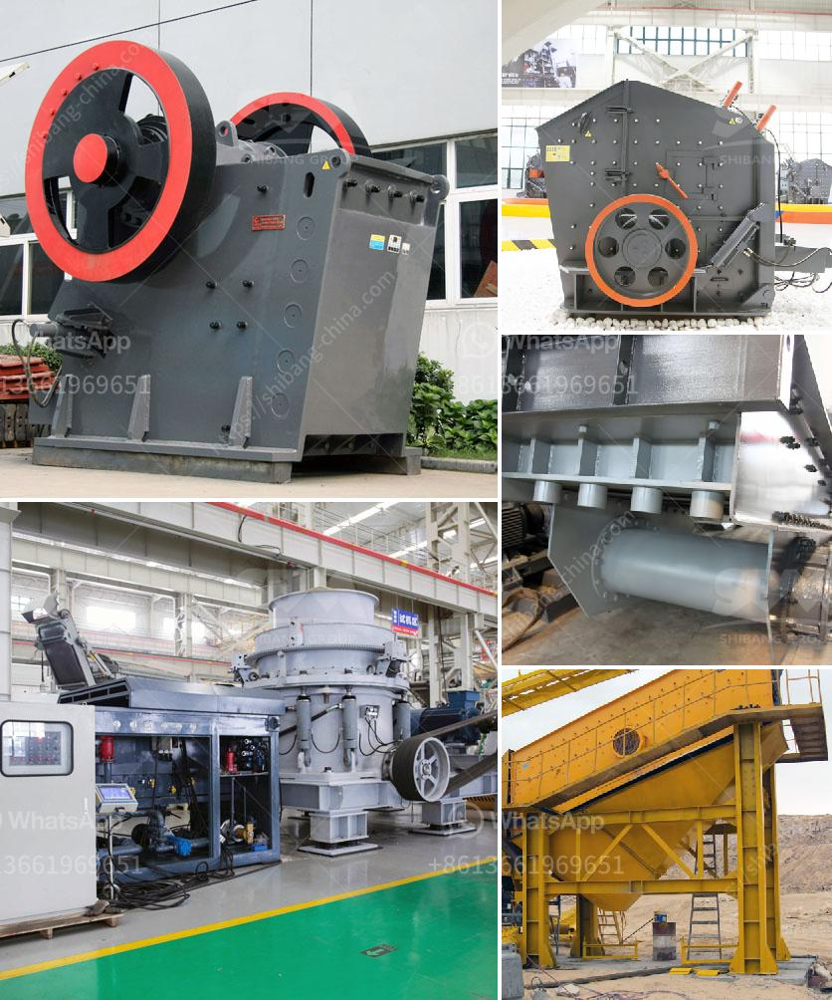

<h3>How to operate a ore ball mill normally?</h3>
An ore ball mill is a crucial piece of equipment in mineral processing plants, where grinding is performed to prepare the ore for subsequent concentration or metallurgical processes. Operating such mills is more than just throwing in ores and balls – it requires precision, technical expertise, and a good understanding of mill dynamics. In this article, we will discuss the important steps to operate an ore ball mill normally to optimize productivity and ensure optimal performance.

Before operating the ore ball mill, it is essential to perform a thorough inspection of the mill components. Look for any signs of wear or damage to ensure safe and efficient operation. Examine the shell liners, trunnion bearings, and gear alignment.

The mill's performance greatly depends on the proper loading of grinding media (balls) and ores. The optimal ball-to-ore ratio should strike a balance between maximizing grinding effectiveness and preventing excessive wear of the mill liners. Improper ball loading can lead to reduced efficiency and increased energy consumption.

Commence by engaging the clutch or starting the synchronous motor gradually to minimize mechanical stress and avoid sudden impact loads on the drive system. Ensure that all lubrication systems are operational, and the mill is adequately supplied with cooling water to prevent overheating.

Keep a constant watch on the mill operation to detect any abnormal changes in vibrations, temperatures, or power consumption. Such indications can alert operators to potential issues like ball overloading, excessive feed, or liner damage. Regularly measure and record these parameters to evaluate mill performance and make necessary adjustments.

Maintaining a consistent and optimal feed rate is crucial for efficient operation. Too high or too low feed rates can negatively impact both grinding performance and mill internals' wear. Adjust the feed rate depending on the ore properties and desired grind size while maintaining a stable mill load.

Controlling the material flow within the mill circuit is essential for maintaining optimal performance. Ensure a balanced hydrocyclone feed density, adjust water addition and reagent dosage, and monitor the particle size distribution of the grinding circuit to maximize recovery and minimize overgrinding.

Regular maintenance is vital for the long-term performance and reliability of the ore ball mill. Follow maintenance schedules for trunnion and pinion bearing lubrication, gear inspections, and mill liner replacements. Promptly address any worn or damaged parts to prevent costly downtime and major repairs.

Always prioritize safety during mill operation. Adhere to the required safety guidelines, wear appropriate personal protective equipment, and never skip or bypass any safety devices. Regularly inspect and maintain safety guards, emergency stops, and warning signage.

In conclusion, operating an ore ball mill normally requires careful attention to various aspects of maintenance, loading, and control. Following the proper procedures, regularly monitoring mill conditions, and optimizing grinding circuit parameters will ensure smooth and efficient operation, leading to improved overall plant performance and ore recovery.
<h3>Contact us</h3><ul><li><strong>Whatsapp:&nbsp;<a href="https://wa.me/8613661969651">+8613661969651</a></strong></li><li><a href="https://swt.shibang-china.com/?git&amp;zhl&amp;How to operate a ore ball mill normally"><strong>Online Service(chat now)</strong></a></li></ul><h3>Related</h3><ul><li><a href='How to install a gyratory crusher 7 steps are critical.md'>How to install a gyratory crusher? 7 steps are critical</a></li><li><a href='How to extract iron efficiently from silica.md'>How to extract iron efficiently from silica?</a></li><li><a href='How to manufacture marble powder with a mesh size of 1000.md'>How to manufacture marble powder with a mesh size of 1000?</a></li><li><a href='How to collect crusher dust.md'>How to collect crusher dust?</a></li><li><a href='How to Start a Quarry Crushing Plant in Nigeria Need those crushing machines.md'>How to Start a Quarry Crushing Plant in Nigeria? Need those crushing machines?</a></li></ul>