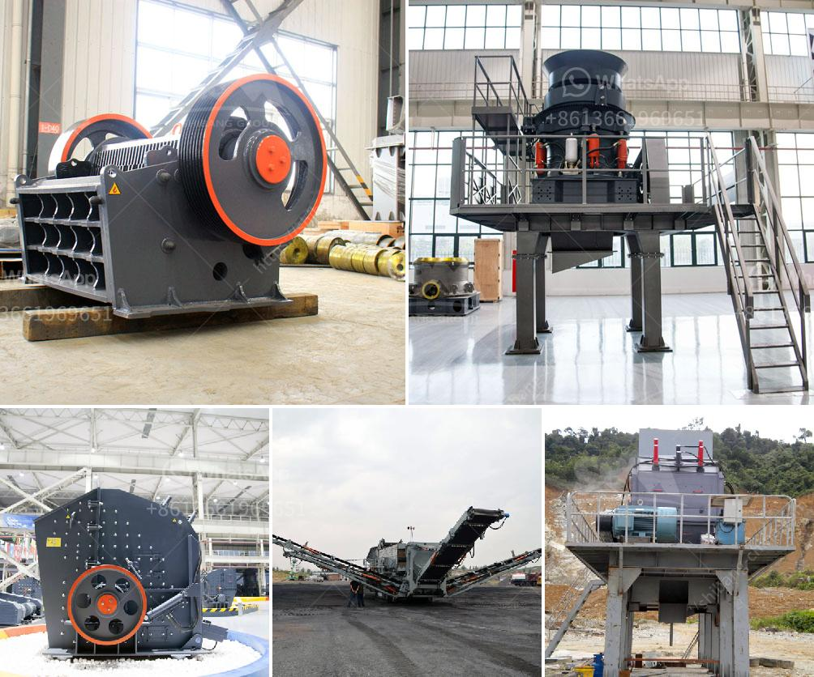

<h3>How to operate a stone crusher?</h3>
Operating a stone crusher is not an easy job to begin with, as there are numerous challenges involved. Operators need extensive training and experience to understand critical aspects of the machinery and ensure their personal safety and the productivity of the stone crusher. If you are interested in operating a stone crusher, keep reading to learn more about the skills and knowledge required.

Firstly, it is essential to understand how a stone crusher operates. All components are important for the smooth functioning of the equipment, but the crusher is the most critical aspect. Understanding how the crusher works, its various settings, and design specifications is necessary to ensure consistent and efficient production.

To operate a stone crusher properly, you must have adequate knowledge of various components and their functions. Certain parts (e.g., jaw plates, blow bars, liners, etc.) need to be replaced periodically. It is important to properly inspect and maintain these components regularly to optimize their performance and avoid unexpected failures. Additionally, a basic understanding of electrical and hydraulic systems is important to troubleshoot any problems that may arise during operation.

Moreover, operating a stone crusher safely is equally important. Safety should always be the top priority, and operators should take appropriate precautions to protect themselves and others around them. Adequate personal protective equipment, including safety glasses, ear protection, and safety gloves, should be worn at all times. Operators should also follow safety guidelines provided by the manufacturer and be familiar with emergency shutdown procedures.

Furthermore, starting and stopping the equipment requires proper procedures. The stone crusher should be started on a surface that is flat and level. This will help ensure that the machine is stable and prevent any sudden movements while it is being started. When stopping the equipment, it is important to shut down the stone crusher in the correct sequence to avoid any potential damage.

Regular maintenance is key to keeping a stone crusher running smoothly and efficiently. Components such as bearings, belts, and fluids should be checked and replaced as required. Lubrication is crucial to ensure that all moving parts operate effectively and to prevent excessive wear. Following the manufacturer's recommended maintenance schedule will help extend the life of the equipment and prevent unexpected breakdowns.

In addition to maintenance, operators should monitor the production output of the stone crusher regularly. Keeping track of the amount of material being crushed and the size of the final product will help identify any issues and allow for necessary adjustments to optimize production efficiency.

Operating a stone crusher requires a combination of skill, knowledge, and experience. It is not a task that can be undertaken lightly or by individuals without the necessary expertise. However, with the proper training and understanding of the machinery, it can be a rewarding job that contributes to the construction industry.
<h3>Contact us</h3><ul><li><strong>Whatsapp:&nbsp;<a href="https://wa.me/8613661969651">+8613661969651</a></strong></li><li><a href="https://swt.shibang-china.com/?git&amp;zhl&amp;How to operate a stone crusher"><strong>Online Service(chat now)</strong></a></li></ul><h3>Related</h3><ul><li><a href='How to extract dust from a ball mill.md'>How to extract dust from a ball mill?</a></li><li><a href='How to change the jaw crusher plates.md'>How to change the jaw crusher plates</a></li><li><a href='Procedures on how to mine nickel ore .md'>Procedures on how to mine nickel ore ?</a></li><li><a href='How to set up a quarry plant.md'>How to set up a quarry plant?</a></li><li><a href='How to select a Highquality sand making machine.md'>How to select a High-quality sand making machine?</a></li></ul>