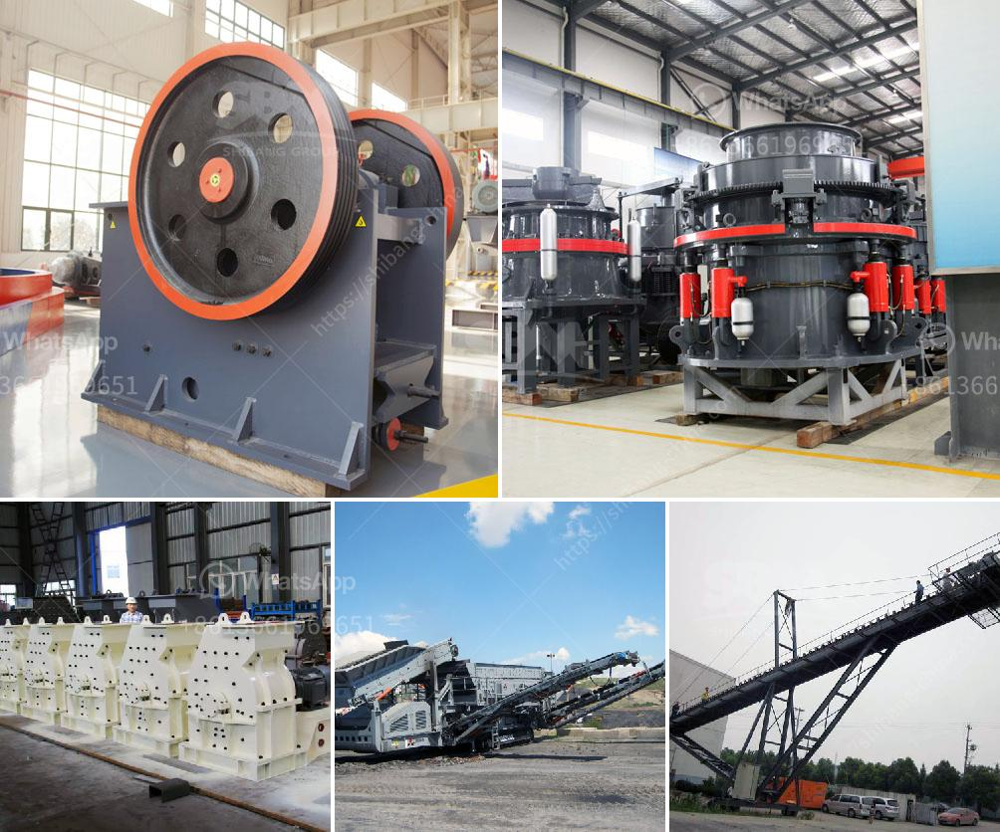

<h3>How to operate a vibrating screen?</h3>
Vibrating screens are an essential tool in many industries, including mineral processing, agriculture, pharmaceutical, food and chemical processing. They are used to separate materials based on their size, shape or composition, ensuring efficient and effective operations.

Operating a vibrating screen may seem daunting at first, but with the right knowledge and understanding, it can be a relatively simple task. This article will guide you on how to operate a vibrating screen effectively and maximise its performance.

Before operating a vibrating screen, it is crucial to understand its components and their functions. A typical vibrating screen consists of a screen deck, a screen frame, a motor, counterweights and springs, and a support structure. Familiarize yourself with these components and their respective functions to ensure smooth operation.

Every vibrating screen comes with a user manual provided by the manufacturer. It contains important information about the screen’s specifications, maintenance requirements, and operating instructions. Take the time to thoroughly read the manual and understand the recommended procedures for startup, operation, and shutdown.

Typically, a vibrating screen has various settings that can be adjusted to optimize its performance. These may include the vibration amplitude, frequency, angle, and screening media tension. Consult the user manual to understand how to modify these settings based on specific materials and desired outcomes.

To ensure the longevity and effectiveness of your vibrating screen, regular maintenance is essential. Key maintenance tasks may include lubricating the motor, inspecting and replacing worn-out components, cleaning the screen deck, and removing any debris or blockages that can affect performance. Follow the manufacturer's maintenance guidelines to keep your screen in optimal condition.

When shutting down the vibrating screen, it is important to follow proper procedures to avoid any damage or safety hazards. Remember to:

Operating a vibrating screen efficiently requires a combination of knowledge, experience, and adherence to proper procedures. By understanding the equipment, following the manufacturer's guidelines, and performing regular maintenance, you can ensure that your vibrating screen functions optimally and maximizes productivity in your industry.
<h3>Contact us</h3><ul><li><strong>Whatsapp:&nbsp;<a href="https://wa.me/8613661969651">+8613661969651</a></strong></li><li><a href="https://swt.shibang-china.com/?git&amp;zhl&amp;How to operate a vibrating screen"><strong>Online Service(chat now)</strong></a></li></ul><h3>Related</h3><ul><li><a href='How to design an iron ore conveyor.md'>How to design an iron ore conveyor?</a></li><li><a href='How to maintain stone crusher equipment.md'>How to maintain stone crusher equipment?</a></li><li><a href='How to replace a broken bearing in a jaw crusher.md'>How to replace a broken bearing in a jaw crusher?</a></li><li><a href='How to disassemble the jaw plate of jaw crusher.md'>How to disassemble the jaw plate of jaw crusher?</a></li><li><a href='how to limit excess fines in crushing .md'>how to limit excess fines in crushing ?</a></li></ul>