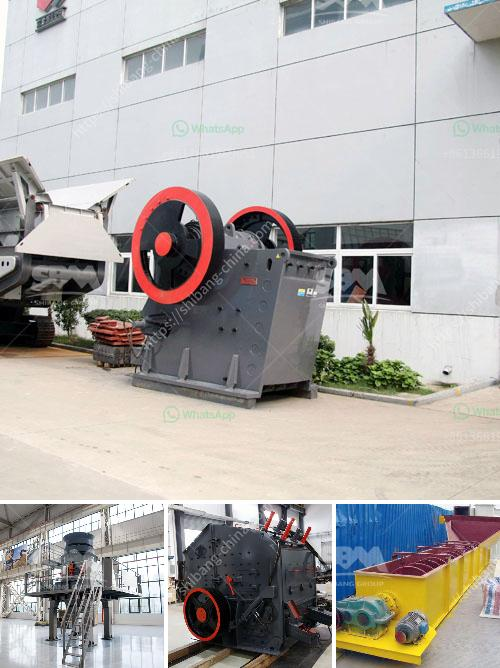

<h3>How to operate aggregate crushing plant?</h3>
Operating a crushing plant is a significant undertaking, as it involves large machinery that can cause significant damage to the surrounding environment. One must take careful steps to ensure that all personnel are protected, and that the plant operates efficiently and effectively. In this article, we will discuss the necessary steps to operate an aggregate crushing plant.

The first step when operating a crushing plant is to ensure that the machine is fully lubricated. This includes all bearings, bolts, and other moving parts. Lubricating the machine not only keeps it running smoothly but also helps to prevent excessive wear and tear, which can lead to costly repairs and downtime.

Next, it is crucial to inspect and clean the crusher regularly. The accumulation of dust and debris can cause the machine to malfunction or become clogged, resulting in reduced productivity. Regular cleaning will prevent such issues and prolong the lifespan of the equipment.

Proper training for all personnel involved in operating the crushing plant is essential. Anyone working with the machine should have a comprehensive understanding of its operation, as well as the necessary safety precautions to take. Training should include instruction on how to handle, operate, and maintain the machine, as well as safety procedures and emergency protocols.

When operating the crushing plant, it is crucial to pay attention to the feed material. The material should be evenly distributed across the entire width of the crushing chamber, ensuring that all rocks are properly crushed. Uneven feeding can cause the machine to become overloaded, leading to reduced productivity and potential damage to the equipment.

Monitoring the machine's performance is another essential aspect of operating a crushing plant. This includes regularly checking the crusher's settings, such as the gap between the jaws or cones, to ensure optimal output and desired product size. Additionally, monitoring the motor and other components for any signs of wear or malfunction will help prevent major breakdowns and costly repairs.

Lastly, regular maintenance and inspections should be conducted to keep the crushing plant running smoothly. This includes checking and replacing any worn or damaged parts, such as conveyor belts, screens, and blades. Performing regular maintenance tasks, such as belt tensioning and lubrication, will also help prolong the lifespan of the machinery.

In conclusion, operating a crushing plant requires careful attention to various factors to ensure optimal productivity, efficiency, and safety. By following the steps outlined in this article, one can effectively operate an aggregate crushing plant while minimizing downtime and reducing the risk of accidents. Proper training, regular maintenance, and monitoring the machine's performance are all key elements to operating a successful crushing plant.
<h3>Contact us</h3><ul><li><strong>Whatsapp:&nbsp;<a href="https://wa.me/8613661969651">+8613661969651</a></strong></li><li><a href="https://swt.shibang-china.com/?git&amp;zhl&amp;How to operate aggregate crushing plant"><strong>Online Service(chat now)</strong></a></li></ul><h3>Related</h3><ul><li><a href='How to make talcum powder.md'>How to make talcum powder?</a></li><li><a href='How to manufacture cement plant ball mill in Kenya.md'>How to manufacture cement plant ball mill in Kenya?</a></li><li><a href='how to size a limestone screen？.md'>how to size a limestone screen？</a></li><li><a href='how to maintainance stone cone crusher.md'>how to maintainance stone cone crusher?</a></li><li><a href='How to operate aggregate crushing plant.md'>How to operate aggregate crushing plant?</a></li></ul>