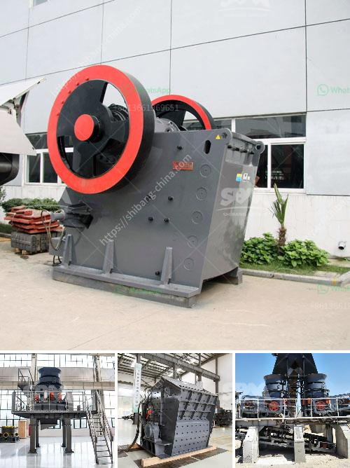

<h3>How to operate ball mills?</h3>
Ball mills are used in many industries to grind raw materials into fine powders. They are critical pieces of equipment for many different processes. However, operating ball mills can be quite challenging, as the power of the machine relies on its ability to maintain optimal speed and efficiency.

1. Check the power supply: Before starting the machine, make sure that the power supply is stable. This can be accomplished by connecting the mill to an auxiliary power source such as a generator or a battery system. A fluctuating power supply can negatively impact the mill's performance and cause unexpected shutdowns.

2. Familiarize yourself with the controls: Before operating the ball mill, thoroughly read through the user manual and understand the machine's controls. Once you are familiar with all the necessary information, set up a work area that is clear of any potential hazards and has adequate lighting.

3. Ensure the mill is properly assembled: Before starting the operation, double-check that all the mill components are properly assembled. Check if there are loose bolts, missing parts, or any other potential issues that may hinder the mill's performance. Fix any problems before proceeding.

4. Load the mill with the desired material: The next step is to load the mill with the desired material. This can be done by adding the raw material into the mill's feed chute or hopper. Make sure to follow the prescribed maximum load capacity to avoid inefficient grinding and potential damage to the mill.

5. Start the mill and adjust the speed: Once the mill is loaded with the material, start it by turning on the main switch. Gradually increase the speed of the mill by adjusting the frequency converter's settings or the driving gear system. It is essential to gradually increase the speed to prevent sudden jolts or overloading the mill. Observe the mill's operation and adjust the speed accordingly.

6. Monitor the grinding process: During the operation, regularly monitor the grinding process to ensure efficiency and optimal performance. This can be done by periodically checking the product size and evaluating the mill's power consumption. Any significant deviations should be investigated promptly to avoid further issues.

7. Maintain the mill: Regular maintenance is crucial to ensure the mill's long-term efficiency and performance. Routinely inspect the mill's components, such as the liners, grinding media, and lubrication systems. Replace any worn or damaged parts and carry out the recommended maintenance procedures outlined in the user manual.

8. Shutdown the mill properly: When finishing the grinding process, gradually reduce the mill's speed and allow it to come to a complete stop before shutting it down. Thoroughly clean the mill and remove any remaining materials to prevent potential damage or contamination.

In conclusion, operating ball mills requires careful attention to detail and adherence to all safety protocols. By following these guidelines, you can ensure the efficient and safe operation of your ball mill, extending its lifespan and maximizing its capabilities.
<h3>Contact us</h3><ul><li><strong>Whatsapp:&nbsp;<a href="https://wa.me/8613661969651">+8613661969651</a></strong></li><li><a href="https://swt.shibang-china.com/?git&amp;zhl&amp;How to operate ball mills"><strong>Online Service(chat now)</strong></a></li></ul><h3>Related</h3><ul><li><a href='How to select a vibrating screen in Britain.md'>How to select a vibrating screen in Britain?</a></li><li><a href='How to improve pulveriser capacity.md'>How to improve pulveriser capacity?</a></li><li><a href='How to extract iron efficiently from silica.md'>How to extract iron efficiently from silica?</a></li><li><a href='How much is the quarry machinery .md'>How much is the quarry machinery ?</a></li><li><a href='How can the throughput capacity of a ball mill be increased.md'>How can the throughput capacity of a ball mill be increased?</a></li></ul>