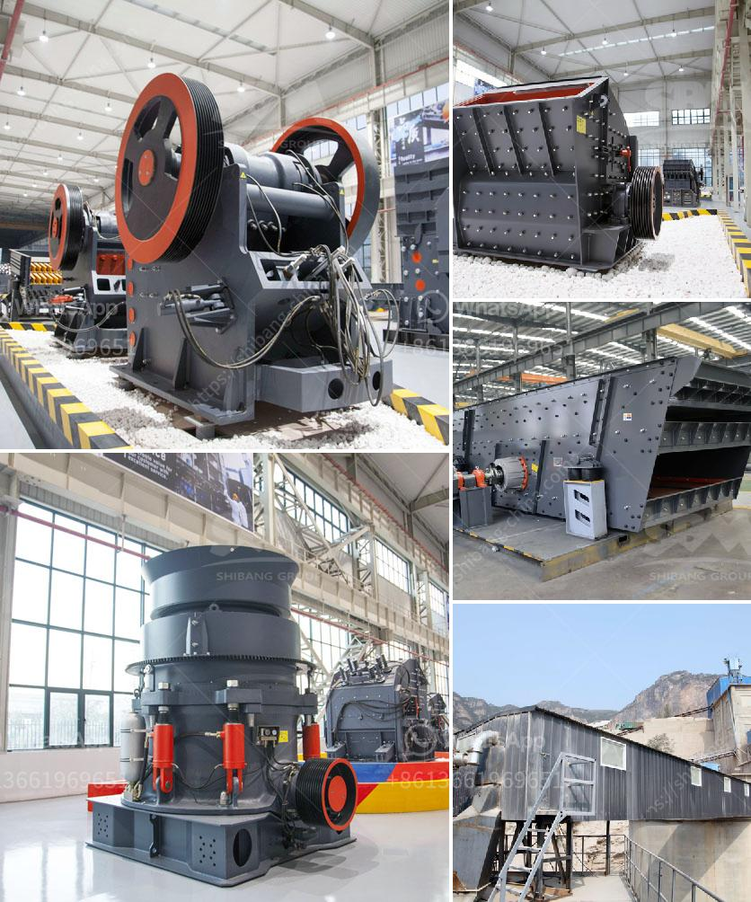

<h3>How to operate mine crushing machinery?</h3>
Operating mine crushing machinery requires knowledge and skill to ensure efficiency and safety. This equipment is crucial for crushing and processing materials to extract desired minerals from the earth. Here are some essential steps and tips to help operators effectively and safely operate mine crushing machinery.

1. Familiarize Yourself with the Machinery: Before operating any crushing machinery, it is crucial to read the manufacturer's manuals and instructions thoroughly. Understand the working principles, components, and maintenance requirements of the equipment.

2. Perform a Pre-Operational Check: Before starting the machine, conduct a pre-operational check to ensure everything is in proper working condition. Inspect belts, guards, oil levels, and any other critical components. Address any maintenance issues or abnormalities before proceeding.

3. Follow Safety Procedures: Protecting your safety and the safety of those around you is essential when operating crushing machinery. Always wear appropriate personal protective equipment (PPE) like gloves, safety glasses, and ear protection. Additionally, make sure all safety guards are in place and that you are trained in emergency procedures.

4. Start-Up Sequence: Follow the correct start-up sequence provided by the manufacturer. This generally involves turning on the power supply, oil pumps, and ventilation systems. Ensure all controls are in the proper position before starting the equipment.

5. Load the Machine Appropriately: Understand the maximum capacity and limitations of the crushing machinery. Overloading the machine can lead to inefficiencies, increased wear and tear, and even accidents. Follow the manufacturer's instructions on proper loading techniques and weight limitations.

6. Monitor the Machinery: While the crushing machinery is operating, it is essential to closely monitor its performance. Pay attention to any abnormal noises, vibrations, or temperature increases. If any issues arise, stop the machine immediately and address the problem.

7. Regular Maintenance: Regular maintenance is vital for the smooth operation and longevity of crushing machinery. Follow the suggested maintenance schedule outlined by the manufacturer. This may involve daily, weekly, monthly, and annual inspections, as well as lubrication and component replacements.

8. Cleanliness and Housekeeping: Keep the work area clean and organized to minimize hazards. Remove any debris, tools, or loose materials from the machinery before and after use. Maintain good housekeeping practices to prevent accidents and improve overall equipment performance.

9. Shutting Down the Machine: When finished operating the crushing machinery, follow the correct shutdown procedure. Turn off the power supply, stop any material flow, and ensure all moving parts have come to a complete stop before leaving the machine.

10. Continuous Learning and Training: Stay up-to-date with industry best practices and advancements in crushing machinery operations. Attend training programs, workshops, and seminars to enhance your knowledge and skills. Regularly evaluate and reassess your operating protocols to improve efficiency and safety.

Operating mine crushing machinery safely and efficiently requires knowledge, attention to detail, and adherence to proper procedures. By following these steps and tips, operators can ensure optimal performance of the machinery while prioritizing the safety of themselves and others in the workplace.
<h3>Contact us</h3><ul><li><strong>Whatsapp:&nbsp;<a href="https://wa.me/8613661969651">+8613661969651</a></strong></li><li><a href="https://swt.shibang-china.com/?git&amp;zhl&amp;How to operate mine crushing machinery"><strong>Online Service(chat now)</strong></a></li></ul><h3>Related</h3><ul><li><a href='how to maintain pe 900x600 limestone crusher ？.md'>how to maintain pe 900x600 limestone crusher ？</a></li><li><a href='How to choose a hightechnology and correct mine sand washing machine.md'>How to choose a high-technology and correct mine sand washing machine?</a></li><li><a href='how much power does a 50 tph crusher need ？.md'>how much power does a 50 tph crusher need ？</a></li><li><a href='How to turn off crushing and screening plant.md'>How to turn off crushing and screening plant?</a></li><li><a href='How to concentrate gold in hard rock.md'>How to concentrate gold in hard rock?</a></li></ul>