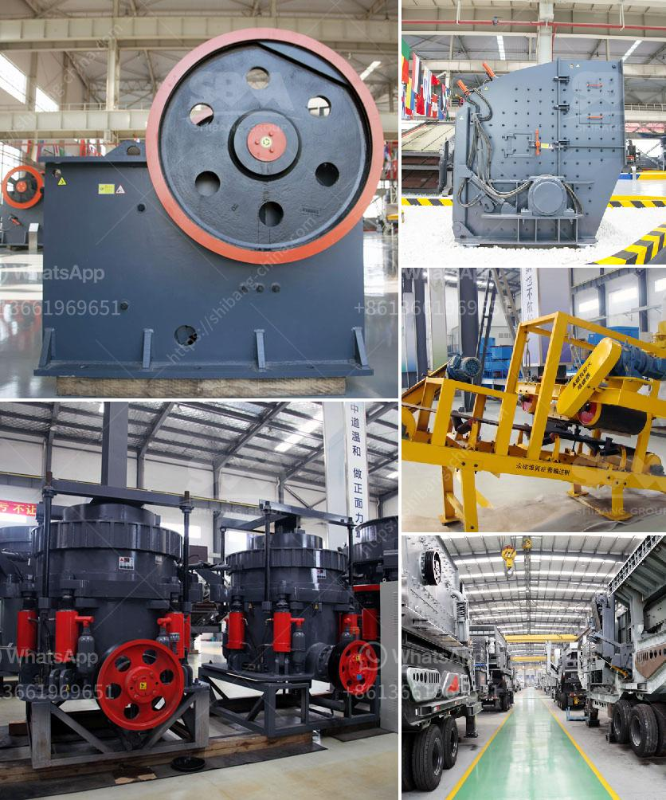

<h3>How to operate the hammer mill</h3>
Operating a hammer mill can be a daunting task for many individuals. However, with proper guidance and understanding, it can be easy to operate and maintain a hammer mill for effective and efficient use. Hammer mills are designed to crush or shred materials into smaller pieces through the repeated blows of small hammers mounted on a rotating shaft. They are used in various industries including mining, agriculture, and waste management.

1. Read the manual: Before using the hammer mill, it is important to carefully read and understand the operator's manual provided. This will help in knowing the fundamental principles and the proper procedures to follow when operating the machine. The manual will also provide information on the maintenance requirements and safety precautions.

2. Wear appropriate protective gear: When operating a hammer mill, it is crucial to wear the necessary protective gear to ensure personal safety. This includes safety goggles, gloves, and ear protection to protect against potential injury from flying debris or excessive noise.

3. Prepare the materials: Before feeding the material into the hammer mill, it is essential to ensure that they are properly prepared. Depending on the application, the materials may need to be sorted, cleaned, or dried. Any foreign objects or contaminants should be removed to avoid damage to the hammer mill and ensure a smooth operation.

4. Adjust the settings: To achieve the desired particle size, the settings of the hammer mill need to be adjusted accordingly. The distance between the hammers and the screen, as well as the speed of the rotor, can be adjusted to control the size of the final product. It is essential to closely monitor and adjust these settings during operation to optimize performance.

5. Feed the material evenly: It is vital to feed the material evenly into the hammer mill for efficient and consistent processing. Uneven feeding can cause overloading, which may lead to clogging or damage to the machine. A steady and controlled feed rate will ensure smooth operation and prevent unnecessary downtime.

6. Regular maintenance: Routine maintenance is necessary to keep the hammer mill in good working condition. This includes checking all components for wear and tear, lubricating moving parts, and cleaning the machine regularly. Following the manufacturer's recommendations for maintenance intervals and procedures will help prolong the lifespan of the hammer mill.

In conclusion, operating a hammer mill can be a straightforward process when done correctly. By following the manufacturer's guidelines, wearing appropriate protective gear, preparing the materials, adjusting the settings, feeding evenly, and performing regular maintenance, the hammer mill can be operated efficiently and effectively. It is essential to prioritize safety, understand the machine's operation principles, and take necessary precautions to avoid any accidents or damage.
<h3>Contact us</h3><ul><li><strong>Whatsapp:&nbsp;<a href="https://wa.me/8613661969651">+8613661969651</a></strong></li><li><a href="https://swt.shibang-china.com/?git&amp;zhl&amp;How to operate the hammer mill"><strong>Online Service(chat now)</strong></a></li></ul><h3>Related</h3><ul><li><a href='How to install a stone crusher hopper.md'>How to install a stone crusher hopper?</a></li><li><a href='How to set up a crushing production line station ？.md'>How to set up a crushing production line station ？</a></li><li><a href='how a cone crusher works .md'>how a cone crusher works ?</a></li><li><a href='How much does a quarry crusher cost.md'>How much does a quarry crusher cost?</a></li><li><a href='How to move and install a mobile rock crusher.md'>How to move and install a mobile rock crusher?</a></li></ul>