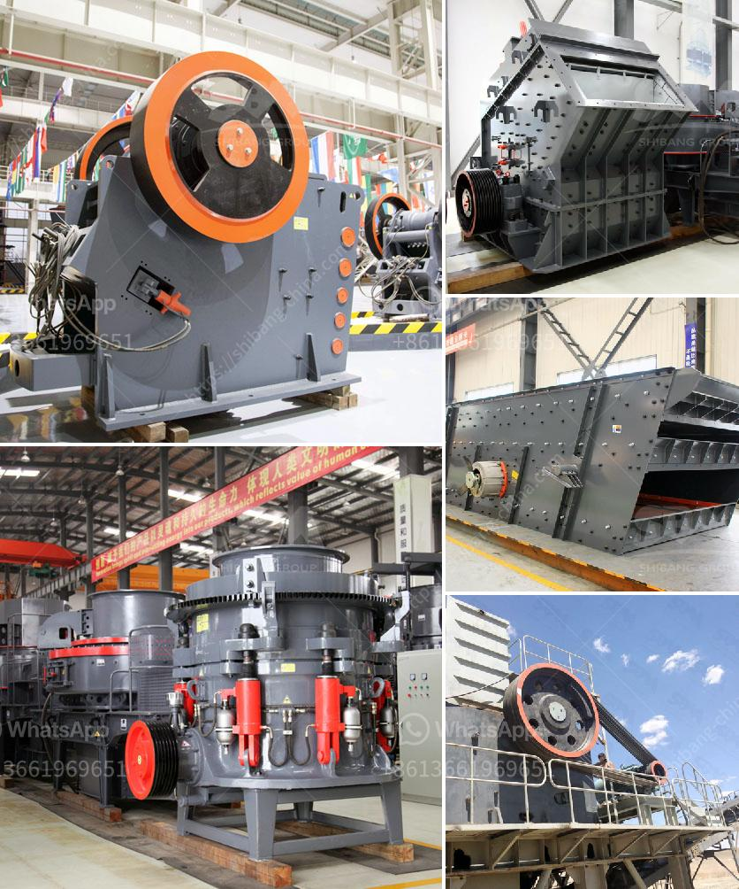

<h3>How to overhaul a jaw crusher?</h3>
A jaw crusher is a primary crushing machine used in various industries, such as mining, building materials, and construction. In order to ensure the continuous operation of the crusher, regular maintenance and repairs are essential. Overhauling the jaw crusher is particularly important in extending the service life of the machine and ensuring its efficient operation. Here are the steps to overhaul a jaw crusher effectively.

To start the overhaul process, the first step is to dismantle the jaw crusher components. These include the swing jaw, stationary jaw, liners, side plates, toggle plates, and the main shaft. Carefully disassemble each component, ensuring that all parts are labeled and kept in a proper order for easy reassembly later.

Once the components are dismantled, thoroughly inspect each part to identify any signs of wear, damage, or excessive corrosion. Focus particularly on the jaw plates, since they directly engage with the materials being crushed. Replace any worn or damaged parts to avoid further complications during the reassembly process.

Cleaning the individual components is crucial during the overhaul process. Remove any debris or contaminants from the parts using a suitable cleaning agent and a brush. Pay special attention to the threaded holes and surfaces to ensure proper reinstallation. Additionally, apply lubrication to the moving parts to reduce friction and ensure smooth operation.

Once all the parts have been cleaned and dried, start reassembling the jaw crusher. Begin with the main shaft and eccentric shaft, then proceed to install the toggle plate, side plates, liners, and the swing jaw. Pay attention to the proper alignment and positioning of each component. Use the manufacturer's guidelines or technical documents to ensure accurate reassembly.

After successfully reassembling the jaw crusher, perform necessary adjustments and final checks to ensure its proper functioning. To do this, check the tightness of all bolts and screws, ensuring that they are properly secured. Additionally, check the gap between the jaw plates and make necessary adjustments to achieve the desired crushing results. Finally, perform a test run to ensure that the crusher operates smoothly without any abnormal vibrations or noises.

Once the jaw crusher has been overhauled, it is crucial to establish a regular maintenance routine. This includes periodic checks, lubrication, and replacement of worn-out parts as needed. Regularly monitoring the crusher's operating parameters, such as temperature and pressure, allows for early detection of any issues and minimizes the risk of unexpected breakdowns.

In conclusion, overhauling a jaw crusher is a necessary process to maintain the machine's performance and extend its service life. By following the steps outlined above, operators can effectively perform the overhaul and ensure the crusher's smooth operation. Regular maintenance and monitoring are equally important to detect and address potential problems before they escalate. With proper care and attention, a jaw crusher can continue to deliver efficient and reliable crushing operations for years to come.
<h3>Contact us</h3><ul><li><strong>Whatsapp:&nbsp;<a href="https://wa.me/8613661969651">+8613661969651</a></strong></li><li><a href="https://swt.shibang-china.com/?git&amp;zhl&amp;How to overhaul a jaw crusher"><strong>Online Service(chat now)</strong></a></li></ul><h3>Related</h3><ul><li><a href='How to Grind Manganese Ores Using a Ball Mill.md'>How to Grind Manganese Ores Using a Ball Mill?</a></li><li><a href='How can we reduce the amount of fines generated from a coal double roll crusher.md'>How can we reduce the amount of fines generated from a coal double roll crusher?</a></li><li><a href='How to set up a clinker grinding unit.md'>How to set up a clinker grinding unit?</a></li><li><a href='How to balance a cement mill separator.md'>How to balance a cement mill separator?</a></li><li><a href='how to remove fines from stone crush.md'>how to remove fines from stone crush?</a></li></ul>