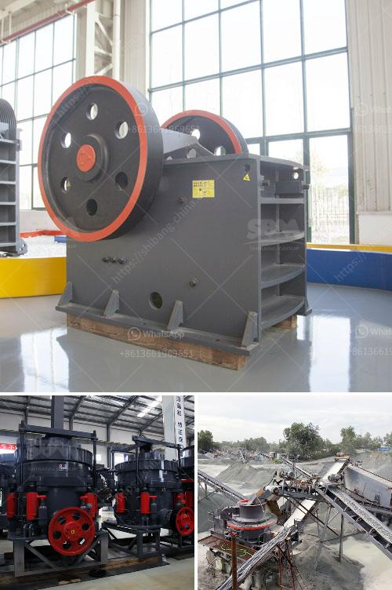

<h3>How to plan and develop a small mine?</h3>
Mining activities have been an integral part of human civilization since ancient times. While large-scale mining operations dominate the industry, there are opportunities for individuals or small companies to establish smaller mines. However, planning and developing a small mine requires careful consideration and adherence to various regulatory and environmental guidelines. In this article, we will outline some essential steps to help you successfully plan and develop a small mine.

1. Research and Feasibility Study: Before initiating any mining project, extensive research and a feasibility study are crucial. Determine the type of minerals or resources you want to extract, their potential market value, and the estimated costs of extraction and processing. Conduct surveys and studies to assess the availability and quality of the resource, geology of the land, and potential environmental impacts.

2. Secure Funding: Developing a mine necessitates substantial investment. Secure financing through various means, such as private investors, loans, or government grants. Prepare a detailed business plan with realistic financial projections to attract potential investors.

3. Obtain Permits and Licenses: Mining operations are heavily regulated to ensure environmental sustainability and safety. Research and understand the legal requirements, permits, and licenses needed for your project. This may involve engaging with local authorities, obtaining environmental impact assessments, and ensuring adherence to health and safety regulations.

4. Engage with Stakeholders: Mining operations often impact local communities and indigenous populations. Therefore, it is crucial to engage with stakeholders, including community leaders, residents, and indigenous groups, to address their concerns and ensure the socioeconomic benefits of the project are considered.

5. Develop an Environmental Management Plan: Take into account the potential environmental impacts of your mining activities and develop a comprehensive environmental management plan. This includes addressing water management, air quality control, waste management, and land rehabilitation strategies. Engage with environmental consultants and experts to ensure your activities are sustainable and in compliance with environmental regulations.

6. Invest in Proper Infrastructure: Infrastructure is vital for mining operations. Develop and invest in infrastructure required for mining, such as access roads, power supply, water source, and accommodation for workers. Prioritize safety measures and install proper equipment for excavation, transportation, and mineral processing.

7. Implement Safety Protocol: Mining can be a hazardous industry, so prioritize the safety and well-being of your workers. Develop a safety protocol that complies with relevant standards and regulations. Provide appropriate safety training, personal protective equipment, and regular safety inspections.

8. Establish Efficient Extraction and Processing Techniques: Optimize extraction and processing techniques to maximize efficiency and yield. Invest in modern mining equipment and technologies that increase the accuracy and speed of extraction, while minimizing environmental impact.

9. Continuous Monitoring and Improvement: Regularly monitor your operations and assess their environmental impact. Implement systems for monitoring air quality, water quality, land rehabilitation, and waste management. Based on the findings, continually improve your methods and strategies to minimize negative effects on the environment and local communities.

In conclusion, planning and developing a small mine requires extensive research, secure funding, obtaining permits and licenses, engaging with stakeholders, implementing safety protocols, investing in infrastructure, and adhering to environmental regulations. Proper planning and adherence to good mining practices will not only ensure legal compliance but also promote sustainable mining practices and the overall success of your small mine operation.
<h3>Contact us</h3><ul><li><strong>Whatsapp:&nbsp;<a href="https://wa.me/8613661969651">+8613661969651</a></strong></li><li><a href="https://swt.shibang-china.com/?git&amp;zhl&amp;How to plan and develop a small mine"><strong>Online Service(chat now)</strong></a></li></ul><h3>Related</h3><ul><li><a href='How to increase productivity of ball mill .md'>How to increase productivity of ball mill ?</a></li><li><a href='How to Build a Limestone Crusher ？.md'>How to Build a Limestone Crusher ？</a></li><li><a href='How to feed a jaw crusher from a concrete hopper.md'>How to feed a jaw crusher from a concrete hopper?</a></li><li><a href='How does a spring cone crusher work.md'>How does a spring cone crusher work?</a></li><li><a href='how do you process of gold in south africa.md'>how do you process of gold in south africa</a></li></ul>