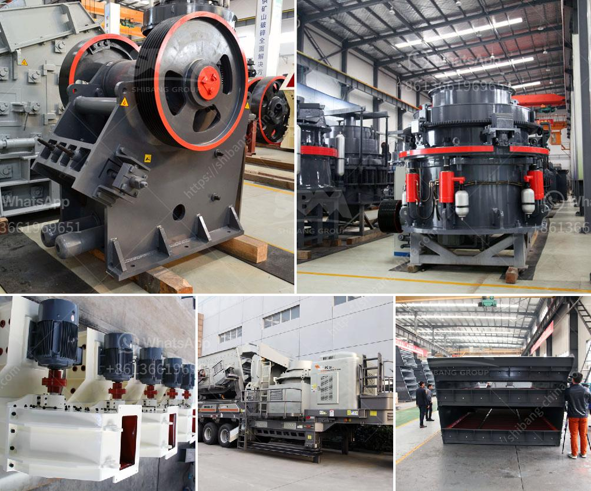

<h3>How to plan to build a rock crusher production line?</h3>
Planning and executing a rock crusher production line can be a complex task, as there are many variables to consider. However, with proper planning and preparation, it can be a successful and efficient process. In this article, we will discuss some key steps to help you plan and build a rock crusher production line.

The first step in planning a rock crusher production line is to determine the purpose and scope of the project. What type of rock will be crushed? What is the desired output size? Is it a stationary or mobile crushing plant? Answering these questions will help you establish the necessary equipment, manpower, and budget required for the project.

Once you have determined the purpose and scope of your rock crusher production line, you need to research and select the appropriate equipment. There are various types of crushers available, such as jaw crushers, impact crushers, cone crushers, and vertical shaft impactors. Consider the characteristics of your raw material and the desired final product to choose the most suitable crusher. In addition to the crusher, you will need other equipment such as a feeder, screen, conveyor belts, and generators.

Before starting the construction of the rock crusher production line, it is crucial to prepare the site properly. Clear the area of any obstacles or debris and level the ground. Make sure there is enough space for all the equipment to be installed and operated safely. Consider the location of the power source and ensure proper infrastructure is in place to support the electrical requirements of the production line.

A well-designed layout is essential for an efficient rock crusher production line. Take into account the flow of material from the feeding stage to the final product. Position the crushers, screens, and other equipment in a logical sequence to minimize material handling and maximize productivity. Consider factors such as accessibility for maintenance and safety regulations.

Before constructing and operating a rock crusher production line, it is essential to obtain the necessary permits and licenses. Check with local authorities and regulatory bodies to ensure compliance with zoning, environmental, and safety regulations. Failure to obtain the appropriate permits can result in costly delays and legal issues.

Regular maintenance is essential to keep the rock crusher production line running smoothly and efficiently. Develop a maintenance plan that includes inspections, lubrication, and scheduled repairs to prevent unexpected breakdowns. Train your staff and provide them with the necessary tools and knowledge to carry out maintenance tasks effectively.

In conclusion, planning to build a rock crusher production line requires careful consideration and preparation. By determining the purpose and scope, selecting the appropriate equipment, preparing the site, designing a layout, securing permits, and establishing a maintenance plan, you can ensure a successful and productive operation. Remember to consult with experts and seek professional advice to ensure you make informed decisions throughout the process.
<h3>Contact us</h3><ul><li><strong>Whatsapp:&nbsp;<a href="https://wa.me/8613661969651">+8613661969651</a></strong></li><li><a href="https://swt.shibang-china.com/?git&amp;zhl&amp;How to plan to build a rock crusher production line"><strong>Online Service(chat now)</strong></a></li></ul><h3>Related</h3><ul><li><a href='How to maintain the stone crusher .md'>How to maintain the stone crusher ?</a></li><li><a href='How to remove calcium oxide from manganese ore.md'>How to remove calcium oxide from manganese ore?</a></li><li><a href='How to choose a jaw crusher.md'>How to choose a jaw crusher?</a></li><li><a href='How to run granite quarry .md'>How to run granite quarry ?</a></li><li><a href='How to install a secondary crusher.md'>How to install a secondary crusher?</a></li></ul>