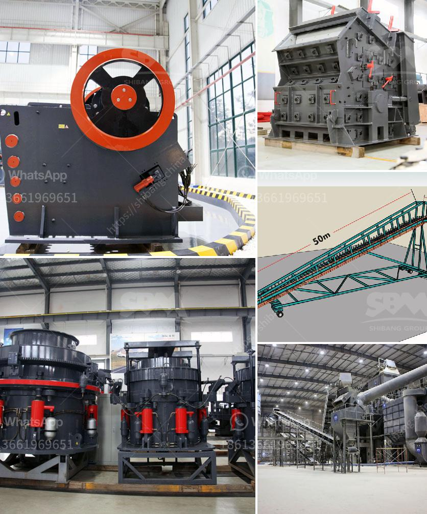

<h3>How to prevent crusher equipment from rusting ?</h3>
Crusher equipment is a crucial part of the mining or quarrying process. Unfortunately, it is prone to rusting due to its exposure to moisture, chemicals, and harsh environmental conditions. Rust can significantly impact the performance and lifespan of crushers, leading to costly repairs and replacements. Therefore, it is essential to implement preventive measures to protect this valuable equipment. In this article, we will discuss some effective ways to prevent crusher equipment from rusting.

Regular cleaning is one of the fundamental steps to prevent crusher equipment from rusting. Accumulated dirt, dust, and debris can retain moisture, providing an ideal environment for rust to develop. Therefore, it is necessary to clean the equipment thoroughly after each use or at regular intervals. This can be done using a power washer or by using a high-pressure hose to remove dirt and grime from all the crevices and hard-to-reach areas.

Moisture is one of the main catalysts for rust formation. Therefore, it is essential to ensure that the crusher equipment is stored in a dry environment. When not in use, it should be kept in a covered area or indoors to protect it from rain, snow, and other weather elements that can cause rusting. If the equipment must be stored outdoors, consider using appropriate covers or tarpaulins to protect it from moisture.

Proper lubrication can significantly extend the life of crusher equipment by preventing rust and reducing friction. Rust can quickly develop in areas where metal parts come into contact with each other, leading to wear and tear. Applying a suitable lubricating oil or grease to moving parts and joints will create a protective barrier, preventing rust formation and ensuring smooth operation.

Applying a protective layer of paint or coating can effectively prevent rust formation on crusher equipment. The paint acts as a barrier, protecting the metal surface from direct exposure to moisture and other corrosive substances. Before applying paint or coating, make sure to clean and dry the equipment thoroughly. Use a primer that is specifically designed for metal surfaces, followed by a high-quality paint or coating that is resistant to rust and corrosion.

Rust inhibitors are chemicals that can be applied to crusher equipment to prevent rust formation. These inhibitors create a protective coating on the metal surface, inhibiting the oxidation process that leads to rust formation. It is crucial to choose a rust inhibitor that is compatible with the specific type of metal used in the equipment and follow the manufacturer's instructions for proper application.

Preventing rust is crucial for maintaining the efficiency and longevity of crusher equipment. By following these preventive measures, you can protect your investment and ensure that your crusher equipment operates smoothly for years to come. Remember, regular cleaning, dry storage, lubrication, paint or coating, and the use of rust inhibitors are all integral parts of an effective rust prevention strategy.
<h3>Contact us</h3><ul><li><strong>Whatsapp:&nbsp;<a href="https://wa.me/8613661969651">+8613661969651</a></strong></li><li><a href="https://swt.shibang-china.com/?git&amp;zhl&amp;How to prevent crusher equipment from rusting "><strong>Online Service(chat now)</strong></a></li></ul><h3>Related</h3><ul><li><a href='How to determine hp for aggregate conveyor .md'>How to determine hp for aggregate conveyor ?</a></li><li><a href='how to design a sand washing classifier？.md'>how to design a sand washing classifier？</a></li><li><a href='How to build granite crusher machine Australia.md'>How to build granite crusher machine Australia?</a></li><li><a href='how is iron ore transported to kenya.md'>how is iron ore transported to kenya</a></li><li><a href='How does the ball mill produce cement.md'>How does the ball mill produce cement</a></li></ul>