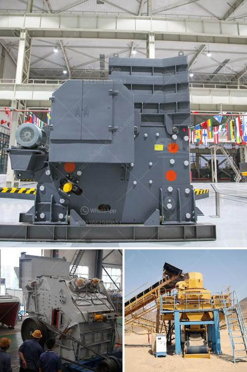

<h3>How to process lightweight aggregates in Ethiopia?</h3>
Lightweight aggregates are widely used in the construction industry due to their low density and excellent insulation properties. In Ethiopia, where there is a growing demand for sustainable construction materials, the production and processing of lightweight aggregates can offer significant benefits. This article aims to explore the process of manufacturing and using lightweight aggregates in Ethiopia.

The primary raw materials for producing lightweight aggregates are natural materials such as clay, shale, and slate. These materials are abundantly available in Ethiopia. The selection of raw materials is crucial as they determine the final properties of the lightweight aggregates. The raw materials should have the appropriate mineralogy and chemical composition to produce aggregates with the desired characteristics.

Once the raw materials are selected, they need to be crushed and ground into fine particles. This process increases the surface area of the raw materials, allowing for better reactions during the firing process. Crushing and grinding can be carried out using crushers and mills. Care should be taken to ensure uniformity in the particle size distribution to obtain consistent lightweight aggregates.

After crushing and grinding, the raw materials are mixed together to create a homogeneous mixture. Water may be added to achieve the desired consistency. The mixture is then pelletized using a pelletizing machine. The pellets are typically spherical in shape and have a uniform size. The pelletizing process enhances the handling and transportability of the raw materials.

The pelletized raw materials are subjected to high temperatures in a rotary kiln or a vertical firing furnace. The firing process causes the pellets to expand, resulting in lightweight aggregates. This expansion is due to the release of gases trapped within the pellets. The firing temperature and duration are critical in determining the density and strength of the lightweight aggregates.

After firing, the lightweight aggregates are cooled to room temperature before being screened to remove oversized or undersized particles. The screened aggregates are then sorted based on their density and size to meet the specific requirements of different applications.

To ensure the quality of lightweight aggregates, various tests are conducted. These tests include measuring the density, compressive strength, thermal conductivity, and moisture content of the aggregates. Quality control measures should be implemented throughout the manufacturing process to maintain consistent product quality.

Lightweight aggregates have a wide range of applications in Ethiopia. They can be used in lightweight concrete production, insulation materials, geotechnical engineering, and horticulture. Lightweight aggregates offer advantages such as reduced dead load on structures, improved insulation properties, and increased fire resistance.

In conclusion, the production and processing of lightweight aggregates in Ethiopia offer significant opportunities for the construction industry. With abundant raw materials and growing demand for sustainable construction materials, the manufacturing of lightweight aggregates can contribute to the country's economic growth and environmental sustainability. By following the mentioned steps, Ethiopia can establish a robust lightweight aggregate industry to meet the needs of the construction sector and promote sustainable development.
<h3>Contact us</h3><ul><li><strong>Whatsapp:&nbsp;<a href="https://wa.me/8613661969651">+8613661969651</a></strong></li><li><a href="https://swt.shibang-china.com/?git&amp;zhl&amp;How to process lightweight aggregates in Ethiopia"><strong>Online Service(chat now)</strong></a></li></ul><h3>Related</h3><ul><li><a href='how to increase production capicity of ball mill.md'>how to increase production capicity of ball mill?</a></li><li><a href='How to weld the broken jaw plate of jaw crusher.md'>How to weld the broken jaw plate of jaw crusher?</a></li><li><a href='How to crush concrete for recycling .md'>How to crush concrete for recycling ?</a></li><li><a href='How to enter into a business of stone crusher plant in Malaysia .md'>How to enter into a business of stone crusher plant in Malaysia ?</a></li><li><a href='How to disassemble the jaw plate of jaw crusher.md'>How to disassemble the jaw plate of jaw crusher?</a></li></ul>