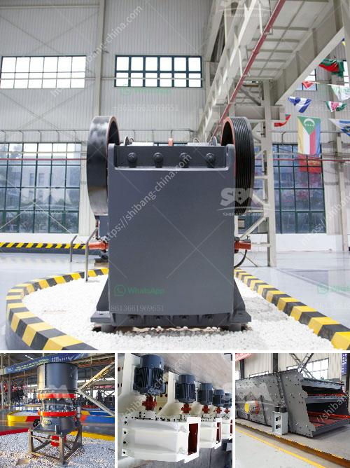

<h3>How to process metallic minerals ?</h3>
Metallic minerals, also known as ore minerals, play a crucial role in various industries. These minerals contain valuable metals, such as iron, copper, gold, silver, and zinc, among others, which are essential for manufacturing processes, infrastructure development, and technological advancements. The process of extracting and processing metallic minerals involves a series of steps that require careful planning and adherence to industry best practices. In this article, we will explore the key steps involved in processing metallic minerals.

1. Exploration and Discovery: The initial step in processing metallic minerals is the discovery of mineral deposits through exploration activities. Geologists and mineral experts survey areas based on geological models, remote sensing data, and historical mining records. They use various techniques, including geophysical surveys, drilling, and sampling, to identify potential mineral deposits.

2. Extraction: Once a mineral deposit is discovered, the next step is extraction. Extraction methods vary based on the type of minerals and the geological characteristics of the deposit. Some common extraction methods include open-pit mining, underground mining, and placer mining. Open-pit mining involves removing the overlying soil to expose the mineral deposit, while underground mining involves tunneling into the Earth to access the minerals. Placer mining is the extraction of minerals from alluvial deposits, such as riverbeds and shorelines. Miners use heavy machinery, explosives, and other equipment to extract the minerals from the earth.

3. Crushing and Grinding: After extraction, the metallic minerals are transported to a processing plant, where they undergo crushing and grinding. These processes break down the mineral rocks into smaller, more manageable sizes. Crushing involves using mechanical force to reduce the size of the rocks, while grinding involves using rotating mills to further break down the mineral particles. The goal of crushing and grinding is to liberate the valuable metals from the surrounding rock or gangue.

4. Beneficiation: The next step in processing metallic minerals is beneficiation, which involves separating the valuable metals from the waste or gangue minerals. Various techniques are used for beneficiation, including froth flotation, magnetic separation, and gravity separation. Froth flotation relies on the differences in the surface properties of the minerals, while magnetic separation uses magnets to extract magnetic minerals. Gravity separation involves using the force of gravity to separate heavier minerals from lighter ones.

5. Smelting and Refining: Once the valuable metals are separated from the waste minerals, they undergo smelting and refining processes. Smelting involves heating the metal-bearing minerals to high temperatures to extract the metal. Refining is the process of purifying the extracted metal to remove impurities and achieve the desired quality. Different refining techniques, such as electrolysis or chemical processes, are employed based on the type of metal and desired purities.

6. Product Manufacturing: Finally, the purified metals are further processed into various products. Depending on the metal, these products can range from steel used in construction to copper wires used in electrical systems. The metallic minerals may undergo additional processing, such as alloying, shaping, or heat treatment, to attain the desired properties for specific applications.

In conclusion, processing metallic minerals is a complex and multi-step process that involves exploration, extraction, crushing and grinding, beneficiation, smelting, refining, and product manufacturing. Each step requires expertise and adherence to environmental regulations to ensure sustainable and responsible mining practices. By following these processes, we can harness the valuable metals contained within metallic minerals and contribute to the growth and development of various industries.
<h3>Contact us</h3><ul><li><strong>Whatsapp:&nbsp;<a href="https://wa.me/8613661969651">+8613661969651</a></strong></li><li><a href="https://swt.shibang-china.com/?git&amp;zhl&amp;How to process metallic minerals "><strong>Online Service(chat now)</strong></a></li></ul><h3>Related</h3><ul><li><a href='How to build a small rock crusher.md'>How to build a small rock crusher?</a></li><li><a href='How to choose the right grinder for the processing mineral materials.md'>How to choose the right grinder for the processing mineral materials?</a></li><li><a href='How can I improve the grinding of a raw mill.md'>How can I improve the grinding of a raw mill?</a></li><li><a href='How to adjust impact crusher 7 key steps.md'>How to adjust impact crusher? 7 key steps</a></li><li><a href='How to crush coal in power plant.md'>How to crush coal in power plant?</a></li></ul>