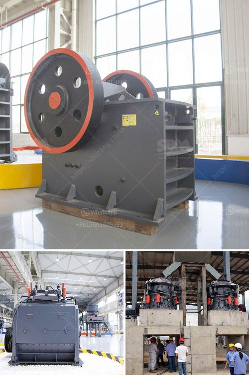

<h3>How to process ore in crusher with sticky soil ?</h3>
Processing ore in a crusher can be a challenging task, particularly when the soil is sticky and moist. Sticky soil can clog the crusher and potentially cause downtime or reduced efficiency. However, with the right equipment and proper techniques, it is possible to process ore in a crusher even with sticky soil. In this article, we will discuss some effective methods to overcome this challenge.

1. Grizzly bar screening: The first step in processing ore with sticky soil is to separate the larger pieces of soil from the ore. Installing a grizzly bar screening system before the crusher can help remove large rocks and chunks of soil. This will prevent them from entering the crusher and causing clogging issues.

2. Proper crusher selection: Choosing the right crusher for processing ore with sticky soil is crucial. Opt for a crusher that is specifically designed to handle sticky materials. A gyratory crusher or a jaw crusher with a hydraulic toggle relief system can be suitable options. These crushers are designed to handle large chunks of sticky soil without clogging the crushing chamber.

3. Regular cleaning and maintenance: It is important to regularly clean the crusher and perform routine maintenance to prevent clogging issues caused by sticky soil. Clear any buildup of clay or soil around the crusher's hopper, chute, and crushing chamber. This can be done using high-pressure water jets or manually removing the material with shovels.

4. Adequate moisture control: Controlling the moisture content of the material being processed is essential in preventing clogs. Wet soil tends to adhere to surfaces more easily, leading to blockages. Monitor the moisture content of the ore and use dryers or other moisture control measures if necessary. This will help reduce the stickiness of the soil and improve its flow through the crusher.

5. Utilize screening decks: In some cases, using multiple screening decks can further aid in removing sticky soil particles from the ore before it enters the crusher. These decks can help break up and separate the soil, reducing the chances of clogs. Adjust the screen sizes and angles to optimize the process.

6. Proper feeding techniques: The way you feed the crusher can greatly impact its performance when dealing with sticky soil. Avoid large, sudden feed surges, as this can overload the crusher and cause blockages. Instead, feed the material gradually and evenly to ensure smooth and efficient processing.

In conclusion, processing ore in a crusher with sticky soil can be challenging, but it is possible with the right equipment and techniques. Implementing grizzly bar screening, choosing the appropriate crusher, regular cleaning, moisture control, utilizing screening decks, and employing proper feeding techniques can significantly improve the efficiency and productivity of the crushing process. By following these guidelines, operators can effectively process ore with sticky soil and minimize downtime caused by clogging issues.
<h3>Contact us</h3><ul><li><strong>Whatsapp:&nbsp;<a href="https://wa.me/8613661969651">+8613661969651</a></strong></li><li><a href="https://swt.shibang-china.com/?git&amp;zhl&amp;How to process ore in crusher with sticky soil "><strong>Online Service(chat now)</strong></a></li></ul><h3>Related</h3><ul><li><a href='How does bauxite crushers work.md'>How does bauxite crushers work?</a></li><li><a href='How does a stone crushing plant work.md'>How does a stone crushing plant work?</a></li><li><a href='How to separate the gold from the powdered sand .md'>How to separate the gold from the powdered sand ?</a></li><li><a href='How to electrify a ball mill.md'>How to electrify a ball mill?</a></li><li><a href='How to improve pulveriser capacity.md'>How to improve pulveriser capacity?</a></li></ul>