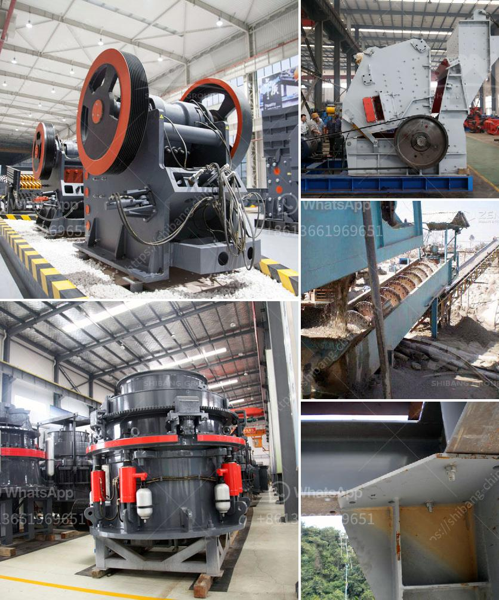

<h3>How to process tantalite mineral?</h3>
Tantalite minerals are a valuable resource that is used in various industries, including electronics, aerospace, and medical equipment manufacturing. This naturally occurring mineral consists of tantalum and niobium, which are highly sought-after elements due to their unique properties. To make the most of these minerals, they must undergo a series of processing steps. In this article, we will explore the process of tantalite mineral processing.

The first step in processing tantalite minerals is mining. This involves extracting the ore from the ground using heavy machinery or by manually digging into the earth. The mined ore is then transported to a processing plant for further refinement.

Once at the processing plant, the tantalite ore undergoes a variety of processes to remove impurities and concentrate the valuable minerals. One common method is gravity separation, which utilizes the differences in density between tantalite minerals and gangue materials. In this process, the ore is crushed into fine particles and then fed into a shaking table or jig machine. The heavy tantalite minerals sink to the bottom while the lighter gangue materials are washed away. The resulting concentrate is further processed.

Another important step in tantalite mineral processing is magnetic separation. This technique utilizes the magnetic properties of tantalite minerals to separate them from non-magnetic materials. The crushed ore is subjected to magnetic fields that attract and separate the tantalite minerals from the rest of the material. This process produces a magnetic concentrate that can be further refined.

After the magnetic separation, the tantalite minerals may undergo a flotation process. Flotation is a technique that utilizes the different surface properties of minerals to separate them. In this process, chemicals and reagents are added to the slurry of tantalite minerals and water. The chemicals attach to the surface of the valuable minerals, making them hydrophobic and allowing them to float to the surface. The resulting froth is then collected and dried to produce a tantalite concentrate.

Once the tantalite minerals have been concentrated, they may undergo additional processes to further refine and purify them. These processes can include leaching, roasting, and solvent extraction, depending on the desired product specifications. These refining steps aim to remove any remaining impurities and increase the purity of the tantalite concentrate.

In conclusion, the process of tantalite mineral processing involves several steps to extract and concentrate the valuable minerals. These steps include mining, crushing, gravity separation, magnetic separation, flotation, and refining. With careful processing techniques, tantalite minerals can be transformed into high-quality concentrates that are in high demand in various industries. Proper processing is essential to maximize the value of tantalite minerals and ensure their efficient use in various applications.
<h3>Contact us</h3><ul><li><strong>Whatsapp:&nbsp;<a href="https://wa.me/8613661969651">+8613661969651</a></strong></li><li><a href="https://swt.shibang-china.com/?git&amp;zhl&amp;How to process tantalite mineral"><strong>Online Service(chat now)</strong></a></li></ul><h3>Related</h3><ul><li><a href='How to set up a granite processing plant.md'>How to set up a granite processing plant?</a></li><li><a href='How to separate the gold from the powdered sand .md'>How to separate the gold from the powdered sand ?</a></li><li><a href='How to measure the jaw crusher bearing temperature.md'>How to measure the jaw crusher bearing temperature?</a></li><li><a href='How to clean copper ore with equipment .md'>How to clean copper ore with equipment ?</a></li><li><a href='how to produce alternative to river sand ？.md'>how to produce alternative to river sand ？</a></li></ul>