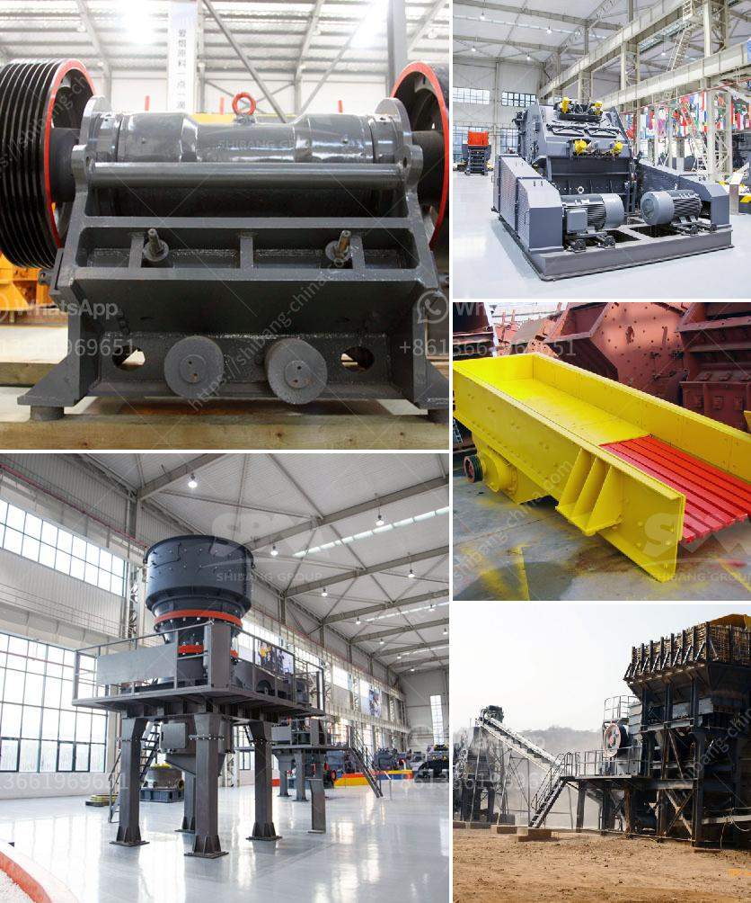

<h3>How to produce crushed sand</h3>
Producing crushed sand is becoming increasingly popular as a sustainable alternative to natural sand. Crushed sand is composed of crushed stone and manufactured sand, offering promising durability and workability. It is widely used in concrete mixes, road construction, and landscaping projects. If you're wondering how to produce crushed sand, then this article will guide you through the required steps.

The first step in producing crushed sand is to select the appropriate material. It is crucial to choose hard, durable stones that can withstand the crushing process. Generally, igneous rocks such as granite, basalt, or sandstone are preferred due to their high strength and quality.

Once the material is selected, it needs to undergo the crushing process. There are various types of crushers available, each with different crushing principles such as jaw crushers, impact crushers, or cone crushers. The chosen crusher will depend on the material's characteristics and the desired output size.

After the crushing process, the crushed stones need to be screened to ensure the desired particle size distribution. A vibrating screen can be used for this purpose, separating the crushed sand into different sizes. Washing the crushed sand can help remove impurities such as silt and clay, enhancing its quality.

To produce high-quality crushed sand, it is important to control the shape of the grains. This can be achieved by using advanced VSI (Vertical Shaft Impactor) machines or tertiary impact crushers. These machines can shape the particles into a more cubical and well-graded form, improving the overall strength and workability of the sand.

After the production process, the crushed sand needs to be properly dried and stored. Excessive moisture content can lead to material clumping and affect its quality. Hence, drying the crushed sand to an optimal moisture level is essential. Proper storage in covered areas or silos will prevent contamination and maintain its quality.

Quality control is crucial in producing crushed sand. Regular testing for particle size distribution, moisture content, and other relevant parameters should be conducted. This ensures that the produced crushed sand meets the required standards and specifications.

Producing crushed sand should be done with environmental sustainability in mind. Minimizing energy consumption, utilizing efficient machines, and reusing waste materials, such as crushed concrete or asphalt, can contribute to sustainable production practices. It is also important to comply with local regulations and procedures regarding environmental impacts.

In conclusion, producing crushed sand involves a series of steps, starting from material selection and ending with quality testing. By following these steps, one can produce crushed sand with desirable characteristics and consistently high quality. Additionally, integrating sustainable practices can make the production process more environmentally friendly. Crushed sand offers numerous benefits as a construction material, making it a viable alternative to natural sand.
<h3>Contact us</h3><ul><li><strong>Whatsapp:&nbsp;<a href="https://wa.me/8613661969651">+8613661969651</a></strong></li><li><a href="https://swt.shibang-china.com/?git&amp;zhl&amp;How to produce crushed sand"><strong>Online Service(chat now)</strong></a></li></ul><h3>Related</h3><ul><li><a href='How to make boulders into gravel.md'>How to make boulders into gravel</a></li><li><a href='How to manage a quarry plant 10 suggestions.md'>How to manage a quarry plant? 10 suggestions</a></li><li><a href='How to crush borax .md'>How to crush borax ?</a></li><li><a href='How to build your own shaker wash plant.md'>How to build your own shaker wash plant?</a></li><li><a href='How to extract manganese ore in Pakistan.md'>How to extract manganese ore in Pakistan?</a></li></ul>