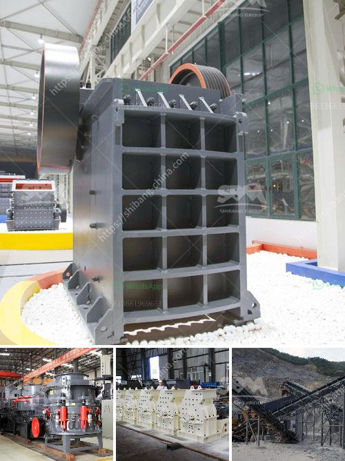

<h3>How to produce dolomite using a roller mill?</h3>
Dolomite is a mineral commonly found in sedimentary rocks, and its main component is calcium magnesium carbonate. Dolomite is widely used in various industries such as construction, agriculture, and environmental protection due to its numerous physical and chemical properties. One efficient way to produce dolomite is by using a roller mill. In this article, we will discuss the steps involved in producing dolomite using a roller mill.

The first step in producing dolomite using a roller mill is to prepare the raw materials. Dolomite rocks are usually mined from a quarry or open pit and then transported to the processing plant. The raw dolomite rocks are usually large, so they need to be crushed into smaller pieces before being fed into the roller mill. This can be done using a jaw crusher or a hammer mill.

After preparing the raw material, the next step is to grind the dolomite into fine particles. The roller mill is a suitable machine for grinding dolomite. The mill is equipped with a special device to prevent the dolomite from sticking. Grinding rollers and grinding rings are forged from special materials, making them durable and long-lasting. The dolomite is fed into the grinding chamber through the feeding device and is ground by the grinding roller assembly. The ground dolomite particles are then sent to the classifier for classification.

Classification is an essential step in the dolomite production process. The ground dolomite particles are classified by the classifier according to their size. The classifier is equipped with a rotating impeller, which produces a strong centrifugal force. The larger particles are thrown to the outer edge of the classifier and fall back into the grinding chamber for regrinding. The finer particles, which meet the desired particle size, are collected and sent to the finished product storage bin.

The final step in producing dolomite using a roller mill is to collect the finished dolomite. The finished dolomite particles are collected from the bottom of the classifier and are transported by the air flow to the cyclone collector. In the cyclone collector, the dolomite particles are separated from the air flow and then collected in the finished product storage bin. The collected dolomite particles can be packaged for sale or further processed according to specific requirements.

In conclusion, producing dolomite using a roller mill involves several steps, including raw material preparation, grinding the dolomite, classifying the ground dolomite, and collecting the finished dolomite. The roller mill is an efficient machine for producing dolomite, and it offers numerous advantages such as high grinding efficiency, low energy consumption, and easy control of the final product's particle size. By following the aforementioned steps, dolomite can be produced in large quantities and of high quality, meeting the demands of various industries.
<h3>Contact us</h3><ul><li><strong>Whatsapp:&nbsp;<a href="https://wa.me/8613661969651">+8613661969651</a></strong></li><li><a href="https://swt.shibang-china.com/?git&amp;zhl&amp;How to produce dolomite using a roller mill"><strong>Online Service(chat now)</strong></a></li></ul><h3>Related</h3><ul><li><a href='how to choose a jaw crusher malaysia.md'>how to choose a jaw crusher malaysia?</a></li><li><a href='How to set up a limestone processing plant.md'>How to set up a limestone processing plant?</a></li><li><a href='How to remove feldspars from sand production.md'>How to remove feldspars from sand production?</a></li><li><a href='How to measure the jaw crusher bearing temperature.md'>How to measure the jaw crusher bearing temperature?</a></li><li><a href='How to build granite crusher machine Australia.md'>How to build granite crusher machine Australia?</a></li></ul>