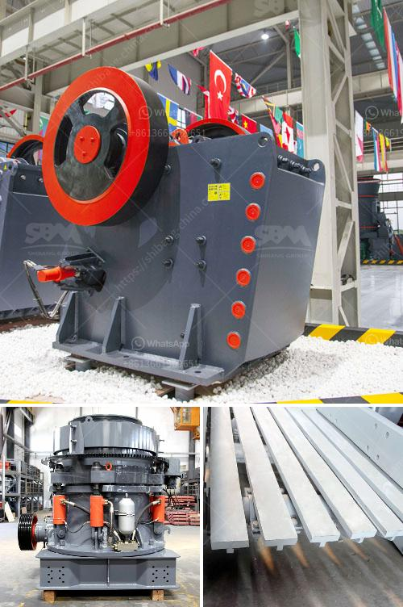

<h3>How to produce silica sand? 7 steps</h3>
Silica sand is a highly versatile industrial mineral that is used in multiple applications, including glassmaking, hydraulic fracturing, and foundry casting. Producing high-quality silica sand involves a series of steps that require considerable expertise and careful consideration of environmental factors. In this article, we will outline the seven main steps involved in the production of silica sand.

The first step in producing silica sand is to identify and assess potential deposits. Geologists and mining engineers study the geological formations to determine the quality and quantity of silica sand available in a particular area. Environmental factors, such as proximity to water bodies and wildlife habitats, are also taken into consideration. This phase involves extensive research, data collection, and planning.

Once a suitable deposit is identified, the next step is to extract the sand through open-pit or underground mining methods. Mining equipment, such as excavators and loaders, is used to remove the sand from the ground. Care is taken to minimize the impact on the environment and surrounding ecosystems.

After the sand is mined, it undergoes crushing and grinding processes to reduce its size and achieve the desired particle size distribution. Crushing equipment, such as jaw crushers and cone crushers, is used in this stage to break down the material into smaller pieces. Ball mills or rod mills may be employed for grinding to further refine the particle size.

At this stage, the sand undergoes a washing process to remove impurities and excess clay materials. It is common to use water and mechanical agitation to separate the sand particles from these unwanted elements. Desliming, which involves removing ultrafine particles, is also conducted to improve the quality of the final product.

To ensure that the silica sand reaches the required moisture content, it undergoes a drying process. Depending on the characteristics of the sand, it may be dried using rotary dryers, fluidized bed dryers, or other industrial drying equipment. This step is vital to prevent issues such as mold growth and clumping during storage and transportation.

After drying, the silica sand is sieved and graded according to particle size specifications. Sieving involves passing the sand through various screens to separate it into different size fractions. This ensures that the final product meets the requirements of different industries and applications.

The last step in producing silica sand involves packaging and transport. The sand is typically loaded into bags or bulk containers, and appropriate labeling is applied. Care must be taken to protect the sand during loading, transportation, and unloading to prevent contamination or damage to its quality.

In conclusion, producing high-quality silica sand involves a meticulous process that spans several steps. From exploration and mining to crushing, washing, and drying, each phase requires technical expertise and adherence to environmental considerations. By following these steps, producers can ensure that they deliver silica sand that meets the strict quality standards demanded by various industries.
<h3>Contact us</h3><ul><li><strong>Whatsapp:&nbsp;<a href="https://wa.me/8613661969651">+8613661969651</a></strong></li><li><a href="https://swt.shibang-china.com/?git&amp;zhl&amp;How to produce silica sand 7 steps"><strong>Online Service(chat now)</strong></a></li></ul><h3>Related</h3><ul><li><a href='How is limestone processed flowchart.md'>How is limestone processed flowchart?</a></li><li><a href='how to set up screening and crushing plant .md'>how to set up screening and crushing plant ?</a></li><li><a href='How to design a marble or stone processing production line.md'>How to design a marble or stone processing production line?</a></li><li><a href='How is quartz mined and processed.md'>How is quartz mined and processed?</a></li><li><a href='How can I improve the grinding of a raw mill.md'>How can I improve the grinding of a raw mill?</a></li></ul>