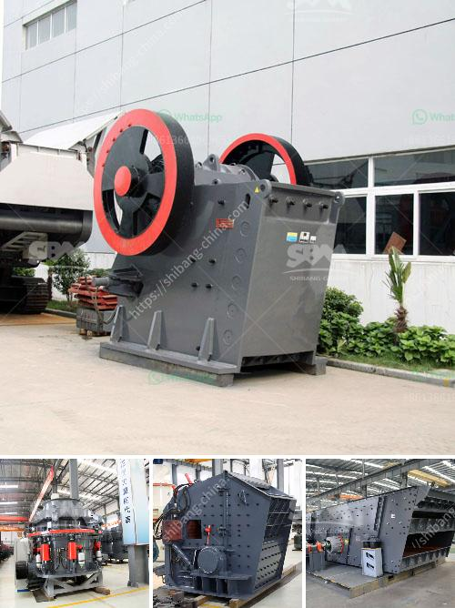

<h3>How to reduce VSI crusher noise?</h3>
VSI (Vertical Shaft Impactor) crushers are widely used in the mining industry, construction industry, and recycling applications. These machines are renowned for their high reduction ratio, efficiency, and precise particle shape. However, one drawback of VSI crushers is that they can produce high levels of noise during operation, which can be disruptive and potentially harmful to workers and nearby residents. In this article, we will explore some effective ways to reduce VSI crusher noise.

One of the most effective methods to reduce VSI crusher noise is to create a soundproof enclosure around the machine. This can be achieved by using sound-absorbing materials such as rubber, foam, or fiberglass insulation on the walls and roof of the enclosure. Additionally, sealing any gaps or openings in the enclosure will help prevent noise leakage.

Another approach to reducing VSI crusher noise is to install vibration isolators between the crusher and its foundation. Vibration isolators are flexible mounts that absorb and isolate vibrations, preventing them from traveling through the structure. By isolating the crusher from its surroundings, the transmission of noise can be significantly reduced.

Proper maintenance and servicing of the VSI crusher can also contribute to reducing noise levels. Regularly inspecting and lubricating the machine's components will help identify and fix any potential sources of noise, such as loose or worn-out parts. Additionally, ensuring that the crusher is properly balanced and aligned will minimize vibrations and noise generation.

Noise can be generated not only by the VSI crusher itself but also during the feeding and discharge process. To reduce noise during these operations, measures can be taken, such as installing rubber liners in the hopper and chute to absorb impact noise, using vibration-damping materials on conveyor belts, and avoiding overloading or forcing materials into the crusher.

Some manufacturers offer noise-reducing features or options for their VSI crushers. These may include special liners or baffles designed to reduce noise, as well as noise-enclosed rotor assemblies. When purchasing a new VSI crusher, it is worth exploring these options to ensure that the machine meets noise emission standards and regulations.

In conclusion, while VSI crushers are essential equipment in many industries, their noise generation can be a significant concern. By implementing the above-mentioned strategies and considering noise-reducing features or options, it is possible to minimize the noise produced by these machines. Doing so not only improves working conditions but also demonstrates a commitment to environmental sustainability and community well-being.
<h3>Contact us</h3><ul><li><strong>Whatsapp:&nbsp;<a href="https://wa.me/8613661969651">+8613661969651</a></strong></li><li><a href="https://swt.shibang-china.com/?git&amp;zhl&amp;How to reduce VSI crusher noise"><strong>Online Service(chat now)</strong></a></li></ul><h3>Related</h3><ul><li><a href='How to replace the vertical impact crusher on the production line.md'>How to replace the vertical impact crusher on the production line?</a></li><li><a href='How to make a foundation for sand crusher.md'>How to make a foundation for sand crusher?</a></li><li><a href='How to judge how much power the jaw crusher needs？.md'>How to judge how much power the jaw crusher needs？</a></li><li><a href='How to increase the production capacity of stone grinding machine ？.md'>How to increase the production capacity of stone grinding machine ？</a></li><li><a href='How to import stone crusher machine from China to Canada.md'>How to import stone crusher machine from China to Canada?</a></li></ul>