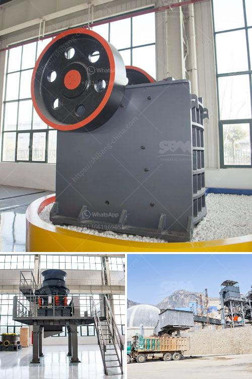

<h3>How to remove calcium oxide from manganese ore?</h3>
Manganese ore is a widely used metal in various industries due to its impressive properties, such as high strength, durability, and resistance to corrosion. However, manganese ore is often contaminated with impurities, such as calcium oxide, which can hinder its effectiveness in certain applications. Removing calcium oxide from manganese ore is essential to ensure its quality and usability. In this article, we will explore different methods that can effectively remove calcium oxide from manganese ore.

One of the most common methods to remove calcium oxide from manganese ore is through acid treatment. In this process, the ore is soaked in sulfuric acid or hydrochloric acid. Acid treatment helps dissolve the calcium oxide, leaving behind purified manganese ore. However, it is important to use the appropriate concentration of acid and maintain the right temperature to prevent excessive dissolution of manganese ore. Acid treatment should be carried out carefully, taking all safety precautions, as these acids can be hazardous if mishandled.

Roasting is another effective method to remove calcium oxide from manganese ore. In this process, the ore is subjected to high temperatures in an oxygen-rich environment. The combination of heat and oxygen causes the calcium oxide to react and form calcium carbonate, which can be easily separated from the manganese ore. Roasting should be done under controlled conditions to prevent excessive loss of manganese ore due to oxidation.

Magnetic separation is a promising method to remove calcium oxide from manganese ore. In this process, the ore is passed through a magnetic separator that attracts the calcium oxide particles, leaving behind purified manganese ore. Magnetic separation is effective in removing larger particles of calcium oxide but may not be efficient in removing tiny particles. Therefore, it is often used in conjunction with other methods for better results.

Flotation is a widely used method to separate minerals based on their physical and chemical properties. It involves the use of chemicals called collectors that selectively bind to calcium oxide particles, making them float while leaving the manganese ore behind. The floated calcium oxide particles can then be easily removed, resulting in purified manganese ore. Flotation is a complex process that requires careful optimization of various parameters, such as pH, temperature, and flotation time, to ensure effective removal of calcium oxide.

Hydrometallurgical processes involve the use of water-based solutions to extract and purify metals from ores. Various hydrometallurgical techniques, such as leaching and solvent extraction, can be employed to remove calcium oxide from manganese ore. These processes rely on the selective dissolution of calcium oxide in specific solvents, which can be subsequently separated from the manganese ore. Hydrometallurgical processes can be efficient, but they often require complex equipment and precise control over operating conditions.

In conclusion, removing calcium oxide from manganese ore is crucial to enhance its quality and usability. Various methods, such as acid treatment, roasting, magnetic separation, flotation, and hydrometallurgical processes, can be employed to achieve this goal. The choice of method depends on factors such as the concentration of calcium oxide, particle size, and desired purity of the manganese ore. Whichever method is employed, it is essential to carefully optimize operating conditions and ensure proper safety measures to obtain effectively purified manganese ore.
<h3>Contact us</h3><ul><li><strong>Whatsapp:&nbsp;<a href="https://wa.me/8613661969651">+8613661969651</a></strong></li><li><a href="https://swt.shibang-china.com/?git&amp;zhl&amp;How to remove calcium oxide from manganese ore"><strong>Online Service(chat now)</strong></a></li></ul><h3>Related</h3><ul><li><a href='How to grind bentonite clay .md'>How to grind bentonite clay ?</a></li><li><a href='How to determine the capacity of impact crusher？.md'>How to determine the capacity of impact crusher？</a></li><li><a href='How to choose the specification of jaw crusher？.md'>How to choose the specification of jaw crusher？</a></li><li><a href='how does a grinding cement mill work？.md'>how does a grinding cement mill work？</a></li><li><a href='How industry crush graphite.md'>How industry crush graphite?</a></li></ul>