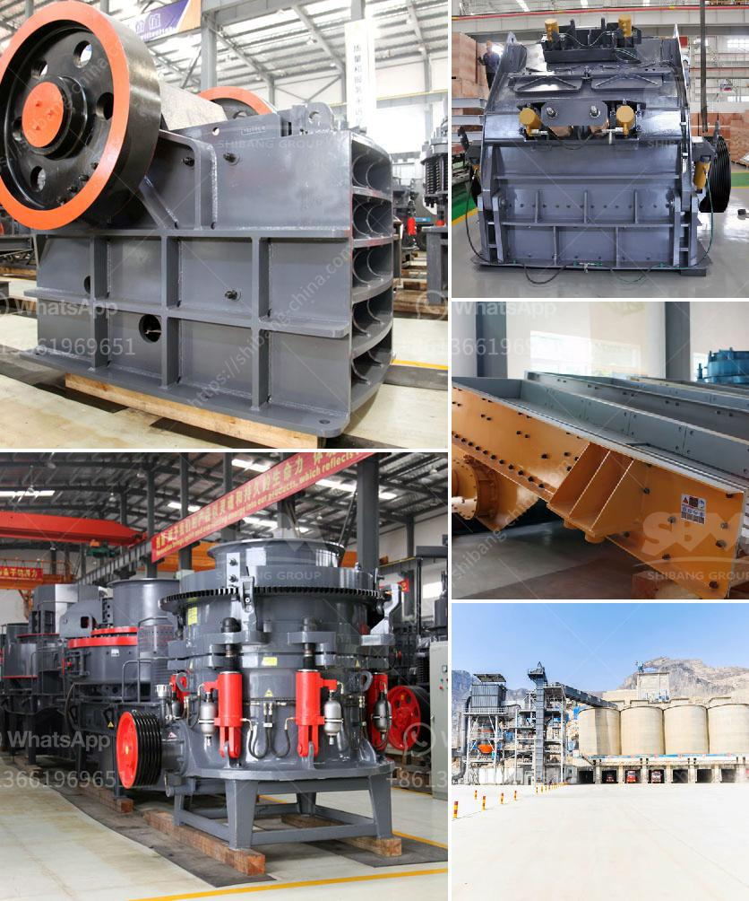

<h3>How to remove feldspars from sand production?</h3>
Feldspars are a common group of rock-forming minerals found in many types of sand deposits. While they may not be harmful, their presence can affect the quality and value of the sand. Removing feldspars from sand production is a crucial step in ensuring the desired sand quality for various applications such as construction, glass manufacturing, and foundry casting. In this article, we will explore some effective methods to remove feldspars from sand production.

Mechanical methods involve physical processes to separate feldspars from sand particles. One effective technique is screening. By using different mesh sizes, sand particles and feldspars can be separated based on particle size. This method is often used in large-scale sand production, where a series of screens with different mesh sizes are employed to obtain the desired sand purity.

Magnetic separation utilizes the magnetic properties of minerals such as feldspars to separate them from sand particles. In this method, magnets are used to attract and separate the feldspars from the sand. This can be accomplished by applying a magnetic field to the sand mixture, causing the magnetic feldspar particles to be attracted to the magnets while the non-magnetic sand particles pass through.

Froth flotation is a widely used technique in mineral processing to separate valuable minerals from unwanted ones. This method can be applied to remove feldspars from sand production. By adding special flotation agents to the sand mixture, the feldspars can be selectively attached to air bubbles, forming a froth layer that can be skimmed off, leaving behind purified sand.

Acid leaching is a chemical method that involves treating the sand mixture with a diluted acid solution to dissolve the feldspars. This method is particularly useful when dealing with feldspars that are resistant to other separation techniques. The acid dissolves the feldspars, leaving the sand particles unaffected. However, it is essential to choose the appropriate acid concentration and conditions to avoid damaging the sand particles or causing environmental issues.

Hydrocyclones are devices commonly used in sand washing plants to remove impurities. They operate by creating a swirling motion that separates particles according to their density. By adjusting the parameters and flow rate, feldspars can be selectively separated from the sand particles, leading to improved sand quality.

With advancements in technology, sorting machines with optical sensors and computer algorithms have become more sophisticated and capable of separating minerals based on their optical properties. These advanced sorting technologies can be utilized to remove feldspars from sand production by accurately identifying and selectively removing the unwanted minerals.

In conclusion, removing feldspars from sand production is crucial for ensuring high-quality sand that meets the desired specifications. Various methods, such as mechanical separation, magnetic separation, froth flotation, acid leaching, hydrocyclones, and advanced sorting technologies, can be employed to effectively remove feldspars from sand production. The choice of method depends on the specific requirements, scale of production, and the type of feldspars present. Proper implementation of these techniques will result in purified sand with improved value and better suitability for different applications.
<h3>Contact us</h3><ul><li><strong>Whatsapp:&nbsp;<a href="https://wa.me/8613661969651">+8613661969651</a></strong></li><li><a href="https://swt.shibang-china.com/?git&amp;zhl&amp;How to remove feldspars from sand production"><strong>Online Service(chat now)</strong></a></li></ul><h3>Related</h3><ul><li><a href='how to maintain pe 900x600 limestone crusher ？.md'>how to maintain pe 900x600 limestone crusher ？</a></li><li><a href='How does the Vibrating Screen machine work？.md'>How does the Vibrating Screen machine work？</a></li><li><a href='How do I change the mantle of a cone crusher.md'>How do I change the mantle of a cone crusher?</a></li><li><a href='How to maintain a coal crusher.md'>How to maintain a coal crusher?</a></li><li><a href='How to Operate a Portable Cone Crusher.md'>How to Operate a Portable Cone Crusher?</a></li></ul>