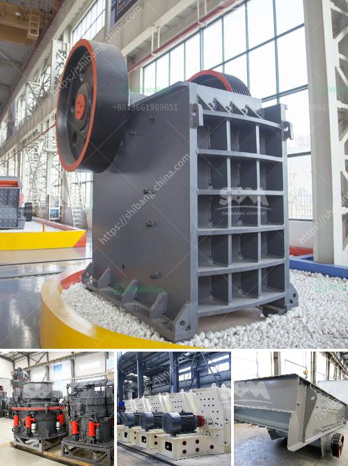

<h3>How to remove iron from zinc ore?</h3>
Zinc ore is a vital resource used in various industries, including the production of materials such as steel, batteries, and electronics. However, before zinc can be utilized effectively, it is essential to remove impurities from the ore, particularly iron. Iron in zinc ore can negatively impact its quality and purity, reducing its market value and hindering its application in various processes. This article will explore some common methods used to remove iron impurities from zinc ore.

One widely used technique for iron removal from zinc ore is the floatation process. This process utilizes flotation agents, which selectively bind to the iron impurities present in the ore. Typically, a frothing agent is added to the zinc ore slurry, causing bubbles to form. These bubbles attach to the iron impurities, floating them to the surface, where they are skimmed off. The remaining zinc ore is then collected and further processed.

Another effective method for the removal of iron impurities from zinc ore is magnetic separation. This technique exploits the magnetic properties of iron, enabling its separation from the zinc ore. The ore is crushed into a fine powder and exposed to a strong magnetic field. The magnetic particles (iron) are attracted to the magnet and separated from the non-magnetic zinc ore particles. This process can be repeated multiple times to ensure the highest level of iron removal.

Roasting is a thermal treatment process that reduces the iron content in zinc ore. In this method, the zinc ore is heated in the presence of air or oxygen, causing a chemical reaction that converts the iron impurities into an easily removable form. The high temperatures break down the iron compounds, such as oxides or sulfides, allowing them to be easily separated from the zinc ore. Roasting can be a complex process requiring precise temperature control to ensure efficient iron removal while preserving the desired properties of the zinc ore.

Chemical leaching is also utilized to remove iron from zinc ore. This method involves treating the ore with specific chemicals that selectively dissolve the iron impurities. The choice of chemicals depends on the ore composition and desired results. For instance, acid leaching can be effective when dealing with iron oxide impurities. The acid reacts with the iron, forming a soluble compound that is then separated from the zinc ore. However, it is essential to carefully manage the chemicals used in this method to avoid any environmental or health risks.

In conclusion, removing iron impurities from zinc ore is a crucial step in ensuring the quality and value of the final product. The methods discussed here, including floatation processes, magnetic separation, roasting, and chemical leaching, are some viable techniques used in the industry. The choice of method depends on various factors, such as the ore composition and desired results. Each method has its own advantages and limitations, and it is important to consider the specific requirements of the ore being processed. Implementing effective iron removal techniques can optimize zinc ore quality, enhancing its applications in various industries.
<h3>Contact us</h3><ul><li><strong>Whatsapp:&nbsp;<a href="https://wa.me/8613661969651">+8613661969651</a></strong></li><li><a href="https://swt.shibang-china.com/?git&amp;zhl&amp;How to remove iron from zinc ore"><strong>Online Service(chat now)</strong></a></li></ul><h3>Related</h3><ul><li><a href='How to increase productivity in ball mill.md'>How to increase productivity in ball mill?</a></li><li><a href='How to break down a copper ore.md'>How to break down a copper ore?</a></li><li><a href='How to increase the productivity of the cone crusher ？.md'>How to increase the productivity of the cone crusher ？</a></li><li><a href='How to install cement mill liners .md'>How to install cement mill liners ?</a></li><li><a href='How do you calculate the motor power for a vibrator screen.md'>How do you calculate the motor power for a vibrator screen?</a></li></ul>