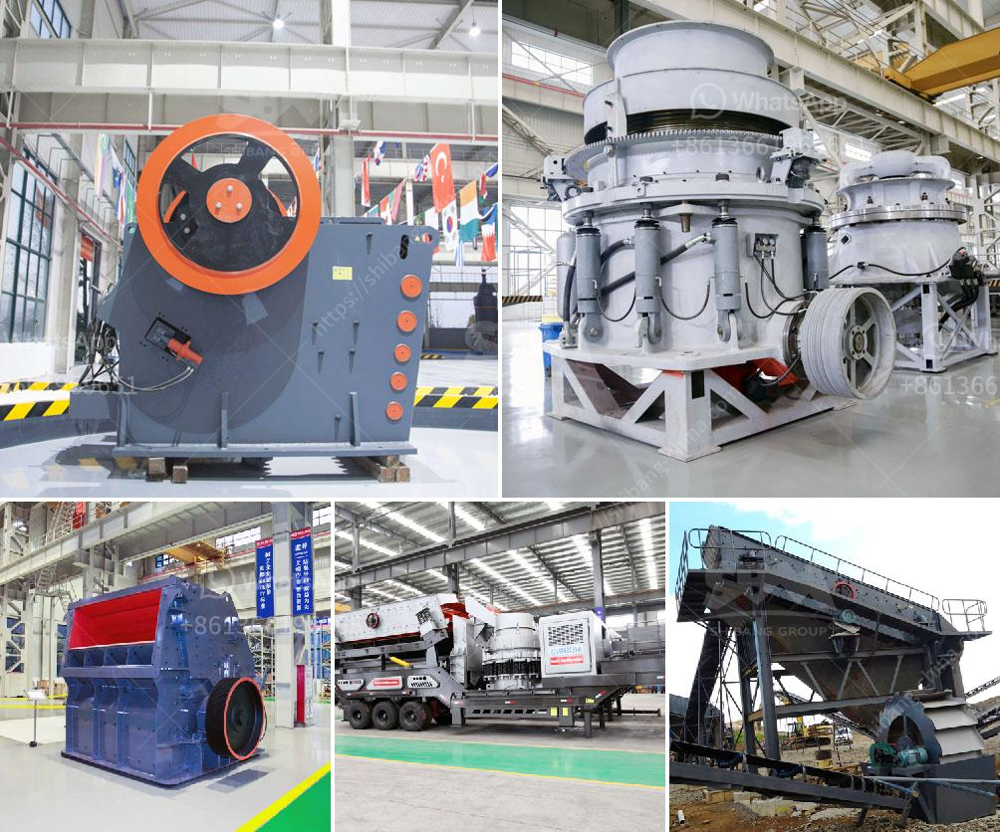

<h3>How to remove pyrite stones from coal?</h3>
Pyrite, also known as "fool's gold," frequently occurs in veins and is often found within coal deposits. Although pyrite can be a visually captivating mineral, its presence in coal can have detrimental effects on its quality and usability. Pyrite stones contain sulfur, which can lead to various environmental issues, including acidic water and air pollution when coal is burned. Therefore, it is crucial to remove pyrite stones from coal to enhance its value and reduce harmful impacts. Here are some effective methods for removing pyrite stones from coal.

One common method to remove pyrite stones from coal is through a beneficiation process. This involves crushing the coal and then using various techniques like gravity separation, magnetic separation, or flotation to separate the pyrite from the coal. Gravity separation relies on differences in density to separate the minerals, while magnetic separation utilizes magnetic properties. Flotation involves adding chemicals that selectively bind with pyrite to make it float, allowing for easy separation from the coal.

Another method to eliminate pyrite stones from coal is through cleaning with organic acids. Acid treatment can effectively dissolve pyrite and separate it from coal. The choice of organic acid depends on the coal properties and desired outcomes. Commonly used organic acids include oxalic acid, hydrochloric acid, and sulfuric acid. However, it is essential to handle these acids with caution, as they can be hazardous. Proper safety measures, such as wearing protective clothing and working in well-ventilated areas, should be followed.

The dense medium cyclone method is widely used for removing pyrite from coal. This technique relies on the principle of separation through density differences. A mixture of coal and a dense medium, typically a suspension of finely ground magnetite or ferrosilicon, is fed into a cyclone. The centrifugal force created by the cyclone separates the pyrite and other minerals from the coal based on their densities. The separated coal and pyrite can then be collected separately.

Electrostatic separation is another useful method to remove pyrite stones from coal. In this process, a high voltage is applied to the mixture of coal and pyrite. The difference in electrical conductivity between the two minerals causes them to separate. Pyrite stones, being poor conductors, tend to be attracted to the electrodes, while coal particles with higher conductivity are deflected away. This method provides a highly efficient way to remove pyrite stones from coal.

In conclusion, the presence of pyrite stones in coal can significantly impact its quality, usability, and environmental impact. Therefore, removing pyrite is crucial to enhance the value of coal and reduce pollution when burning it. Several effective methods, such as beneficiation processes, cleaning with organic acids, dense medium cyclones, and electrostatic separation, can be employed to remove pyrite stones from coal. It is important to carefully consider the specific coal properties and desired outcomes when selecting the most appropriate method. By implementing these techniques, the quality of coal can be improved, positively contributing to both industrial processes and environmental sustainability.
<h3>Contact us</h3><ul><li><strong>Whatsapp:&nbsp;<a href="https://wa.me/8613661969651">+8613661969651</a></strong></li><li><a href="https://swt.shibang-china.com/?git&amp;zhl&amp;How to remove pyrite stones from coal"><strong>Online Service(chat now)</strong></a></li></ul><h3>Related</h3><ul><li><a href='How to setting up of stone crusher unit in maharashtra and order there of .md'>How to setting up of stone crusher unit in maharashtra and order there of ?</a></li><li><a href='How to make talcum powder.md'>How to make talcum powder?</a></li><li><a href='How to crush the California sandstone .md'>How to crush the California sandstone ?</a></li><li><a href='How to separate gold from iron ore.md'>How to separate gold from iron ore?</a></li><li><a href='How to repair a crack in the trunnion of a ball mill.md'>How to repair a crack in the trunnion of a ball mill?</a></li></ul>