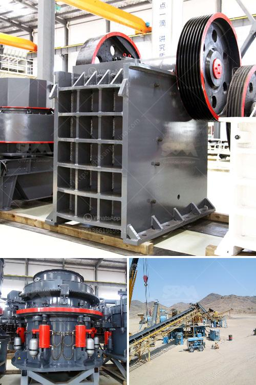

<h3>How to remove salt from sea sand ?</h3>
Sea sand, also known as beach sand or saltwater sand, is particularly popular in construction and landscaping due to its unique properties. However, one major drawback of using sea sand is its high salt content, which can cause corrosion and degradation in certain applications. Consequently, there is a need to remove the salt from sea sand before utilizing it in various projects. In this article, we will explore some effective methods that can be used to remove salt from sea sand.

The most basic and widely used method to remove salt from sea sand is through washing. This process involves rinsing the sand with freshwater to dissolve and carry away the salt particles. To effectively wash the sand, it can be placed in a bucket or container and freshwater should be poured over the sand, allowing it to overflow. This should be repeated several times until the water runs clear, indicating the removal of the majority of salt particles. However, it is worth noting that this method may not completely eliminate all the salt from the sea sand.

Another method to remove salt from sea sand is leaching. In this process, the sea sand is soaked in freshwater for an extended period, allowing the salt to dissolve and be carried away. To implement this method, fill a container with sea sand and pour enough freshwater over it to completely submerge the sand. Leave the container undisturbed for a few days, allowing sufficient time for the fresh water to permeate through the sand and dissolve the salt. Afterward, carefully pour off the top layer of saltwater and repeat the process multiple times until the water remains clear. This method is effective, but it requires more time compared to washing.

Desalination is an advanced and highly effective technique used to remove salt from water, and it can also be applied to remove salt from sea sand. One common method of desalination is reverse osmosis. Although this method is typically used on a larger scale, it can be adapted to treat sea sand as well. It involves passing sea sand through a membrane that only allows freshwater to pass, thus leaving behind the salt and other impurities. Although desalination is efficient, it requires specialized equipment and expertise to be implemented successfully.

Once the salt has been removed from the sea sand using any of the above methods, it is essential to rinse the sand thoroughly with freshwater to eliminate any remaining salt residue. After rinsing, the sand should be left to dry completely before use to prevent any residual moisture from causing corrosion or other issues.

In conclusion, removing salt from sea sand is crucial when using it for construction or landscaping purposes. Methods such as washing, leaching, and desalination can effectively reduce the salt content in sea sand, making it suitable for various applications. It is essential to select the most appropriate method based on the available resources, time, and desired results. By following these effective techniques, we can harness the benefits of sea sand without the negative effects of salt.
<h3>Contact us</h3><ul><li><strong>Whatsapp:&nbsp;<a href="https://wa.me/8613661969651">+8613661969651</a></strong></li><li><a href="https://swt.shibang-china.com/?git&amp;zhl&amp;How to remove salt from sea sand "><strong>Online Service(chat now)</strong></a></li></ul><h3>Related</h3><ul><li><a href='how to change hammer in rock crusher.md'>how to change hammer in rock crusher?</a></li><li><a href='How to unjam a mine crushing mill.md'>How to unjam a mine crushing mill?</a></li><li><a href='How to control the dust of stone crusher .md'>How to control the dust of stone crusher ?</a></li><li><a href='How to Start a Quarry Crushing Plant in Nigeria Need those crushing machines.md'>How to Start a Quarry Crushing Plant in Nigeria? Need those crushing machines?</a></li><li><a href='How to adjust a toggle spring on a jaw crusher.md'>How to adjust a toggle spring on a jaw crusher?</a></li></ul>