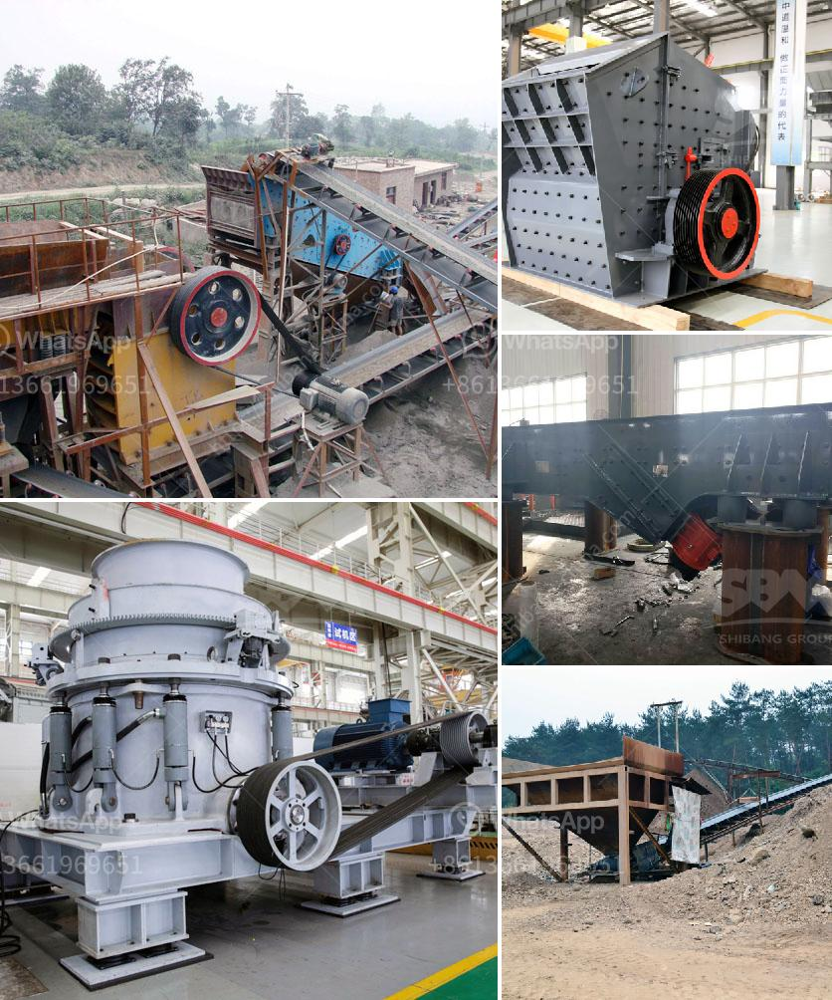

<h3>How to remove the gasket on the mineral ball mill?</h3>
Mineral ball mills are essential equipment in the mining industry, used for grinding and crushing materials into finer powder. These machines are designed with a gasket, a sealing material placed between the rotating cylinder and the stationary base, to prevent leakage of the grinding materials. Over time, this gasket may become worn out or damaged, requiring replacement. In this article, we will discuss how to remove the gasket on the mineral ball mill.

Before we begin, it is important to emphasize that safety should always be the top priority when handling any machinery. Ensure that the ball mill is turned off and unplugged from the power source before starting the process.

To remove the gasket, you will need a set of basic tools including a wrench, screwdriver, scraper, and cleaning cloth. It's important to have the right tools on hand to make the process easier and more efficient.

Examine the gasket carefully to determine its condition. Look for signs of wear, such as cracks, tears, or deterioration. If any damage is found, replacement is necessary. Also, take note of the gasket's shape and position to ensure proper reinstallation.

Using the appropriate screwdriver or wrench, carefully remove the screw fasteners securing the gasket in place. These screws are usually located on the outer edge or along the circumference of the ball mill. Make sure to keep track of the screws, as they will need to be reinstalled later.

After the screws are removed, gently loosen the gasket by applying even pressure around its perimeter. You can use a scraper or any flat tool to help separate the gasket from the cylinder. Be cautious not to scratch or damage the cylinder surface.

Once the gasket is removed, clean the surface of the cylinder and the base to remove any residue or debris left behind. Use a cleaning cloth or a gentle solvent to ensure a clean and smooth surface for the new gasket.

Place the new gasket onto the cleaned surface, ensuring proper alignment with the screw holes. Carefully secure the gasket in place by reattaching the screw fasteners. Make sure to tighten the screws evenly to create a secure and consistent seal.

After replacing the gasket, turn on the ball mill to test for any leakage. It is crucial to ensure that the gasket provides an effective seal to prevent any material or fluid from escaping during the grinding process. If leakage is detected, inspect and reposition the gasket as necessary.

In conclusion, removing the gasket on a mineral ball mill requires careful attention and the use of the right tools. By following the steps outlined in this article, you can effectively replace a worn or damaged gasket, ensuring the efficient operation of your ball mill and maintaining a secure seal. Remember to prioritize safety at all times and consult the manufacturer's guidelines for any specific instructions or precautions.
<h3>Contact us</h3><ul><li><strong>Whatsapp:&nbsp;<a href="https://wa.me/8613661969651">+8613661969651</a></strong></li><li><a href="https://swt.shibang-china.com/?git&amp;zhl&amp;How to remove the gasket on the mineral ball mill"><strong>Online Service(chat now)</strong></a></li></ul><h3>Related</h3><ul><li><a href='How to crush granite.md'>How to crush granite?</a></li><li><a href='How to build a small limestone mill production line？.md'>How to build a small limestone mill production line？</a></li><li><a href='How To Build Your Own Rock Crusher Plant？.md'>How To Build Your Own Rock Crusher Plant？</a></li><li><a href='How to make sand from rocks.md'>How to make sand from rocks?</a></li><li><a href='How to operate rock crusher equipment safely .md'>How to operate rock crusher equipment safely ?</a></li></ul>